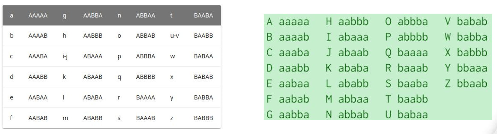
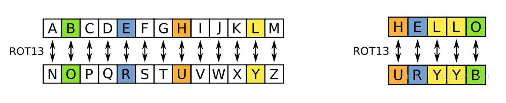

# Cipher

##  morse

```python
#!/usr/bin/python

morse_dic = {'01':'A','1000':'B','1010':'C','100':'D','0':'E','0010':'F','110':'G','0000':'H','00':'I','0111':'J','101':'K','0100':'L','11':'M','10':'N','111':'O','0110':'P','1101':'Q','010':'R','000':'S','1':'T','001':'U','0001':'V','011':'W','1001':'X','1011':'Y','1100':'Z','01111':'1','00111':'2','00011':'3','00001':'4','00000':'5','10000':'6','11000':'7','11100':'8','11110':'9','11111':'0','001100':'?','10010':'/','101101':'()','100001':'','010101':'.','110011':',','011010':'@','111000':':','101010':':','10001':'=','011110':"'",'101011':'!','001101':'_','010010':'"','10110':'(','1111011':'{','1111101':'}'} 


s = input("请输入密文:").strip()

if '/' in s:
    s = s.replace('/', ' ')
if '.' in s:
    table = ''.maketrans('.-','01')
    t = s.translate(table).split()
else:
    t = s.split()
res = ''
for i in t:
    res += morse_dic.get(i, "#")
print(res)
```

## Bacon's cipher

培根密码是一种简单的替换密码，密文字符只有a和b

- 每个明文字符都会被替换为一个由a和b组成的长度为5的字符串
- h  ->  aabbb
- 密文字符也可以选择任意两个其它字符

- 常规培根密码表 明文i和j、u和v所对应的密文是一样的
  
- 扩展培根密码表 包括所有26个字母



*转换为标准密文*
```python
#!/usr/bin/python

str = 'hellO everyone,Are YOU huNGrY? woUld you li To eAt BAcon'

res = ''

for i in str:
    if i.islower():
        res += 'A'
    elif i.isupper():
        res += 'B'
print(res)

table = ''.maketrans('AB','BA')
print(res.translate(table))
```
**解密**
```python
#!/usr/bin/python

bacon24 = ["aaaaa", "aaaab", "aaaba", "aaabb", "aabaa", "aabab", "aabba", "aabbb", "abaaa", "abaab", "ababa", "ababb", "abbaa", "abbab", "abbba", "abbbb", "baaaa", "baaab", "baaba", "baabb", "babaa", "babab", "babba", "babbb"]
alpha24 = ['a', 'b', 'c', 'd', 'e', 'f', 'g', 'h', '(ij)', 'k', 'l', 'm', 'n', 'o', 'p', 'q', 'r', 's', 't', '(uv)', 'w', 'x', 'y', 'z']
table24 = dict(zip(bacon24, alpha24))

bacon26 = ["aaaaa", "aaaab", "aaaba", "aaabb", "aabaa", "aabab", "aabba", "aabbb", "abaaa", "abaab", "ababa", "ababb", "abbaa", "abbab", "abbba", "abbbb", "baaaa", "baaab", "baaba", "baabb", "babaa", "babab", "babba", "babbb", "bbaaa", "bbaab"]
alpha26 = [chr(i) for i in range(ord('a'), ord('z') + 1)]
table26 = dict(zip(bacon26, alpha26))

def bacon_decode(ciphertext):
    """bacon解密"""
    s = ciphertext.replace(' ', '').lower()
    return ''.join(table24.get(s[i:i+5], '#') for i in range(0, len(s), 5)), \
           ''.join(table26.get(s[i:i+5], '#') for i in range(0, len(s), 5))

if __name__ == '__main__':
    s = input("请输入密文: ")
    plaintext24, plaintext26 = bacon_decode(s)
    print("24码:", plaintext24)
    print("26码:", plaintext26)

```

## Caesar cipher

**凯撒密码加密原理**

- 把明文中的所有字母按字母表顺序向后移动n位，数字和非字母字符保持不变。
- 位移数n就是密钥。
- 凯撒密码只有25种可能的密钥。


*tools.py*
```python
def caesar_transfer(text, n):
    """caesar转换 text-待转换的文本   n-移动位数(正数右移，负数左移)"""
    res = ''
    for i in text:
        if i.isupper():
            res += chr(((ord(i) - 65) + n) % 26 + 65)
        elif i.islower():
            res += chr(((ord(i) - 97) + n) % 26 + 97)
        else:
            res += i
    # print(res)
    return res
```

`caesar_demo.py`
```python
#!/usr/bin/python
from tools import caesar_transfer

# 'L oryh Sbwkrq3'
# 'synt{mur_VF_syn9_svtug1at}'
# 'oknqdbqmoq{kag_tmhq_xqmdzqp_omqemd_qzodkbfuaz}'
# 'NGBKLATCOZNIXEVZU'
# "gmbhjtdbftbs" 

keywords = ('flag','ctf','pass','fun', 'have','caesar','cyber','you','zmxh','mzwg','666c')

cipher = input("请输入密文:")
print('-'*15, '解密结果', '-'*15)

for i in range(1,26):
    res = caesar_transfer(cipher.strip(), i)
    for keyword in keywords:
        if keyword in res.lower():
            print('Maybe:', res)
            break
```
---

#### ROT13

ROT13是凯撒密码的一种变体，移位数固定为13。
- ROT13实现的效果是将26个字母的前半部分与后半部分互换，ROT13的密文和明文互为逆反。



---

## Rail Fence Ciphe

**置换(移位)密码**
- 与替代密码不同，置换密码并不将明文字符用另一种字符来代替。
- 置换密码的主要思想是改变明文字符的排列方式。
- 保持明文的字符相同，但是重新将字符进行排序，形成新的密文序列。

<span style="font-size: 23px;">**1.传统型（分组式）**</span>

**操作步骤：**
1. 选择一个数字作为栏数（Key）。
2. 将明文每个字符分为一组。
3. 依次取出每组的第 1 个字符组成密文的第一部分，再取每组的第 2 个字符，以此类推，直到所有字符取完。

**示例**（明文：ILoveLinux，栏数：2）：
1. 分组：`IL ov eL in ux`
2. 取每组第1位：`Ioeiu`
3. 取每组第2位：`LvLnx`
4. 密文：`IoeiuLvLnx `

```bash
#!/usr/bin/python

s = input("请输入原文:").strip()
# 自动求出可加密的栏数
key = [i for i in range(2, len(s)) if len(s)%i == 0]

for k in key:
    res = ''.join([s[i::k] for i in range(0, k)])
    print(f'{k}栏加密: {res}')

```

<span style="font-size: 23px;">**2.W型（波浪式）**</span>

`WE ARE DISCOVERED. FLEE AT ONCE'`
```txt
W . . . E . . . C . . . R . . . L . . . T . . . E
. E . R . D . S . O . E . E . F . E . A . O . C .
. . A . . . I . . . V . . . D . . . E . . . N . .
```
`WECRL TEERD SOEEF EAOCA IVDEN`
