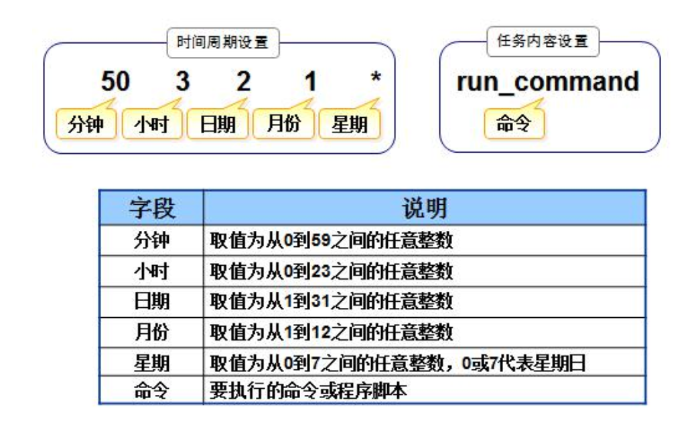

# Linux Advanced

Linux系统中允许同时执行多条命令的符号

- `;` 连接多条命令
- `&&` 前面命令执行成功了才执行后面的命令
- `||` 前面命令执行失败了才执行后面的命令
- `|` 前面命令输出结果作为后面命令的输入内容
- `&` 将前面的命令转入后台执行，并同时执行后面的命令

---

## cron计划任务

在指定时间自动执行指定的操作, 三种方式。



### 1.crontab 命令

- `crontab –e`，为当前用户配置计划任务
- `crontab –l`，查看计划任务

```bash
[root@host ~]# crontab -l
*/1 * * * * /bin/date >> /tmp/test.log

[root@host ~]# tail -f /tmp/test.log
Mon Apr 13 23:21:01 CST 2026
Mon Apr 13 23:22:01 CST 2026
Mon Apr 13 23:23:01 CST 2026
```
---

### 2.修改`/etc/crontab` 文件

- 在该**系统文件**中为指定用户添加计划任务操作

```bash
[root@host etc]# cat /etc/crontab
SHELL=/bin/bash
PATH=/sbin:/bin:/usr/sbin:/usr/bin
MAILTO=root

# For details see man 4 crontabs

# Example of job definition:
# .---------------- minute (0 - 59)
# |  .------------- hour (0 - 23)
# |  |  .---------- day of month (1 - 31)
# |  |  |  .------- month (1 - 12) OR jan,feb,mar,apr ...
# |  |  |  |  .---- day of week (0 - 6) (Sunday=0 or 7) OR sun,mon,tue,wed,thu,fri,sat
# |  |  |  |  |
# *  *  *  *  * user-name  command to be executed
43 22 * * * root /usr/bin/nc -lp 6000

[root@host etc]# netstat -tulpn | grep 6000
tcp        0      0 0.0.0.0:6000            0.0.0.0:*               LISTEN      18974/nc
tcp6       0      0 :::6000                 :::*                    LISTEN      18974/nc
```
---

### 3.`/etc/cron.d` 目录

- 在该**目录**中创建的任何文件，只要文件内容遵循了计划任务的配置格式，那么就会被当作计划任务去执行。

```bash
[root@host cron.d]# cat test
33 22 * * * root /usr/bin/nc -lp 6666

[root@host cron.d]# netstat -tulpn | grep 6666
tcp        0      0 0.0.0.0:6666            0.0.0.0:*               LISTEN      18889/nc
tcp6       0      0 :::6666                 :::*                    LISTEN      18889/nc
```
---

## named pipe

命名管道（Named Pipe），在 Unix/Linux 系统中也常被称为 **FIFO (First-In, First-Out)**，是一种特殊的进程间通信（IPC）机制。它与传统的匿名管道（通常用于父子进程之间）不同，匿名管道是临时的、没有名字的，并且只能在有共同祖先的进程之间使用。

命名管道则克服了这些限制：

1.  **有名字：** 它在文件系统中拥有一个实际的名字，就像普通文件一样（例如 `/tmp/my_pipe`）。这意味着任何知道其名字的进程都可以打开并使用它，无论这些进程之间是否有父子关系。
2.  **先进先出 (FIFO)：** 命名管道的数据传输遵循“先进先出”的原则。先写入管道的数据会先被读取出来。
3.  **文件系统可见：** 尽管它在文件系统中表现为一个文件，但它并不是一个普通的文件。写入命名管道的数据不会存储在磁盘上，而是直接从写入进程传递到读取进程。它更像是一个“通道”或者“缓冲区”。
4.  **全双工或半双工：** 命名管道可以支持单向（半双工）或双向（全双工）通信，具体取决于系统和实现。在 Unix/Linux 中，通常是半双工，但可以通过创建两个命名管道来实现全双工通信。
5.  **生命周期：** 命名管道的生命周期可以比创建它的进程更长。它会一直存在，直到被显式删除（例如使用 `rm` 命令）。

### 如何创建和使用命名管道 (Unix/Linux)

在 Unix/Linux 系统中，你可以使用 `mkfifo` 命令来创建命名管道：

```bash
mkfifo /tmp/my_named_pipe
```

创建后，你就可以像操作普通文件一样来读写它。例如：

**在一个终端写入数据：**

```bash
echo "Hello, world!" > /tmp/my_named_pipe
```

**在另一个终端读取数据：**

```bash
cat < /tmp/my_named_pipe
```

当你执行写入命令时，它会阻塞，直到有另一个进程打开管道进行读取。同样，读取命令也会阻塞，直到有数据被写入管道。

### 命名管道的常见用途

* **进程间通信：** 允许不相关的进程之间进行数据交换。
* **简化复杂命令：** 有时可以将多个命令通过命名管道连接起来，避免创建大量的临时文件。例如，一个程序将数据解压到命名管道，另一个程序可以直接从命名管道读取解压后的数据进行处理。
* **守护进程通信：** 守护进程（后台服务）可以使用命名管道来接收来自其他应用程序的命令或数据。

### 与匿名管道的区别

| 特性     | 匿名管道 (Pipe)                     | 命名管道 (Named Pipe / FIFO)             |
| :------- | :---------------------------------- | :--------------------------------------- |
| **名字** | 没有名字，通过文件描述符引用        | 有名字，在文件系统中可见                 |
| **创建** | 由 shell 或 `pipe()` 系统调用创建   | 由 `mkfifo` 命令或 `mkfifo()` 系统调用创建 |
| **可见性** | 仅限于创建它的进程及其子进程        | 任何进程都可以访问                       |
| **持久性** | 随着创建进程的结束而消失            | 需要显式删除（`rm`）才会消失             |
| **用途** | 主要用于父子进程间的单向数据流      | 用于不相关的进程间的通信，更灵活         |

总的来说，命名管道提供了一种灵活、持久的进程间通信方式，它允许系统上任意两个进程通过一个公共的、有名字的“文件”进行数据交换，而无需像普通文件那样将数据实际写入磁盘。

---

## chattr

`chattr`（全称 **change attribute**）是 Linux 系统中用于 **改变文件或目录隐藏属性(Attributes)** 的命令。

它与常用的 `chmod`（修改读、写、执行权限）不同，`chattr` 修改的是文件系统底层的特殊属性，这些属性甚至可以超越 `root` 用户的最高权限。它通常只在支持扩展属性的文件系统（如 ext2、ext3、ext4、xfs 等）上有效。

---

### 1. 最常用的属性（Attributes）
使用 `chattr` 时，最常用的两个属性是 `i` 和 `a`：

*   **`+i` (Immutable，不可变属性)**：
    *   **作用**：设置该属性后，文件**不能被删除、重命名、修改内容，也不能创建指向它的链接**。
    *   **即使是 `root` 用户也无法对其进行写操作或删除**。
    *   **场景**：保护系统关键配置文件（如 `/etc/passwd` 或 `/etc/resolv.conf`），防止被意外修改或被黑客篡改。

*   **`+a` (Append Only，仅可追加属性)**：
    *   **作用**：设置该属性后，文件**只能追加写入数据（如使用 `>>`），不能修改已有内容，也不能删除或重命名**。
    *   **场景**：保护系统日志文件（如 `/var/log/messages`），确保历史日志不被篡改或删除，同时允许系统继续写入新日志。

---

### 2. 常用命令格式

`chattr` 的基本语法如下：
```bash
chattr [-RVf] [-+=aAcCdDeFijPsStTuUx] files...
```

*   `+` ：开启/增加某个属性。
*   `-` ：关闭/移除某个属性。
*   `=` ：指定文件的唯一属性（覆盖旧属性）。

#### 实例演示：

1.  **防止文件被删除或修改（锁定文件）**：
    ```bash
    sudo chattr +i important.txt
    ```
    *此时尝试 `rm important.txt` 或修改它，系统都会提示 `Operation not permitted`（即使使用 `sudo` 也不行）。*

2.  **解除锁定**：
    ```bash
    sudo chattr -i important.txt
    ```

3.  **设置日志文件只能追加写入**：
    ```bash
    sudo chattr +a mylog.log
    ```

---

### 3. 如何查看这些属性？
因为 `chattr` 设置的属性使用普通的 `ls -l` 是看不到的，你需要使用配套的 **`lsattr`** 命令来查看：

```bash
lsattr important.txt
```
如果文件被锁定了，输出会类似于：
```text
----i---------e--- important.txt
```
（其中的 `i` 就表示该文件当前拥有不可变属性）。