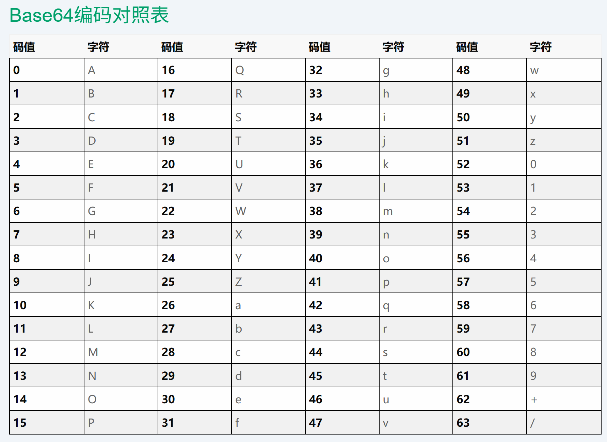
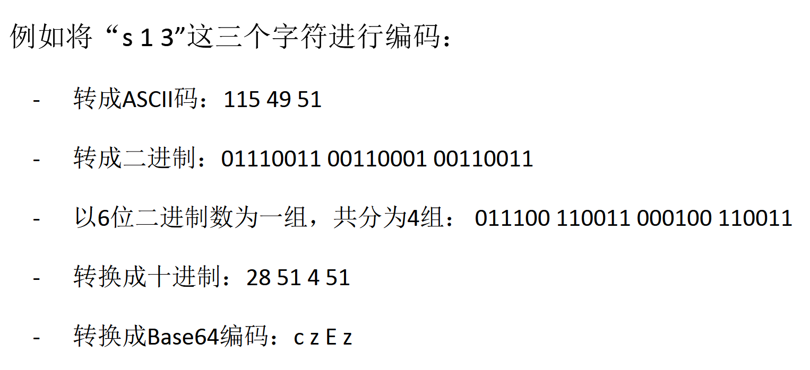

# encoding

## ASCII


---

## Base64



**Base64编码的作用**
- 某些系统中只能使用ASCII字符，Base64可将非ASCII字符的数据转换成ASCII字符。

**Base64编码所采用的字符**
- `Base64`只使用了**ASCII**码中一部分可打印字符。
- 具体包括：大小写字母各26个、10个数字、加号`+`、斜杠`/`
- 除了这64个字符之外，在`Base64`编码中可能还会使用等号`=`作为后缀。

- `Base64`在编码时有自己专门的码表，而不是使用ASCII码



**base64编码的关键特征**

- 只可能包含以下字符：`A-Z a-z 0-9 + / =`
- `=`只会出现在字符串最后，最多三个，也可能没有。
- 字符个数是4的倍数。

---

<span style="font-size: 23px;">**编码解码**</span>

*linux*
```bash
echo -n 'hello' | base64

echo -n 'aGVsbG8=' | base64 -d
```

*python*
```python
>>> import base64

>>> base64.b64encode(b'hello')
b'aGVsbG8='
>>> base64.b64decode('aGVsbG8=')
b'hello'
```