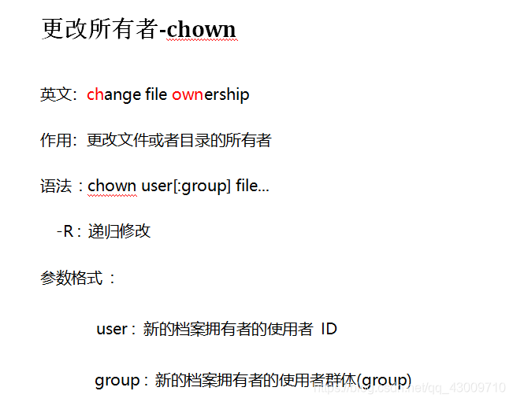
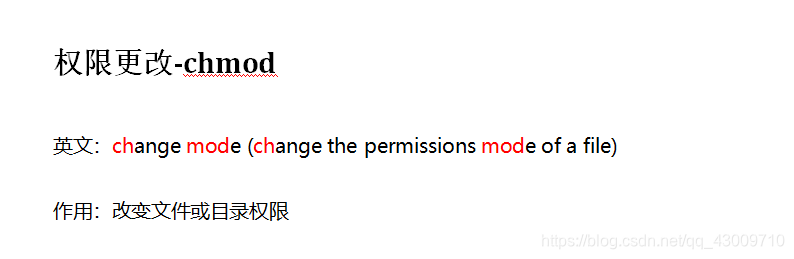
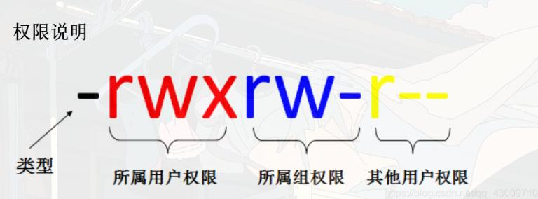

# Linux command

## 0.常用命令

[linux命令在线手册](https://www.linuxcool.com/)

```bash
# ss命令查看端口状态
ss -tulpn

# 显示网络状态
netstat -tulpn

# 查看进程信息
ps -ef 

ps aux

# 查看进程打开的文件、网络连接(TCP/UDP 端口)及硬件设备
lsof -i :80

# 显示当前后台的作业列表及进程号：
jobs -l

# 切回第一个后台任务到前台
fg %1

# 让 Ctrl+Z 暂停丢后台的任务在后台继续跑
bg %1

```
---

## 1.系统服务

```bash
systemctl list-unit-files

systemctl start dhcpcd # 启动服务
systemctl stop dhcpcd # 停止服务
systemctl restart dhcpcd # 重启服务
systemctl reload dhcpcd # 重新加载服务以及它的配置文件
systemctl status dhcpcd # 查看服务状态
systemctl enable --now dhcpcd # 设置服务为开机启动并立即启动这个单元
systemctl disable dhcpcd # 取消开机自动启动
systemctl daemon-reload dhcpcd # 重新载入 systemd 配置。扫描新增或变更的服务单元、不会重新加载变更的配置
```
---

## 2.文件压缩

### .zip

**解压**

```bash
unzip xxx.zip
```
---

### .gz

**解压**

```bash
gzip -d xxx.gz
```

---

### .tar

**解压**

```bash
tar -xvf xxx.tar
```

**压缩**

```bash
tar -cvf xxx.tar [files]
```

---

### .tar.gz

**解压**

```bash
tar -zxvf xxx.tar.gz -C [path]
```
**压缩**

```bash
tar -zcvf xxx.tar.gz [files]
```

### .tar.bz2

**解压**

```bash
tar -jxvf xxx.tar.bz2 -C [path]
```

**压缩**

```bash
tar -jcvf xxx.tar.bz2 [files]
```
---

## 3.磁盘内存

```bash
# 看磁盘硬件结构：几块盘、几个分区、大小、类型
lsblk

# 查看整体磁盘使用情况
df -h

# 查看内存(RAM)和交换分区(Swap)使用情况
free -h


```
---

## 4.curl

Curl 最常用 10 个参数

**I看头、v排错、X改方法、H加头、d传参、L跳转、k跳证书、x走代理**

1. `-I` 只看响应头(不返回页面内容)
```bash
curl -I https://baidu.com
```
查状态码301/200/404、服务器信息、跳转

2. `-v` 详细调试模式(全过程抓包)
```bash
curl -v https://baidu.com
```
看TCP连接、TLS握手、请求头、响应全程，排错必用
组合神器：`curl -vI 网址`

3. `-X` 指定请求方法(POST/PUT/DELETE)
```bash
curl -X POST https://xxx.com
```

4. `-H` 自定义请求头(加Cookie、User-Agent)
```bash
curl -H "User-Agent:test" -H "Cookie:id=1" https://xxx.com
```

5. `-d` 提交POST表单数据
```bash
curl -d "user=admin&pwd=123" https://xxx.com/login
```

6. `-o` 把响应内容保存到文件(不输出终端)
```bash
curl -o test.html https://baidu.com
```

7. `-O` 自动用文件名保存(抓取资源原名)
```bash
curl -O https://xxx.com/1.zip
```

8. `-L` 自动跟随301/302跳转
```bash
curl -L https://xxx.com
```

9. `-k` 忽略HTTPS证书报错(内网/自测用)
```bash
curl -k https://自签名证书域名
```
⚠️ 正式环境别用，不安全

10.  `-x` 指定代理(抓包/内网穿透)
```bash
curl -x 127.0.0.1:8080 https://xxx.com
```
### webshell

```bash
curl https://xxx.xxx.net/files/avatars/shell.php --get --data-urlencode "pass=system('cat /home/carlos/secret');"
```
- `--get`：强制使用 **GET 方法** 发送请求（即使有 `--data` 参数也用 GET，数据附在 URL 的查询字符串中）
- `--data-urlencode`：将后面的数据进行 **URL 编码**后附加到请求中（避免特殊字符破坏 URL 格式）


---

## 5.SCP

`scp`(secure copy)命令用于在本地与远程主机之间安全地复制文件或目录。常用用法如下：

- 从本地复制到远程：
  ```bash
  scp localfile user@remote_host:/remote/path/
  ```

- 从远程复制到本地：
  ```bash
  scp user@remote_host:/remote/path/file localdir/
  scp document.txt mark@10.10.45.80:/home/mark
  ```

- 复制整个目录(加 `-r`)：
  ```bash
  scp -r localdir user@remote_host:/remote/path/
  scp -r user@remote_host:/remote/path/dir localdir/
  ```

- 指定端口(如 2222)：
  ```bash
  scp -P 2222 localfile user@remote_host:/remote/path/
  ```

- 常用参数说明：
  - `-r`：递归复制整个目录
  - `-P`：指定远程主机端口
  - `-i`：指定私钥文件
  - `-C`：启用压缩

**示例：**
```bash
scp -P 2222 -r ./myfolder user@192.168.1.10:/home/user/
```
---

## 6.权限

Linux 文件权限速查表，帮你快速识别和理解 `ls -l` 输出中的权限字段：

---

### 🗂 文件类型标识符

| 字符 | 类型             | 说明                          |
|------|------------------|-------------------------------|
| `-`  | 普通文件         | Regular file                  |
| `d`  | 目录             | Directory                     |
| `l`  | 符号链接         | Symbolic link                 |
| `c`  | 字符设备         | Character device (如终端)     |
| `b`  | 块设备           | Block device (如硬盘)         |
| `s`  | 套接字           | Socket                        |
| `p`  | 命名管道         | Named pipe (FIFO)             |

---

### 🔐 权限字段结构(共 10 个字符)

例如：`-rw-r--r--`

| 位置 | 含义           | 权限说明                          |
|------|----------------|-----------------------------------|
| 1    | 文件类型       | 如上表所示                        |
| 2-4  | 所有者权限     | `r`=读，`w`=写，`x`=执行           |
| 5-7  | 所属组权限     | 同上                              |
| 8-10 | 其他用户权限   | 同上                              |

---

### 👥 权限组合示例

| 权限字符串   | 含义说明                                 |
|--------------|------------------------------------------|
| `rwxr-xr-x`   | 所有者可读写执行，组和其他用户可读执行   |
| `rw-r--r--`   | 所有者可读写，组和其他用户只读           |
| `rwx------`   | 只有所有者有全部权限，其他人无权限       |
| `rwxrwxrwx`   | 所有人都有读写执行权限(不安全！)       |

---

### 🛠 常用命令速查

| 命令              | 功能说明                              |
|-------------------|---------------------------------------|
| `chmod`           | 修改权限(如：`chmod 755 file`)      |
| `chown`           | 修改文件所有者(如：`chown user file`)|
| `ls -l`           | 显示详细权限信息                      |
| `umask`           | 设置默认权限掩码                     |

## chown & chmod

### chown
>在Linux系统中，chown命令用于改变文件或目录的所有者和/或所属群组。这个命令对于系统管理员和需要管理文件权限的用户来说是非常有用的。

<div align=left></div> 

```zsh
# 1.更改文件的所有者： 
# 把file.txt的所有者更改为username。
chown username file.txt

# 2.同时更改文件的所有者和群组：
# 把file.txt的所有者更改为username，并将群组更改为groupname
chown username:groupname file.txt

# 递归更改目录及其所有子目录和文件的所有者
chown -R username /path/to/directory
# -R或--recursive选项表示递归地更改目录及其内部所有文件和子目录的所有者

# 将文件 file1.txt 的拥有者设为 runoob，群体的使用者 runoobgroup :
chown runoob:runoobgroup file1.txt

# 将目前目录下的所有文件与子目录的拥有者皆设为runoob，群体的使用者runoobgroup:
chown -R runoob:runoobgroup *

```
### chmod

>chmod命令是Unix和Linux系统中用于改变文件或目录访问权限的命令。通过chmod，用户可以控制谁可以读取、写入或执行文件或目录。该命令有两种主要用法：数字设定法和符号设定法。

<div align=left></div> 

**数字设定法**

>在数字设定法中，权限通过三个八进制数字来表示，分别对应文件所有者(user, u)、用户组(group, g)和其他用户(others, o)的权限。每个数字是读(r=4)、写(w=2)和执行(x=1)权限的总和。

- 0：表示没有任何权限。
- 1：表示可执行权限(x)。
- 2：表示可写权限(w)。
- 4：表示可读权限(r)。
>例如，权限755表示：
文件所有者(u)有读(4)、写(2)和执行(1)权限，总和为7。
用户组(g)和其他用户(o)都有读(4)和执行(1)权限，但没有写权限，总和为5。
数字设定法的一般形式为：

```bash
# 一般形式
chmod [mode] 文件名
chmod 755 file.txt
chmod -R 755 目录名
```

<div align=left></div>


**符号设定法**

>符号设定法使用字母和操作符来表达权限的更改。操作符可以是+(添加权限)、-(删除权限)或=(赋予指定权限并取消其他所有权限)。

- u：表示文件所有者(user)。
- g：表示用户组(group)。
- o：表示其他用户(others)。
- a：表示所有用户(all)，它是u、g和o的简写。
- r：表示读权限(read)。
- w：表示写权限(write)。
- x：表示执行权限(execute)。

```zsh
sudo chmod a+w /etc/hosts
```

---

## 7.sudo -i 和 su -

这是一个非常棒的问题。虽然 `sudo -i` 和 `su -` 最终都能让你获得一个“完全的 root 环境”，但它们的**认证机制**和**日志审计**逻辑完全不同。

我们可以从**钥匙**、**环境**和**记录**三个维度来拆解：

---

### 1. 认证机制：用谁的钥匙开门？

这是两者最核心的区别：

* **`su -` (Switch User)：**
    * **钥匙：** 必须使用 **root 用户的密码**。
    * **逻辑：** 你必须知道最高管理员的“通关口令”。在多人协作的服务器上，这意味着多个人共享同一个密码，安全性较低。
* **`sudo -i` (Interactive)：**
    * **钥匙：** 使用 **你自己的用户密码**(比如 `admin` 的密码)。
    * **逻辑：** 系统去查看 `/etc/sudoers` 文件，确认你是否有权“变身”。如果权限撤销，你用自己的密码也进不去。

---

### 2. 环境变量：进去后的家是什么样？

加了横杠 `-` 或 `-i` 参数，本质上都是为了开启一个 **Login Shell**(登录式 Shell)。

* **相同点：** 两者都会重置路径(`$PATH`)、工作目录(回到 `/root`)以及加载 root 的配置文件(如 `.bashrc` 或 `.zshrc`)。
* **不同点：**
    * `su -` 几乎抹除了你之前用户的所有痕迹。
    * `sudo -i` 虽然切换了环境，但通常会保留一些变量(如 `SUDO_USER=admin`)，让系统知道这个 root shell 是由谁开启的。

---

### 3. 日志审计：谁干了坏事？

在安全审计(尤其是像 **Kali** 这种涉及敏感操作的系统)中，这一点至关重要：

* **`su -`：** 一旦切换成功，日志只记录“某人变成了 root”。之后你在 root 身份下执行的命令(比如 `rm -rf /`)，在系统日志里通常很难直接追溯到是 `admin` 干的。
* **`sudo -i`：** 每一条通过 `sudo` 开启的操作都会被记录。审计日志会明确写着：“用户 `admin` 提升权限开启了交互式 Shell”。

---

### 4. 快速对比表

| 特性 | `su -` | `sudo -i` |
| :--- | :--- | :--- |
| **验证口令** | **Root 的密码** | **你自己的密码** |
| **前提条件** | Root 账户必须已设置密码并启用 | 你的用户名必须在 `sudoers` 列表里 |
| **工作目录** | 切换到 `/root` | 切换到 `/root` |
| **环境变量** | 清除旧变量，完全加载 Root 环境 | 重新加载环境，但保留溯源变量 |
| **安全性** | 较低(密码共享风险) | 较高(权限可控、可撤销) |


---

### 💡 实际操作建议

1.  **在 Kali Linux 中：** 官方强烈建议使用 **`sudo -i`**。因为现在的 Kali 默认不推荐设置 root 密码，使用 `sudo -i` 既方便又符合安全审计规范。
2.  **在 Arch Linux 中：** 如果你刚装完系统还没配置 `sudo`，你只能用 **`su -`**。一旦配置好了 `sudo`，就应该尽量形成使用 `sudo -i` 的习惯。

---

## 8.ps -ef
 `ps -ef` 是Unix/Linux系统中用于查看进程信息的常用命令：

<span style="font-size: 23px;">**命令构成及含义**</span>
- **ps**：是“process status”的缩写 ，用于显示当前系统的进程状态信息。
- **-e**：等价于`-A` ，表示列出全部的进程，即不仅显示当前用户在当前终端启动的进程，还包括其他用户及系统层面的所有进程。
- **-f**：表示以完整格式(full format)显示进程信息，会展示诸如进程的用户ID、父进程ID、CPU占用率、启动时间等详细字段。 

<span style="font-size: 23px;">**输出字段含义**</span>

执行`ps -ef`后，会显示类似表格的信息，各列含义如下：
- **UID**：进程的所有者用户ID，代表哪个用户启动了该进程，比如`root`表示由超级用户启动。 
- **PID**：进程的唯一标识符，系统通过它来区分不同进程。
- **PPID**：父进程的ID，可用于追踪进程的创建关系，若一个进程的父进程ID找不到，该进程可能是僵尸进程 。
- **C**：CPU的占用率，以百分数形式呈现，反映进程对CPU资源的使用程度。 
- **STIME**：进程的启动时间，记录进程开始运行的时刻。 
- **TTY**：终端设备，是发起该进程的设备识别符号。若显示`?` ，表明该进程并非由终端发起，而是在后台运行等情况。 
- **TIME**：进程占用CPU的总时间，体现进程自启动以来累计使用CPU的时长。 
- **CMD**：启动进程的命令名称或路径，可直观看到进程对应的程序或指令。 

<span style="font-size: 23px;">**常见用法**</span>

- **查看所有进程**：直接运行`ps -ef` ，可列出系统中所有正在运行进程的详细信息，帮助用户全面了解系统当前的进程运行状况。
- **查找特定进程**：常与`grep`命令结合使用，比如`ps -ef | grep nginx` ，用于筛选出与`nginx`相关的进程信息，方便排查特定服务或程序的进程状态。 
- **提取特定列信息**：借助`awk`等工具，如`ps -ef | awk '{print $2, $8}'` ，可以从`ps -ef`的输出结果中提取指定的列，如进程ID(PID)和启动命令(CMD)等信息 。 
- **配合其他命令管理进程**：与`kill`命令结合，先通过`ps -ef`找到目标进程的PID，再使用`kill`命令终止该进程，例如`ps -ef | grep find | awk '{print $2}' | xargs kill -9` ，可查找并强制终止与`find`相关的进程 。 

---

## 9.ss

Linux 命令 `ss` 代表 **Socket Statistics**(套接字统计)。它是一个用于查看和分析系统网络连接状态的工具，功能类似于 `netstat`，但速度更快，并提供更详细的网络连接信息。

`ss` 命令可以显示 TCP、UDP、UNIX 套接字的详细信息，并支持丰富的过滤功能，适用于调试网络、监控连接等任务。例如：
- `ss -t` 仅显示 TCP 连接
- `ss -u` 仅显示 UDP 连接
- `ss -l` 仅显示监听状态的套接字
- `ss -p` 显示与套接字关联的进程信息

---

## 10.find

```bash
find / -type f -name "rockyou.txt" 2>/dev/null
```
- type 文件类型 f-文件 d-目录
- 2 代表标准错误输出(stderr)
- \> 是重定向符号
- /dev/null 是一个特殊的设备文件，也被称为"黑洞"，任何写入它的数据都会被丢弃

这条命令会在整个文件系统中搜索名为 rockyou.txt 的文件,由于搜索过程中会遇到很多没有权限访问的目录，会产生大量错误信息，2>/dev/null 将这些错误信息过滤掉，让输出更清晰，最终只显示成功找到的 rockyou.txt 文件路径.

```bash
find / -name "flag?.txt" 
```
- `?` 匹配 0 个、1 个或多个任意字符
- `*` 匹配 0 个、1 个或多个任意字符

---

## 11.sort

sort命令用于对文本信息按指定内容进行排序

- 默认以行为单位，从每行的首字母开始按ASCII码值的大小依次进行排序。
- `-t`选项，指定分隔符，将每行信息分隔为数个字段。
- `-k`选项，指定用哪个字段来排序。
- `-n`选项，按数值大小进行排序。
- `-u`选项，去除重复的行。
- `-r`选项，以相反的顺序排序

```bash
sort -t: -nk3 /etc/passwd
```

```bash
sort -u fsocity.dic > sortedfs.dic
```

---

## 12.tail

`tail` 是 Linux 中**查看文件末尾内容**的核心命令，最常用的场景是**实时监控日志文件**（比如系统日志、应用日志），默认显示文件的**最后10行**。

**基本语法**

```bash
tail [参数] 文件名
```
**核心参数**

| 参数 | 作用 |
|------|------|
| 无参数 | 默认显示文件**最后10行** |
| `-n 数字` | 指定显示文件**最后N行**（简写：`-数字`） |
| `-f` | **实时跟踪文件更新**（最常用！），文件新增内容会自动刷新显示 |
| `-F` | 增强版`-f`，文件被删除/重命名/重新创建后，仍能继续跟踪 |
| `-c 数字` | 显示文件**最后N个字节** |
| `-q` | 静默模式，多文件查看时不显示文件名 |

**例子**

*显示最后...*
```bash
# 查看最后10行
tail test.log

# 显示最后20行（两种写法等价）
tail -n 20 test.log
tail -20 test.log

# 按字节查看末尾内容
tail -c 100 test.lo

# 查看多个文件的末尾
tail test1.log test2.log
```
*实时监控日志（核心功能）*
```bash
# 实时跟踪nginx访问日志，新增内容自动刷新
tail -f /var/log/nginx/access.log

# 先显示最后50行，再实时跟踪新增内容
tail -50f test.log

# 日志文件被定时切割（如 logrotate）时，-f 会失效，用 -F 更稳定：
tail -F /var/log/messages
```
---

## 13.三剑客

| 工具 | 核心职责 | 一句话总结 |
|------|----------|-------------|
| **grep** | 搜索并**过滤**行 | “我要找包含某个模式的行” |
| **sed**  | 对文本进行**编辑**（增删改查） | “我要批量替换、删除、插入文本” |
| **awk** | 对结构化文本进行**列处理**和**报告生成** | “我要按列切分、计算、格式化报表” |

- **grep** 可以快速过滤行，然后通过管道交给 `sed` 或 `awk` 做精细处理。
- **sed** 有 `-i` 直接修改文件，`grep` 和 `awk` 没有这个能力（`awk` 可以用临时文件模拟）。
- **awk** 完全可以替代 `grep 'pattern'`：`awk '/pattern/' file`，也可以替代简单的 `sed` 替换：`awk '{gsub(/old/,"new")}1'`。但这样写通常不如专用工具简洁。
- **正则表达式**是三者的共同基础，掌握 `grep -E` / `sed -r` / `awk` 的正则语法差异（如 `+`、`?`、`|` 是否需要转义）能减少困惑。

一句话记忆：  
**grep 找行，sed 改行，awk 切行算列。**

## grep

grep(**global search regular expression and print out the line**)，其核心功能是在文件(或标准输入)中搜索匹配指定模式的行，并将匹配的行输出。

**基本语法结构**

```bash
grep [选项]... 模式 [文件]...
```

**例子**

*在对象文件或二进制文件中查找可打印的字符串*
```bash
strings hidekey.jpg | grep -E "flag|ctf|key"
```

---

## awak

awk 是一套专为文本处理设计的编程语言，也是一个强大的命令行工具。它不仅能简单地提取数据，还能像一门微型编程语言那样，执行复杂的格式化、计算和报表生成任务

**基本语法结构**

```bash
awk [选项参数] '模式 {动作}' 文件名
```
其核心思想是**逐行扫描文件**，对匹配 `模式` 的行执行 `动作`

**例子**

```bash
awk -F':' '$3>=970,OFS=":"{print $1,$3,$NF}' /etc/passwd
```

---

## sed

sed(**Stream EDitor**)，它擅长**非交互式**地对文本进行批量编辑，比如替换、删除、插入、查找替换等操作。sed 的基本工作模式是：逐行读取文本，根据用户指定的“脚本”(`script`)对当前行进行编辑，然后输出结果。

**基本语法结构**

```bash
sed [选项] '地址 编辑命令' [输入文件]
```

**例子**

*删除 `/etc/hosts` 文件的最后一行*
```bash
sudo sed -i '$d' /etc/hosts
```
- `sed`：流编辑器，用于处理文本
- `-i`：直接修改原文件(即“就地编辑”)
- `'$d'`：`$` 表示最后一行，`d` 表示删除

---
