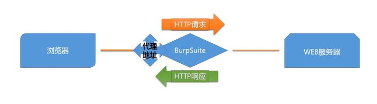
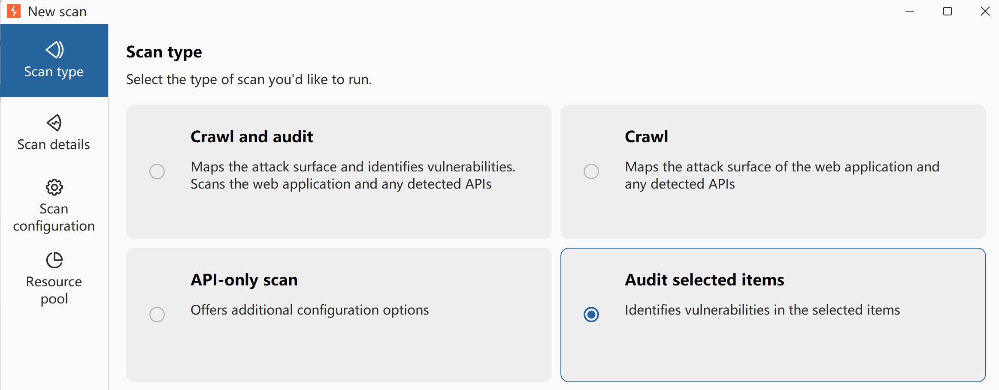

# Burp Suite

## introduction



[Burp Suite](https://portswigger.net/burp) is an integrated platform for performing security testing of web applications. It includes various tools for scanning, fuzzing, intercepting, and analysing web traffic. It is used by security professionals worldwide to find and exploit vulnerabilities in web applications.

In essence, Burp Suite is a Java-based framework designed to serve as a comprehensive solution for conducting web application penetration testing. It has become the industry standard tool for hands-on security assessments of web and mobile applications, including those that rely on application programming interfaces (APIs).

Simply put, Burp Suite captures and enables manipulation of all the HTTP/HTTPS traffic between a browser and a web server. This fundamental capability forms the backbone of the framework. By intercepting requests, users have the flexibility to route them to various components within the Burp Suite framework, which we will explore in upcoming sections. The ability to intercept, view, and modify web requests before they reach the target server or even manipulate responses before they are received by our browser makes Burp Suite an invaluable tool for manual web application testing.

<span style="font-size: 23px;">**key features**</span>

- **Proxy**: The Burp Proxy is the most renowned aspect of Burp Suite. It enables interception and modification of requests and responses while interacting with web applications.
- **Repeater**: Another well-known feature. Repeater allows for capturing, modifying, and resending the same request multiple times. This functionality is particularly useful when crafting payloads through trial and error (e.g., in SQLi - Structured Query Language Injection) or testing the functionality of an endpoint for vulnerabilities.
- **Intruder**: Despite rate limitations in Burp Suite Community, Intruder allows for spraying endpoints with requests. It is commonly utilized for brute-force attacks or fuzzing endpoints.
- **Decoder**: Decoder offers a valuable service for data transformation. It can decode captured information or encode payloads before sending them to the target. While alternative services exist for this purpose, leveraging Decoder within Burp Suite can be highly efficient.
- **Comparer**: As the name suggests, Comparer enables the comparison of two pieces of data at either the word or byte level. While not exclusive to Burp Suite, the ability to send potentially large data segments directly to a comparison tool with a single keyboard shortcut significantly accelerates the process.
- **Sequencer**: Sequencer is typically employed when assessing the randomness of tokens, such as session cookie values or other supposedly randomly generated data. If the algorithm used for generating these values lacks secure randomness, it can expose avenues for devastating attacks.

<span style="font-size: 23px;">**shortcut**</span>

| Shortcut | Tab |
| --- | --- |
| <kbd>Ctrl</kbd> + <kbd>Shift</kbd> + <kbd>D</kbd> | Dashboard |
| <kbd>Ctrl</kbd> + <kbd>Shift</kbd> + <kbd>T</kbd> | Target tab |
| <kbd>Ctrl</kbd> + <kbd>Shift</kbd> + <kbd>P</kbd> | Proxy tab |
| <kbd>Ctrl</kbd> + <kbd>Shift</kbd> + <kbd>I</kbd> | Intruder tab |
| <kbd>Ctrl</kbd> + <kbd>Shift</kbd> + <kbd>R</kbd> | Repeater tab | 

## proxy

### HTTP history

<span style="font-size: 19px;">**脚本添加自定义列**</span>

*显示服务*
```java
if (!requestResponse.hasResponse()) {
    return "";
}

var response = requestResponse.response();

return response.hasHeader("Server")
? response.headerValue("Server")
: "";
```

### Match&replace

<span style="font-size: 19px;">**脚本创建规则**</span>

*强制所有 HTTP 请求到 `https://ginandjuice.shop` 并添加 User: Admin 标头*
```java
return requestResponse.request()
    .withService(HttpService.httpService("https://ginandjuice.shop"))
    .withAddedHeader("User", "Admin")
    .withUpdatedHeader("Host", "ginandjuice.shop");
```

创建一个**响应脚本**，该脚本使用 MontoyaAPI 功能，当项目满足以下条件时，将带有Cached response (缓存响应) 注释的项目发送到 Organizer:
- 响应`X-Cache`头的值为`Hit`
```java
if(requestResponse.response().headerValue("X-Cache").contains("Hit")) {
  api().organizer().sendToOrganizer(HttpRequestResponse.httpRequestResponse(requestResponse.request(),
  requestResponse.response(), Annotations.annotations("Cached response")));
}
return requestResponse.response();
```

---

## Repeater

Burp Suite Repeater enables us to modify and resend intercepted requests to a target of our choosing. It allows us to take requests captured in the Burp Proxy and manipulate them, sending them repeatedly as needed. Alternatively, we can manually create requests from scratch, similar to using a command-line tool like cURL.

### Send group

- Send group in sequence (**single** connection): 共用同一个 TCP, A请求包 → B请求包... → N请求包 → TCP关闭(减少抖动)
- Send group in sequence (**separate** connections): 每个请求包，各自用一个TCP(模拟真实用户)
- Send group in **parallel** (single-packet attack)：并行发送组

## Intruder

Burp Suite's Intruder module is a powerful tool that allows for automated and customisable attacks. It provides the ability to modify specific parts of a request and perform repetitive tests with variations of input data. Intruder is particularly useful for tasks like fuzzing and brute-forcing, where different values need to be tested against a target.

Intruder is Burp Suite's built-in fuzzing tool that allows for automated request modification and repetitive testing with variations in input values. By using a captured request (often from the Proxy module), Intruder can send multiple requests with slightly altered values based on user-defined configurations. It serves various purposes, such as brute-forcing login forms by substituting username and password fields with values from a wordlist or performing fuzzing attacks using wordlists to test subdirectories, endpoints, or virtual hosts. Intruder's functionality is comparable to command-line tools like Wfuzz or ffuf.

There are four sub-tabs within Intruder:

- **Positions**: This tab allows us to select an attack type and configure where we want to insert our payloads in the request template.
- **Payloads**: Here we can select values to insert into the positions defined in the **Positions** tab. We have various payload options, such as loading items from a wordlist. The way these payloads are inserted into the template depends on the attack type chosen in the **Positions** tab. The **Payloads** tab also enables us to modify Intruder's behavior regarding payloads, such as defining pre-processing rules for each payload (e.g., adding a prefix or suffix, performing match and replace, or skipping payloads based on a defined regex).
- **Resource Pool**: This tab is not particularly useful in the Burp Community Edition. It allows for resource allocation among various automated tasks in Burp Professional. Without access to these automated tasks, this tab is of limited importance.
- **Settings**: This tab allows us to configure attack behavior. It primarily deals with how Burp handles results and the attack itself. For instance, we can flag requests containing specific text or define Burp's response to redirect (3xx) responses.

**Note:** The term "fuzzing" refers to the process of testing functionality or existence by applying a set of data to a parameter. For example, fuzzing for endpoints in a web application involves taking each word in a wordlist and appending it to a request URL (e.g., http://MACHINE_IP/WORD_GOES_HERE) to observe the server's response.

### Positions

When using Burp Suite Intruder to perform an attack, the first step is to examine the positions within the request where we want to insert our payloads. These positions inform Intruder about the locations where our payloads will be introduced.

Notice that Burp Suite automatically attempts to identify the most probable positions where payloads can be inserted. These positions are highlighted in green and enclosed by section marks (`§`).

### Payloads

In the Payloads tab of Burp Suite Intruder, we can create, assign, and configure payloads for our attack.

1. **Payload Sets:**
  - This section allows us to choose the position for which we want to configure a payload set and select the type of payload we want to use.
  - When using attack types that allow only a single payload set (Sniper or Battering Ram), the "Payload Set" dropdown will have only one option, regardless of the number of defined positions.
  - If we use attack types that require multiple payload sets (Pitchfork or Cluster Bomb), there will be one item in the dropdown for each position.
  - **Note:** When assigning numbers in the "Payload Set" dropdown for multiple positions, follow a top-to-bottom, left-to-right order. For example, with two positions (**username=§pentester§&password=§Expl01ted§**), the first item in the payload set dropdown would refer to the username field, and
2. **Payload settings:**
  - This section provides options specific to the selected payload type for the current payload set.
  - For example, when using the "Simple list" payload type, we can manually add or remove payloads to/from the set using the **Add** text box, **Paste** lines, or **Load** payloads from a file. The **Remove** button removes the currently selected line, and the **Clear** button clears the entire list. Be cautious with loading huge lists, as it may cause Burp to crash.
  - Each payload type will have its own set of options and functionality. Explore the options available to understand the range of possibilities.
3. **Payload Processing:**
  - In this section, we can define rules to be applied to each payload in the set before it is sent to the target.
  - For example, we can capitalize every word, skip payloads that match a regex pattern, or apply other transformations or filtering.
  - While you may not use this section frequently, it can be highly valuable when specific payload processing is required for your attack.
4. **Payload Encoding:**
  - The section allows us to customize the encoding options for our payloads.
  - By default, Burp Suite applies URL encoding to ensure the safe transmission of payloads. However, there may be cases where we want to adjust the encoding behavior.
  - We can override the default URL encoding options by modifying the list of characters to be encoded or unchecking the "URL-encode these characters" checkbox.

### Attack Types

The **Positions** tab of Burp Suite Intruder has a dropdown menu for selecting the attack type. Intruder offers four attack types, each serving a specific purpose.

1. **Sniper**: The Sniper attack type is the default and most commonly used option. It cycles through the payloads, inserting one payload at a time into each position defined in the request. Sniper attacks iterate through all the payloads in a linear fashion, allowing for precise and focused testing.It is particularly effective for single-position attacks, such as password brute-force or fuzzing for API endpoints. In a Sniper attack, we provide a set of payloads, which can be a wordlist or a range of numbers, and Intruder inserts each payload into each defined position in the request.

2. **Battering ram**: The Battering ram attack type differs from Sniper in that it sends all payloads simultaneously, each payload inserted into its respective position. This attack type is useful when testing for race conditions or when payloads need to be sent concurrently.

3. **Pitchfork**: The Pitchfork attack type enables the simultaneous testing of multiple positions with different payloads. It allows the tester to define multiple payload sets, each associated with a specific position in the request. The Pitchfork attack type is especially useful when conducting credential-stuffing attacks or when multiple positions require separate payload sets. It allows for simultaneous testing of multiple positions with different payloads.

4. **Cluster bomb**: The Cluster bomb attack type combines the Sniper and Pitchfork approaches. It performs a Sniper-like attack on each position but simultaneously tests all payloads from each set. This attack type is useful when multiple positions have different payloads, and we want to test them all together.The Cluster bomb attack type is particularly useful for credential brute-forcing scenarios where the mapping between usernames and passwords is unknown.

## Other Modules

### Decoder

The Decoder module of Burp Suite gives user data manipulation capabilities. As implied by its name, it not only decodes data intercepted during an attack but also provides the function to encode our own data, prepping it for transmission to the target. Decoder also allows us to create hashsums of data, as well as providing a Smart Decode feature, which attempts to decode provided data recursively until it is back to being plaintext (like the "Magic" function of [Cyberchef](https://gchq.github.io/CyberChef/)).

### Comparer

Comparer, as the name implies, lets us compare two pieces of data, either by ASCII words or by bytes.

### Sequencer

Sequencer allows us to evaluate the **entropy**, or randomness, of "tokens". Tokens are strings used to identify something and should ideally be generated in a cryptographically secure manner. These tokens could be session cookies or **Cross-Site Request Forgery** (CSRF) tokens used to protect form submissions. If these tokens aren't generated securely, then, in theory, we could predict upcoming token values. The implications could be substantial, for instance, if the token in question is used for password resets.

**entropy**: The measure of randomness of data in a file is known as entropy. Entropy is very useful in identifying compressed and packed malware. Packed or compressed files usually have a high entropy.

### Organizer

The Organizer module of Burp Suite is designed to help you store and annotate copies of HTTP requests that you may want to revisit later. This tool can be particularly useful for organizing your penetration testing workflow. Here are some of its key features:

- You can store requests that you want to investigate later, save requests that you've already identified as interesting, or save requests that you want to add to a report later.
- You can send HTTP requests to Burp Organizer from other Burp Modules such as **Proxy** or **Repeater**. You can do this by right-clicking the request and selecting Send to Organizer or using the default hotkey `Ctrl + o`. Each HTTP request that you send to Organizer is a read-only copy of the original request saved at the point you sent it to Organizer.
- Requests are stored in a table, which contains columns such as the request index number, the time the request was made, workflow status, Burp tool that the request was sent from, HTTP method, server hostname, URL file path, URL query string, number of parameters in the request, HTTP status code of the response, length of the response in bytes, and any notes that you have made.

---

## Scan

在 Burp Suite 中，当你点击 **New scan（新建扫描）** 时，会看到如你截图中所示的界面。这是 Burp Suite 的核心扫描配置面板。



Burp Suite 将扫描任务分为了两个核心步骤：**Crawl（爬取/爬网）** 和 **Audit（审计/漏洞扫描）**。

下面为你详细介绍界面中这四种 **Scan type（扫描类型）** 的区别和适用场景：

---

1. Crawl and audit (爬取并审计) —— **最全面的全自动扫描**
*   **做什么**：Burp 会先像搜索引擎爬虫一样**爬取**整个目标网站（寻找链接、表单、JavaScript 文件、API 接口等，绘制网站的完整结构图），然后对爬取到的所有页面和参数进行**漏洞审计（主动/被动扫描）**。
*   **适用场景**：当你拿到了一个网站的授权，想要对整个站点进行一次**全面的全自动漏洞扫描**时使用。
2. Crawl (仅爬取) —— **只资产探测，不进行攻击**
*   **做什么**：Burp 只会遍历并记录目标网站的所有 URL、目录结构和接口，**不会发送任何攻击性 Payload**。
*   **适用场景**：
    *   **前期侦察**：想先摸清网站的架构和有哪些功能页面。
    *   **防触发报警**：在不能进行破坏性测试的敏感环境下，仅用来收集网站的目录和参数，后续再进行人工分析。
3. API-only scan (仅 API 扫描) —— **针对前后端分离/微服务的扫描**
*   **做什么**：专门针对 API 接口（如 REST API、GraphQL、SOAP 或上传了 Swagger/OpenAPI 文档的接口）进行爬取和审计。它提供了更多针对 API 认证、数据格式解析的配置项。
*   **适用场景**：测试没有传统 HTML 网页的前后端分离项目、手机 App 的后台接口，或者微服务系统。
4. Audit selected items (审计选定项) —— **定向爆破/单点测试（截图中所选）**
*   **做什么**：**不对网站进行爬取**。直接对你在 Burp 的 Proxy（代理历史）或 Target（目标树）中**手动选中并发送过来的一条或多条特定请求**进行漏洞审计。
*   **适用场景**：**最常用的手动渗透测试配合方式**。当你在手动测试时，发现某一个特定的输入框或请求（例如：一个支付接口、一个复杂的查询表单）很可疑，你可以右键它选择 `Scan`，利用这个模式只针对这一个接口进行深度漏洞探测，效率极高且精准。

---

💡 **补充：左侧配置菜单介绍**

在确定了扫描类型后，你通常还需要配置左侧的其它选项：
*   **Scan details (扫描详情)**：输入目标的 URL。如果选了 Crawl，这里还可以配置**自动登录凭证**（让 Burp 带着账号密码登录进系统后台进行爬取）。
*   **Scan configuration (扫描配置)**：选择使用的**扫描策略**。你可以设置是“快速扫描”还是“深度扫描”，或者自定义只扫描 SQL 注入/XSS，不扫描其它漏洞。
*   **Resource pool (资源池)**：用来**控制扫描速度**。比如并发线程数、请求间隔时间。如果目标有 WAF，你需要在这里把速度调慢，防止 IP 被封锁，或者防止把对方服务器压垮。

### Active and Positive

在 Burp Suite 中，**主动扫描 (Active Scanning)** 和 **被动扫描 (Passive Scanning)** 是两种截然不同的漏洞检测方式。它们的核心区别在于**是否向目标服务器主动发送测试请求（Payload）**。

以下是两者的详细对比和区别：

1. 工作原理区别

*   **被动扫描 (Passive Scanning)**
    *   **原理**：Burp Suite **只分析现有的流量**（即你在浏览器中手动浏览网页时，通过 Burp Proxy 拦截并记录的请求和响应）。它不会往服务器发送任何新的、额外的请求。
    *   **行为**：像一个“旁听者”，通过规则匹配来检查传输的数据。例如：检查 HTTP 响应头是否缺少安全策略、Cookie 是否未设置 `HttpOnly` 标记、响应中是否包含敏感信息（如身份证号、邮箱、报错信息等）。
*   **主动扫描 (Active Scanning)**
    *   **原理**：Burp Suite 会**主动修改请求并向服务器发送大量带有漏洞测试载荷（Payload）的新请求**，然后分析服务器的响应来判断是否存在漏洞。
    *   **行为**：像一个“探测者”，会尝试各种攻击输入（如输入 `' OR '1'='1` 测试 SQL 注入，或输入 `<script>alert(1)</script>` 测试 XSS），并分析返回结果或延迟时间。
2. 核心维度对比

| 对比维度 | 被动扫描 (Passive Scan) | 主动扫描 (Active Scan) |
| :--- | :--- | :--- |
| **流量大小** | **极低**（零新增请求，不增加网络带宽负担）。 | **极高**（会针对每个参数尝试数百甚至数千个 Payload 请求）。 |
| **对目标的影响** | **完全无害**。不会对服务器产生任何写入或破坏性影响。 | **潜在风险**。可能导致数据库污染、触发账户锁定、甚至导致服务崩溃（DoS）。 |
| **隐蔽性/防拦截** | **极高**。因为没有异常流量，WAF（Web 应用防火墙）和 IDS（入侵检测系统）无法察觉。 | **极低**。极易被 WAF 拦截并拉黑 IP。 |
| **检测的漏洞类型** | 侧重于**配置缺陷与信息泄露**。如敏感信息泄露、不安全的 Headers、密码明文传输等。 | 侧重于**需要交互确认的漏洞**。如 SQL 注入、XSS、命令注入、任意文件读取、SSRF 等。 |
| **适用环境** | 生产/线上环境、敏感或脆弱的业务系统、日常手动测试时的后台挂载。 | 测试/预发布环境、已获得充分授权的渗透测试。 |

3. 适用场景建议

*   **什么时候用被动扫描？**
    *   在对**生产环境**进行测试，且客户要求“绝对不能影响业务运行”时。
    *   在进行常规手动渗透测试时，让被动扫描在后台运行，自动帮你找出低级漏洞和配置缺陷。
*   **什么时候用主动扫描？**
    *   在**测试环境/沙箱环境**中，希望快速、全面地覆盖各种输入点的注入类漏洞。
    *   在手动测试某个特定的接口（例如登录框、搜索框、支付接口）时，可以右键该请求发送到主动扫描器（Scan），针对性地进行深度测试。

---

## Extensions

allows developers to create additional modules for the framework.

### Turbo Intruder

[Turbo Intruder](https://github.com/portswigger/turbo-intruder) is a Burp Suite extension for sending **large numbers** of **HTTP requests** and analyzing the results. It's intended to complement Burp Intruder by handling attacks that require extreme speed or complexity.

**应用**

1. [Race Condition](../vuln/FileVuln.md#race-condition)

### Jython

To use Python modules in Burp Suite, we need to include the Jython Interpreter JAR file, which is a Java implementation of Python. The Jython Interpreter enables us to run Python-based extensions within Burp Suite.

Follow these steps to integrate Jython into Burp Suite on your local machine:

1. **Download Jython JAR**: Visit the [Jython website](https://www.jython.org/download) and download the standalone JAR archive. Look for the **Jython Standalone** option. Save the JAR file to a location on your disk.
2. **Configure Jython in Burp Suite**: Open Burp Suite and switch to the **Extensions** module. Then, go to the **Extensions settings** sub-tab.
3. **Python Environment**: Scroll down to the "Python environment" section.
4. **Set Jython JAR Location**: In the "Location of Jython standalone JAR file" field, set the path to the downloaded Jython JAR file.

Once you have completed these steps, Jython will be integrated with Burp Suite, allowing you to use Python modules in the tool. This integration significantly increases the number of available extensions and enhances your capabilities in performing various security testing and web application assessment tasks.

**Note:** The process of adding Jython to Burp Suite is the same for all operating systems, as Java is a multi-platform technology.

### The Burp Suite API

In the Burp Suite Extensions module, you have access to a wide range of API endpoints that allow you to create and integrate your modules with Burp Suite. These APIs expose various functionalities, enabling you to extend the capabilities of Burp Suite to suit your specific needs.

The Extensions APIs give developers significant power and flexibility when writing custom extensions. You can use these APIs to seamlessly interact with Burp Suite's existing functionality and tailor your extensions to perform specific tasks.

