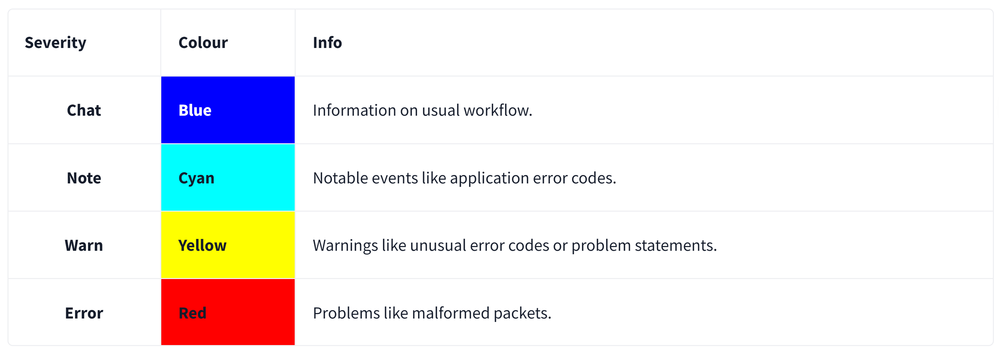
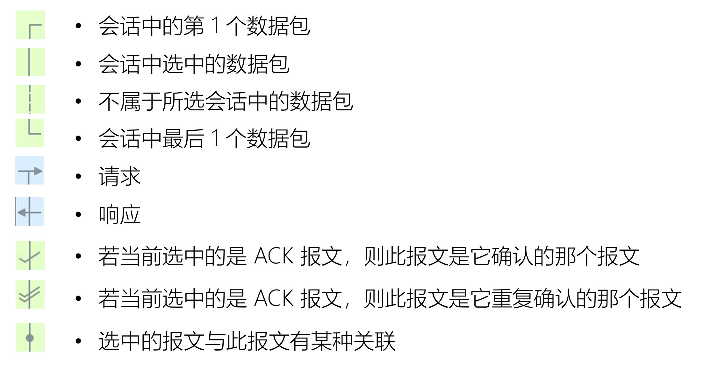
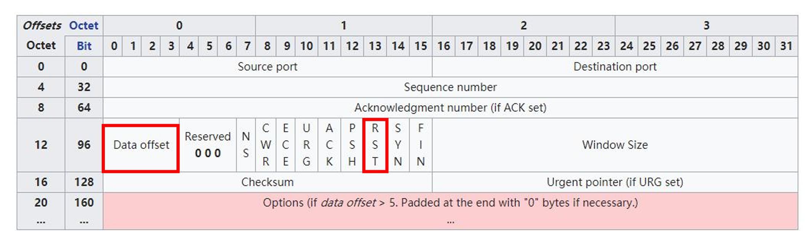

# Wireshark

[Wireshark](https://www.wireshark.org/) is an open-source, cross-platform network packet analyser tool capable of sniffing and investigating live traffic and inspecting packet captures (PCAP). It is commonly used as one of the best packet analysis tools.

**Packet capture (PCAP)** is a networking practice involving the interception of data packets travelling over a network. Once the packets are captured, they can be stored by IT teams for further analysis. The inspection of these packets allows IT teams to identify issues and solve network problems affecting daily operations.

## intro

**Packet Dissection**

Packet dissection is also known as protocol dissection, which investigates packet details by decoding available protocols and fields. Wireshark supports a long list of protocols for dissection, and you can also write your dissection scripts. You can find more details on dissection [here](https://github.com/boundary/wireshark/blob/master/doc/README.dissector).

**Note:** This section covers how Wireshark uses OSI layers to break down packets and how to use these layers for analysis.

**Packet Details**

You can click on a packet in the packet list pane to open its details (double-click will open details in a new window). Packets consist of 5 to 7 layers based on the OSI model.

We can see seven distinct layers to the packet: frame/packet, source [MAC], source [IP], protocol, protocol errors, application protocol, and application data. Below we will go over the layers in more detail.

**The Frame (Layer 1):** This will show you what frame/packet you are looking at and details specific to the Physical layer of the OSI model.

.png>)

**Source [MAC] (Layer 2):** This will show you the source and destination MAC Addresses; from the Data Link layer of the OSI model.

![Source [MAC] (Layer 2)](<assets/Source [MAC] (Layer 2).png>)

**Source [IP] (Layer 3):** This will show you the source and destination IPv4 Addresses; from the Network layer of the OSI model.

![Source [IP] (Layer 3)](<assets/Source [IP] (Layer 3).png>)

**Protocol (Layer 4):** This will show you details of the protocol used (UDP/TCP) and source and destination ports; from the Transport layer of the OSI model.

.png>)

**Protocol Errors:** This continuation of the 4th layer shows specific segments from TCP that needed to be reassembled.

![Protocol Errors]Pro(<assets/tocol Errors.png>)

**Application Protocol (Layer 5):** This will show details specific to the protocol used, such as HTTP, FTP,  and SMB. From the Application layer of the OSI model.

.png>)

**Application Data:** This extension of the 5th layer can show the application-specific data.

---

**Packet Nivagation**

**Export Objects (Files)**

Wireshark can extract files transferred through the wire. For a security analyst, it is vital to discover shared files and save them for further investigation. Exporting objects are available only for selected protocol's streams (DICOM, HTTP, IMF, SMB and TFTP).

**Expert Info**

Wireshark also detects specific states of protocols to help analysts easily spot possible anomalies and problems. Note that these are only suggestions, and there is always a chance of having false positives/negatives. Expert info can provide a group of categories in three different severities. Details are shown in the table below.

---

**Packet Filtering**

Wireshark has a powerful filter engine that helps analysts to narrow down the traffic and focus on the event of interest. Wireshark has two types of filtering approaches: capture and display filters. Capture filters are used for "**capturing**" only the packets valid for the used filter. Display filters are used for "**viewing**" the packets valid for the used filter. We will discuss these filters' differences and advanced usage in the next room. Now let's focus on basic usage of the display filters, which will help analysts in the first place.

Filters are specific queries designed for protocols available in Wireshark's official protocol reference. While the filters are only the option to investigate the event of interest, there are two different ways to filter traffic and remove the noise from the capture file. The first one uses queries, and the second uses the right-click menu. Wireshark provides a powerful GUI, and <u>there is a golden rule for analysts who don't want to write queries for basic tasks</u>: "**If you can click on it, you can filter and copy it**"

**Follow Stream**

Wireshark displays everything in packet portion size. However, it is possible to reconstruct the streams and view the raw traffic as it is presented at the application level. Following the protocol, streams help analysts recreate the application-level data and understand the event of interest. It is also possible to view the unencrypted protocol data like usernames, passwords and other transferred data.

You can use the"right-click menu" or  "`Analyse --> Follow TCP/UDP/HTTP Stream`" menu to follow traffic streams. Streams are shown in a separate dialogue box; packets originating from the server are highlighted with blue, and those originating from the client are highlighted with red.

## how2use

**数据包列表面板的标记符号**

## 过滤器

**捕获过滤器**
- 用于减少抓取的报文体积
- 使用 BPF 语法，功能相对有限

**显示过滤器**
- 对已经抓取到的报文过滤显示
- 功能强大

### BPF 过滤器

**Wireshark 捕获过滤器**

- **Berkeley Packet Filter**，在设备驱动级别提供抓包过滤接口，多数抓包工具都支持此语法
- **expression 表达式**：由多个原语组成

**Expression 表达式**

- primitives 原语：由**名称或数字**，以及描述它的多个限定词组成
  - qualifiers 限定词
    - Type：设置数字或者名称所指示类型，例如 host www.baidu.com
    - Dir：设置网络出入方向，例如 dst port 80
    - Proto：指定协议类型，例如  udp
    - 其他
  
- 原语运算符
  - 与：&& 或者 and
  - 或：|| 或者 or
  - 非：! 或者 not
- 例如：src or dst portrange 6000-8000 && tcp or ip6

**限定词**

**Type：设置数字或者名称所指示类型**

- host、port 
- net ，设定子网，net 192.168.0.0 mask 255.255.255.0  等价于 net 192.168.0.0/24
- portrange，设置端口范围，例如 portrange 6000-8000 

**Dir：设置网络出入方向**

- src、dst、src or dst、src and dst
- ra、ta、addr1、addr2、addr3、addr4（仅对 IEEE 802.11 Wireless LAN 有效）

**Proto：指定协议类型**

- ether、fddi、tr、 wlan、 ip、 ip6、 arp、 rarp、 decnet、 tcp、udp、icmp、igmp、icmp、 igrp、pim、ah、esp、vrrp

**其他**

- gateway：指明网关 IP 地址，等价于 ether host *ehost* and not host *host* 
- broadcast：广播报文，例如 ether broadcast 或者 ip broadcast
- multicast：多播报文，例如 ip multicast 或者 ip6 multicast
- less, greater：小于或者大于

**基于协议域过滤**

- 捕获所有 TCP 中的 RST 报文
  - tcp[13]&4==4 (捕获所有**包含** RST 标志位的数据包)
- 抓取 HTTP GET 报文
  - port 80 and tcp[((tcp[12:1] & 0xf0) >> 2):4] = 0x47455420
    - 注意：47455420 是 ASCII 码的 16 进制，表示"GET "
    - TCP 报头可能不只 20 字节，data offset 提示了承载数据的偏移，但它以 4 字节为单位

### 显示过滤器

**显示过滤器的过滤属性**

**任何在报文细节面板中解析出的字段名，都可以作为过滤属性**

- 在视图->内部->支持的协议面板里，可以看到各字段名对应的属性名
  - 例如，在报文细节面板中 TCP 协议头中的 Source Port，对应着过滤属性为 tcp.srcport

**过滤值比较符号**

| 英文         | 符号 | 描述及示例                                      |
| ------------ | ---- | ----------------------------------------------- |
| eq           | ==   | 等于. `ip.src==10.0.0.5`                        |
| ne           | !=   | 不等于. `ip.src!=10.0.0.5`                      |
| gt           | >    | 大于. `frame.len > 10`                          |
| lt           | <    | 小于. `frame.len < 128`                         |
| ge           | >=   | 大于等于. `frame.len ge 0x100`                  |
| le           | <=   | 小于等于. `frame.len <= 0x20`                   |
| contains     |      | 包含. `sip.To contains "a1762"`                 |
| matches      | ~    | 正则匹配. `host matches "acme\.(org\|com\|net)"`  |
| bitwise_and  | &    | 位与操作. `tcp.flags & 0x02`                    |

**过滤值类型**

- **Unsigned integer**：无符号整型，例如 ip.len le 1500
- **Signed integer**：有符号整型
- **Boolean**：布尔值，例如 tcp.flags.syn
- **Ethernet address**：以:、-或者.分隔的 6 字节地址，例如 eth.dst == ff:ff:ff:ff:ff:ff
- **IPv4 address**：例如 ip.addr == 192.168.0.1
- **IPv6 address**：例如 ipv6.addr == ::1
- **Text string**：例如 http.request.uri == "https://www.wireshark.org/"

**多个表达式间的组合**

| 英文   | 符号 | 意义及示例                                                  |
| ------ | ---- | ----------------------------------------------------------- |
| and    | &&   | AND 逻辑与. `ip.src==10.0.0.5 and tcp.flags.fin`            |
| or     | \|\| | OR 逻辑或. `ip.src==10.0.0.5 or ip.src==192.1.1.1`         |
| xor    | ^^   | XOR 逻辑异或. `tr.dst[0:3] == 0.6.29 xor tr.src[0:3] == 0.6.29` |
| not    | !    | NOT 逻辑非. `not llc`                                      |
| [...]  |      | 见 Slice 切片操作符.                                       |
| in     |      | 见集合操作符.                                               |

**其他常用操作符**

- 大括号{}集合操作符
  - 例如 tcp.port in {443 4430..4434} ，实际等价于 tcp.port == 443 || (tcp.port >= 4430 && tcp.port ⇐ 4434) 
- 中括号[]Slice 切片操作符
  - [n:m]表示 n 是起始偏移量，m 是切片长度
    - eth.src[0:3] == 00:00:83
  - [n-m]表示 n 是起始偏移量，m 是截止偏移量
    - eth.src[1-2] == 00:83
  - [:m]表示从开始处至 m 截止偏移量
    - eth.src[:4] == 00:00:83:00
  - [m:]表示 m 是起始偏移量，至字段结尾
    - eth.src[4:] == 20:20
  - [m]表示取偏移量 m 处的字节
    - eth.src[2] == 83
  - [,]使用逗号分隔时，允许以上方式同时出现
    - eth.src[0:3,1-2,:4,4:,2] ==00:00:83:00:83:00:00:83:00:20:20:83

**可用函数**

| 函数名 | 描述 |
|--------|------|
| upper  | Converts a string field to uppercase. |
| lower  | Converts a string field to lowercase. |
| len    | Returns the byte length of a string or bytes field. |
| count  | Returns the number of field occurrences in a frame. |
| string | Converts a non-string field to a string. |