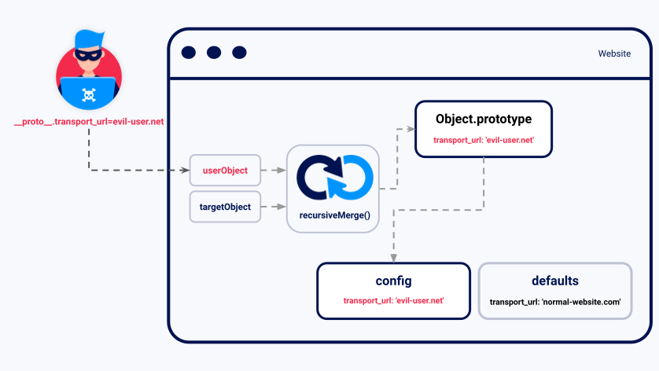

# Advanced

## GraphQL API

[GraphQL API vulnerabilities](https://portswigger.net/web-security/graphql)

GraphQL is an API query language that is designed to facilitate efficient communication between clients and servers. It enables the user to specify exactly what data they want in the response, helping to avoid the large response objects and multiple calls that can sometimes be seen with REST APIs.

GraphQL services define a contract through which a client can communicate with a server. The client doesn't need to know where the data resides. Instead, clients send queries to a GraphQL server, which fetches data from the relevant places. As GraphQL is platform-agnostic, it can be implemented with a wide range of programming languages and can be used to communicate with virtually any data store.

## Server-side template injection

[Server-side template injection](https://portswigger.net/web-security/server-side-template-injection)

## Web cache poisoning

[Web cache poisoning](https://portswigger.net/web-security/web-cache-poisoning)

## HTTP Host header

[HTTP Host header attacks](https://portswigger.net/web-security/host-header)

## HTTP request smuggling

[HTTP request smuggling](https://portswigger.net/web-security/request-smuggling)

## OAuth

[OAuth](https://portswigger.net/web-security/oauth)

## JWT

[JWT](https://portswigger.net/web-security/jwt)

## prototype pollution

[prototype pollution](https://portswigger.net/web-security/prototype-pollution) is a JavaScript vulnerability that enables an attacker to add arbitrary properties to global object prototypes, which may then be inherited by user-defined objects.

