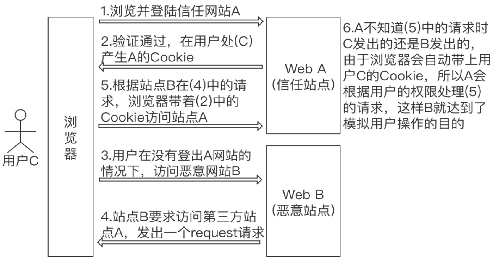

# CSRF

## intro

[Cross-site request forgery](../common.md#csrf) 简称为 **[CSRF](../webapp/ClientSideAttacks.md#csrf)** ，在CSRF的攻击场景中攻击者会伪造一个请求（这个请求一般是一个链接），然后欺骗目标用户进行点击，用户一旦点击了这个请求，整个攻击就完成了。所以CSRF攻击也成为"one click"攻击。

- 利用浏览器自动携带 Cookie

**同源策略**

[SOP](../common.md#sop)(Same-origin policy) 浏览器的一项安全机制，限制一个源的文档或脚本如何与另一个源的资源进行交互。

[同源策略与跨域访问](../web/HTTPProtocol.md#同源策略与跨域访问)

## 其它类似攻击

### 点击劫持

点击劫持(Clickjacking)又名 UI- 覆盖攻击，因为该攻击会劫持用户的点击操作，所以被命名为点击劫持，这是一种视觉上的欺骗手段。

主要劫持目标是含有重要会话交互的页面，如银行交易页面、后台管理页面等。

在 Web 页面中隐藏了一个透明的 [iframe](../cyber/web.md#iframe)，配合 `opacity` 和 `z-index`等 CSS 属性， 用外层假页面诱导用户点击，实际上是在隐藏的 iframe 上触发了点击事件进行用户不知情的操作。

::: details ClickjackingDemo
<<< ../files/html/ClickjackingDemo.html
:::

防范方式：在响应头中设置`X-Frame-Options`头部，可以设置三个值：
- `DENY`：表示该页面不允许在 frame 中展示，即使在相同域名的页面中嵌套也不允许
- `sameorigin`：表示该页面可以在相同域名页面的 frame 中展示
- `allow-from uri`：表示该页面可以在指定来源的 frame 中展示

### URL跳转漏洞 

- 服务端告知浏览器跳转时，未对传入的跳转地址进行合法性校验，导致用户浏览器跳转到钓鱼页面。
- 防范方式：在 URL 链接里加入验证 token 。
