# HTTP/2 Protocol

## intro

<span style="font-size: 19px;">**HTTP/1.1问题**</span>

- 随着带宽的增加，延迟并没有显著下降
- 并发连接有限
- 同一连接同时只能在完成一个 HTTP 事务（请求/响应）才能处理下一个事务
- 单连接上的串行请求
- 无状态导致的高传输量（低网络效率）
- HTTP/1.1 不支持服务器推送消息

<span style="font-size: 23px;">**HTTP/2 特性**</span>

- SPDY（2012-2016）
- HTTP2（RFC7540，2015.5）
  - 在应用层上修改，基于并充分挖掘 TCP 协议性能
  - 客户端向 server 发送 request 这种基本模型不会变。
  - 老的 scheme 不会变，没有 http2://。
  - 使用 http/1.x 的客户端和服务器可以无缝的通过代理方式转接到 http/2 上。
  - 不识别 http/2 的代理服务器可以将请求降级到 http/1.x

**HTTP/2 主要特性**

- **传输数据量的大幅减少**
  - 以二进制方式传输
  - 标头压缩
- **多路复用及相关功能**
  - 消息优先级
- **服务器消息推送**
  - 并行推送


### TLS/SSL 报文

<span style="font-size: 19px;">**在 HTTP/2 应用层协议之下的 TLS 层**</span>

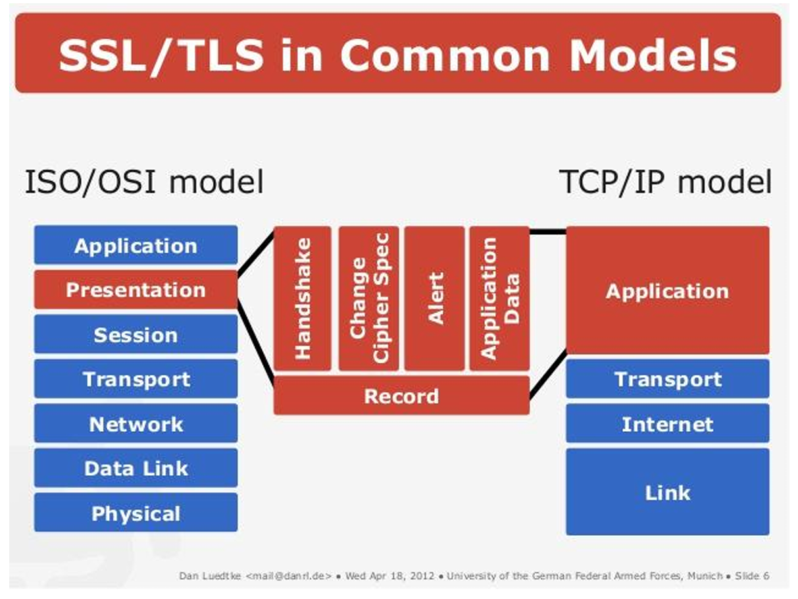

<span style="font-size: 19px;">**TLS1.2 的加密算法**</span>

**常见加密套件**


**对称加密算法：AES_128_GCM**
  - 每次建立连接后，加密密钥都不一样
  
**密钥生成算法：ECDHE**
  - 客户端与服务器通过交换部分信息，各自独立生成最终一致的密钥

[如何使用 Wireshark 解密 TLS/SSL 报文](../security/wireshark.md#解密tls-ssl报文)


<span style="font-size: 19px;">**二进制格式与可见性**</span>

- **TLS/SSL 降低了可见性门槛**
  - 代理服务器没有私钥不能看到内容


## http2会话

<span style="font-size: 23px;">**如何从 `http://`升级到 `HTTP/2` 协议？**</span>

<span style="font-size: 19px;">**HTTP/2 是不是必须基于 TLS/SSL 协议？**</span>

- IETF 标准不要求必须基于TLS/SSL协议
- 浏览器要求必须基于TLS/SSL协议
- 在 TLS 层 ALPN (Application Layer Protocol Negotiation)扩展做协商，只认 HTTP/1.x 的代理服务器不会干扰 HTTP/2
- shema：`http://`和 `https://` 默认基于 80 和 443 端口
- **h2**：基于 TLS 协议运行的 HTTP/2 被称为 h2
- **h2c**：直接在 TCP 协议之上运行的 HTTP/2 被称为 h2c

<span style="font-size: 19px;">**h2 与 h2c**</span>

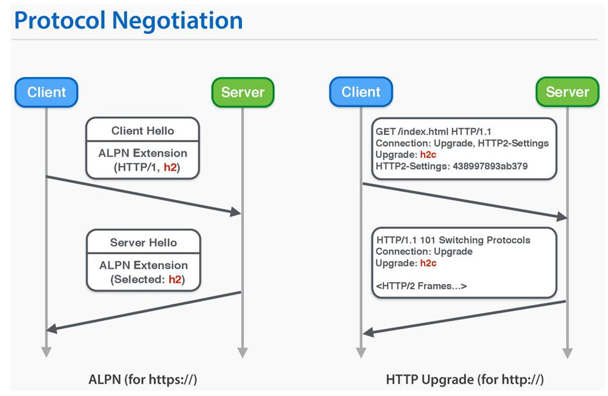

### h2c

<span style="font-size: 19px;">**在 TCP 协议之上升级到http2**</span>

*客户端测试工具：curl(7.46.0版本)*
```bash
curl http://nghttp2.org --http2 -v
```

*tcpdunp抓包*
```bash
tcpdump -i eth0 port 80 and host nghttp2.org -w h2c.pcap
```
<span style="font-size: 19px;">**H2C：客户端发送的 Magic 帧**</span>

Preface（ASCII 编码，12字节）
- 何时发送？
  - 接收到服务器发送来的 101 Switching Protocols
  - TLS 握手成功后
- Preface 内容
  - `0x505249202a20485454502f322e300d0a0d0a534d0d0a0d0a`
  - PRI * HTTP/2.0\r\n\r\nSM\r\n\r\n
- 发送完毕后，应紧跟 SETTING 帧

### h2

<span style="font-size: 19px;">**在 TLS 协议之上升级到http2**</span>

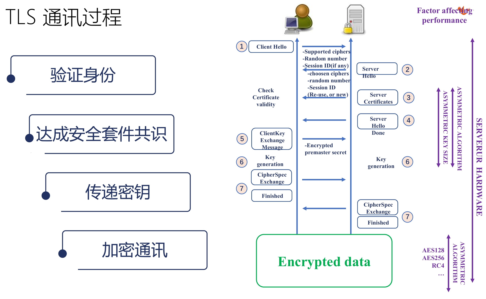

<span style="font-size: 19px;">**Application-Layer Protocol Negotiation Extension**</span>

- **RFC7301**


### Stream-Message—Frame

<span style="font-size: 19px;">**HTTP/2 核心概念**</span>

- **连接 Connection**：1个 TCP 连接，包含一个或者多个 Stream
- **数据流 Stream**：一个双向通讯数据流，包含1 条或者多条 Message
- **消息 Message**：对应 HTTP/1 中的请求或者响应，包含一条或者多条 Frame
- **数据帧 Frame**：最小单位，以二进制压缩格式存放 HTTP/1 中的内容

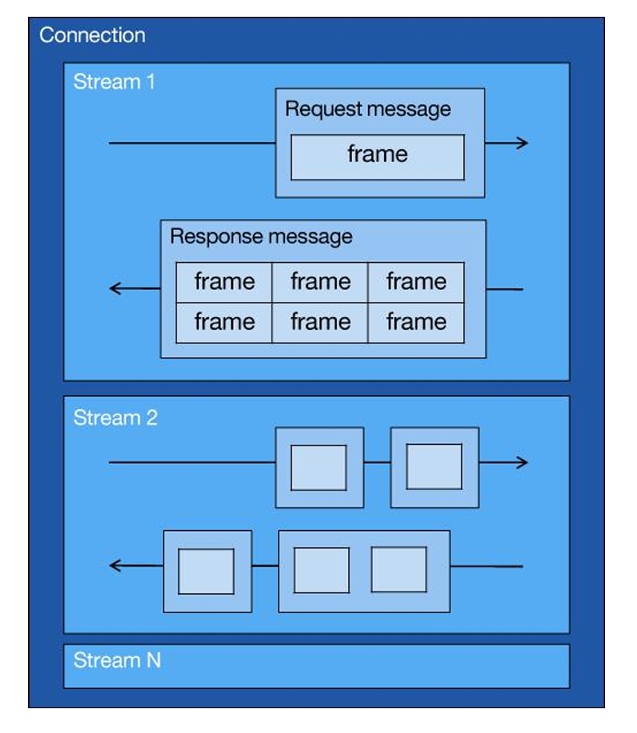

<span style="font-size: 19px;">**Stream、Message、Frame 间的关系**</span>

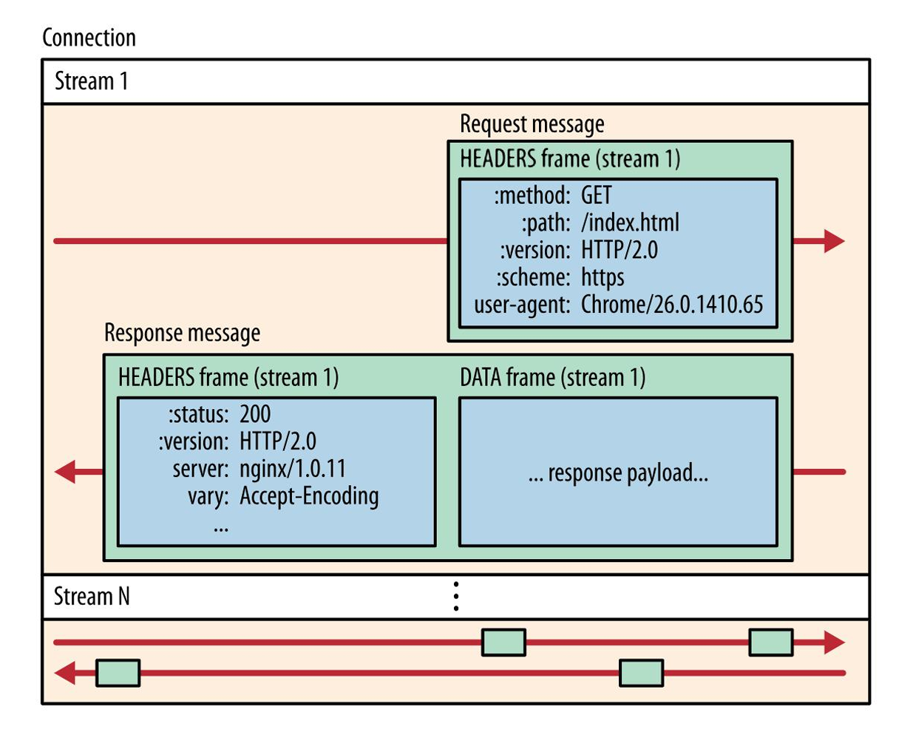

<span style="font-size: 19px;">**消息的组成：HEADERS 帧与 DATA 帧**</span>

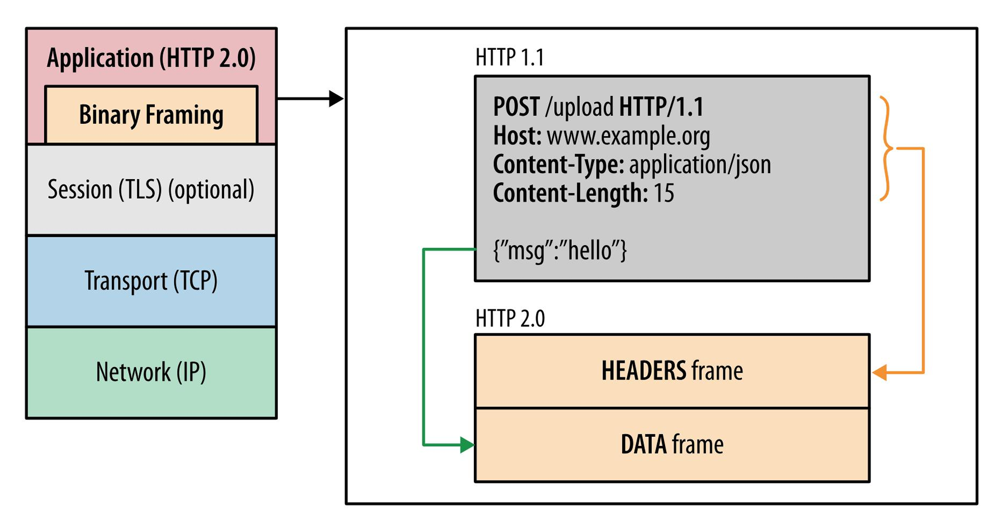

<span style="font-size: 19px;">**stream间传输中无序，接收时组装**</span>

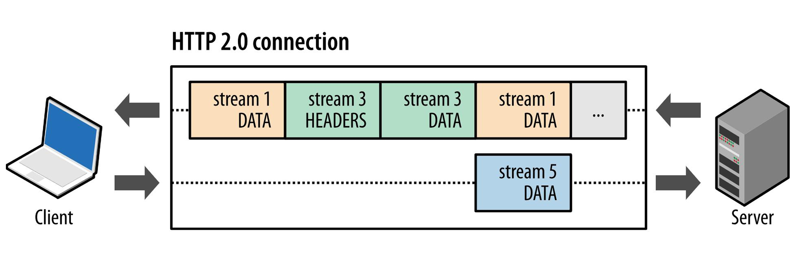

<span style="font-size: 19px;">**消息与帧**</span>

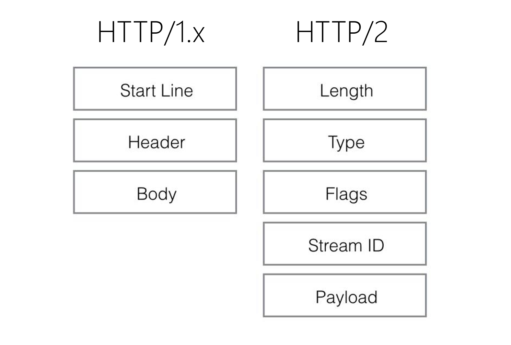

### Stream流ID

<span style="font-size: 23px;">**Stream ID 的作用**</span>

<span style="font-size: 19px;">**实现多路复用的关键**</span>

- 接收端的实现可据此并发组装消息
- 同一 Stream 内的 frame 必须是有序的（无法并发）
- SETTINGS_MAX_CONCURRENT_STREAMS 控制着并发 Stream 数

<span style="font-size: 19px;">**推送依赖性请求的关键**</span>

- 由**客户端主动创建的流**必须是**奇数**
- 由服务器主动创建的流必须是偶数

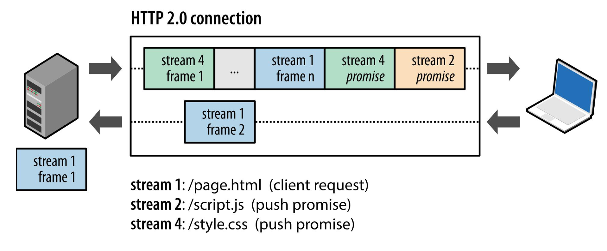

<span style="font-size: 19px;">**流状态管理的约束性规定**</span>

- 新建立的流 ID 必须大于曾经建立过的状态为 opened 或者 reserved 的流 ID
- 在新建立的流上发送帧时，意味着将更小 ID 且为 idle 状态的流置为 closed 状态
- Stream ID 不能复用，长连接耗尽 ID 应创建新连接

<span style="font-size: 19px;">**其它作用**</span>

- HTTP/2 **应用层流量控制**，只对 **DATA 数据帧**生效
- Stream **ID=0** 是全局连接控制流，只用来传连接级控制帧，绝不传输任何业务请求 / 响应数据
- HTTP/1.1 升级到 h2c（明文 HTTP/2）时，原 HTTP/1.1 请求会映射为流 ID=1；客户端完成请求发送后，该流立即进入 half-closed (local) 状态，仅用于接收服务器响应，不能再发送新请求数据

### 9字节标准帧头部

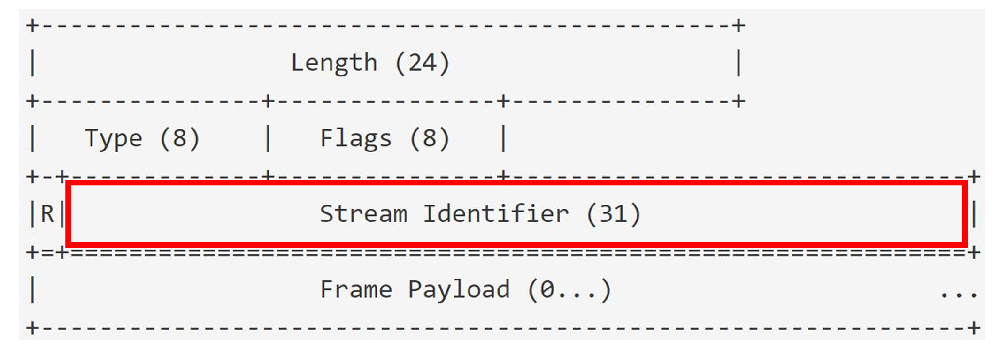

<span style="font-size: 19px;">**9 字节标准帧头部：帧长度**</span>

- **0 至 2<sup>14</sup> (16,384) -1**
  - 所有实现必须可以支持 16KB 以下的帧
- **2<sup>14</sup> (16,384) 至 2<sup>24</sup>-1 (16,777,215)** 
  - 传递 16KB 到 16MB 的帧时，必须接收端首先公布自己可以处理此大小
    - 通过 SETTINGS_MAX_FRAME_SIZE 帧（Identifier=5）告知

### 帧类型及设置帧的子类型

<span style="font-size: 19px;">**帧类型 Type**</span>

| 帧类型           | 类型编码 | 用途                                       |
| ---------------- | -------- | ------------------------------------------ |
| DATA             | 0x0      | 传递HTTP包体                               |
| HEADERS          | 0x1      | 传递HTTP头部                               |
| PRIORITY         | 0x2      | 指定Stream流的优先级                       |
| RST_STREAM       | 0x3      | 终止Stream流                               |
| SETTINGS         | 0x4      | 修改连接或者Stream流的配置                 |
| PUSH_PROMISE     | 0x5      | 服务端推送资源时描述请求的帧               |
| PING             | 0x6      | 心跳检测，兼具计算RTT往返时间的功能       |
| GOAWAY           | 0x7      | 优雅的终止连接或者通知错误                 |
| WINDOW_UPDATE    | 0x8      | 实现流量控制                               |
| CONTINUATION     | 0x9      | 传递较大HTTP头部时的持续帧                 |

<span style="font-size: 19px;">**Settings 设置帧格式(type=0x4)**</span>

- 设置帧并不是“协商”，而是发送方向接收方**通知**其特性、能力
- 一个设置帧可同时设置多个对象
- Identifier：设置对象
- Value：设置值


<span style="font-size: 19px;">**Settings 设置对象(Identifier)的类型**</span>

- **设置类型**
  - SETTINGS_HEADER_TABLE_SIZE (0x1): 通知对端索引表的最大尺寸（单位字节，初始 4096 字节）
  - SETTINGS_ENABLE_PUSH (0x2): Value设置为 0 时可禁用服务器推送功能，1 表示启用推送功能
  - SETTINGS_MAX_CONCURRENT_STREAMS (0x3): 告诉接收端允许的最大并发流数量
  - SETTINGS_INITIAL_WINDOW_SIZE (0x4): 声明发送端的窗口大小，用于Stream级别流控，初始值2^16-1 (65,535)字节
  - SETTINGS_MAX_FRAME_SIZE (0x5):设置帧的最大大小，初始值 2^14 (16,384)字节
  - SETTINGS_MAX_HEADER_LIST_SIZE (0x6): 知会对端头部索引表的最大尺寸，单位字节，基于未压缩前的头部

## HPACK

**HPACK**（RFC 7541）是**HTTP/2 专用头部压缩算法**，专门压缩 HTTP 请求 / 响应的 **Header头部**。


三种压缩方式
- 静态字典
- 动态字典
- 压缩算法：Huffman 编码（最高压缩比 8:5）

<span style="font-size: 19px;">**静态字典**</span>

[静态字典附录表](https://httpwg.org/specs/rfc7541.html#static.table.definition)

<span style="font-size: 19px;">**HPACK 压缩示意**</span>

- 同一个索引空间的 HEADER 表


<span style="font-size: 19px;">**索引表用法示意**</span>

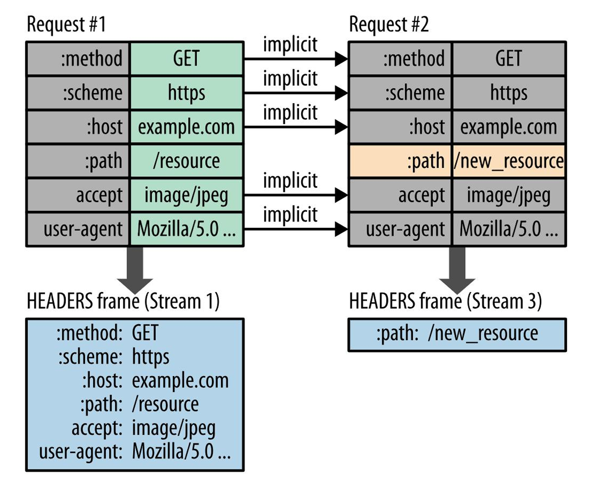

### Huffman树编码

- 原理：出现概率较大的符号采用较短的编码，概率较小的符号采用较长的编码
- 静态 Huffman 编码
  - [huffman.code](https://httpwg.org/specs/rfc7541.html#huffman.code)
- 动态 Huffman 编码

<span style="font-size: 19px;">**Huffman 树的构造过程**</span>

1. 计算各字母的出现概率
2. 将出现频率最小的两个字母相加构成子树，左小右大
3. 重复步骤 2，直至完成树的构造
4. 给树的左链接编码为 0，右链接编码为 1
5. 每个字母的编码即从根结点至所在叶结点中所有链接的编

### 变长整数编码

<span style="font-size: 19px;">**使用 N 位前缀：整型的编码过程**</span>

```txt
if I < 2^N - 1, encode I on N bits 
else 
    encode (2^N - 1) on N bits 
    I = I - (2^N - 1) 
    while I >= 128 
        encode (I % 128 + 128) on 8 bits 
        I = I / 128 
    encode I on 8 bits
```
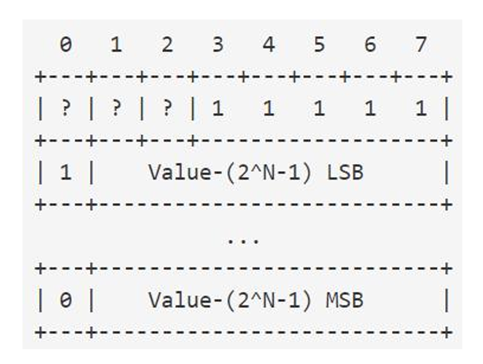

### HEADER的编码格式

<span style="font-size: 19px;">**HEADER 帧的格式**</span>

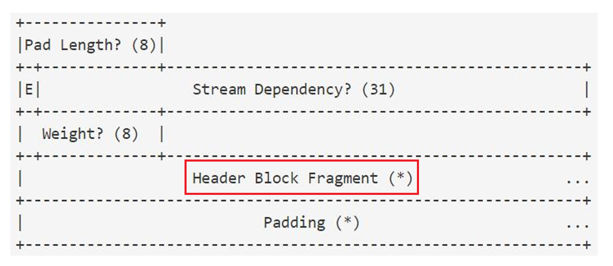

<span style="font-size: 19px;">**CONTINUATION持续帧(type=0x9)**</span>

- 跟在 HEADER 帧或者 PUSH_PROMISE 帧之后，补充完整的 HTTP 头部

<span style="font-size: 19px;">**同一地址空间下的静态表与动态表**</span>

- **静态表：61 项**
- **动态表：先入先出的淘汰策略**
  - 动态表大小由 SETTINGS_HEADER_TABLE_SIZE 设置帧定义
  - 允许重复项
  - 初始为空

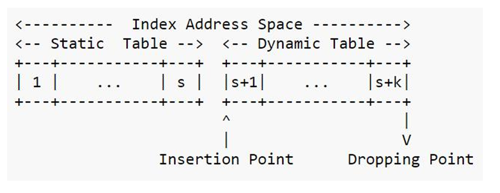

<span style="font-size: 23px;">**字面编码**</span>

- **组成**
  - header name 和 value 以索引方式编码
  - header name 以索引方式编码，而 header value 以字面形式编码
  - header name 和 value 都以字面形式编码
- **可控制是否进入动态表**
  - 进入动态表，供后续传输优化使用
  - 不进入动态表
  - 不进入动态表，并约定该头部永远不进入动态表

<span style="font-size: 23px;">**HEADER 二进制编码格式**</span>

1. **名称与值都在索引表中 (包括静态表与动态表)**
  - 编码方式：首位传 1，其余 7 位传索引号

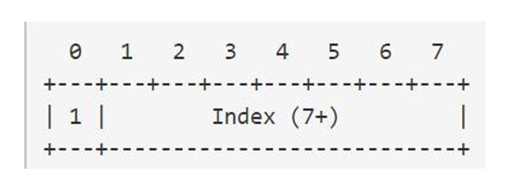

- 例如
  - method: GET在静态索引表中序号为 2，其表示应为 1000 0010，HEX 表示为 82

2. **名称在索引表中，值需要编码传递，同时新增至动态表中**
- 前 2 位传 01
- 名称举例
  - if-none-match 在静态索引表中序号为 41, 表示为 01101001, HEX 表示为 69
- 值举例
  - "5cb816f5-19d8"
  - value长度 15 个字节，采用 Huffman 编码(H 为1)
    - 10001100
  - 8c `fe 5b 24 6f 05 c9 5b 58 2f c8 f7 f3`

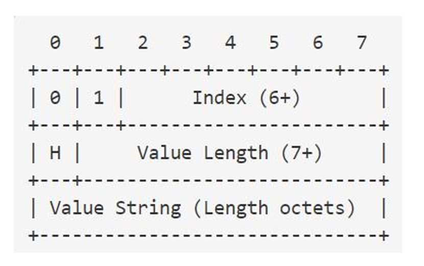

3. **名称、值都需要编码传递，同时新增至动态表中**
- 前 2 位传 01

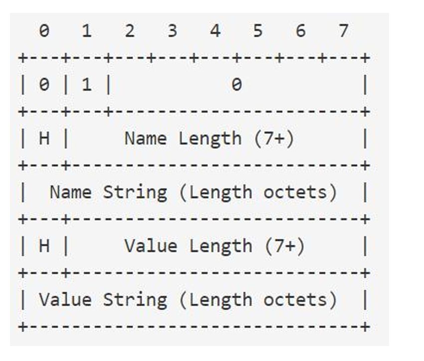

4. **名称在索引表中，值需要编码传递，且不更新至动态表中**
- 前 4 位传 0000
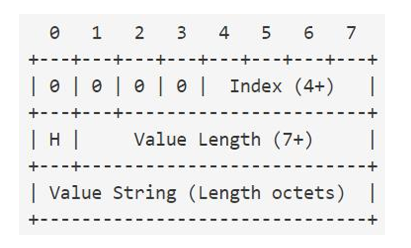

5. **名称、值都需要编码传递，且不更新至动态表中**
- 前 4 位传 0000
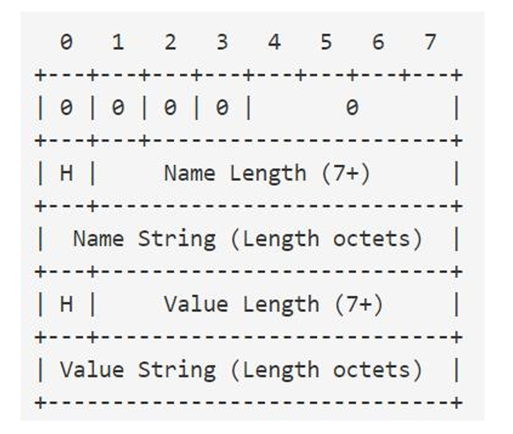

6. **名称在索引表中，值需要编码传递，且永远不更新至动态表中**
- 前 4 位传 0001
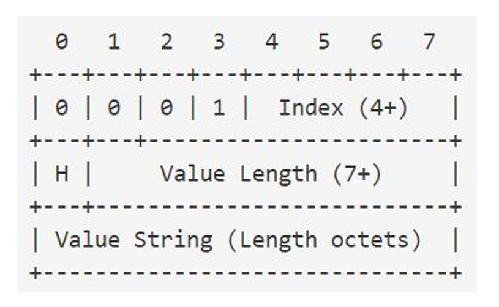

7. **名称、值都需要编码传递，且永远不更新至动态表中**
- 前 4 位传 0001
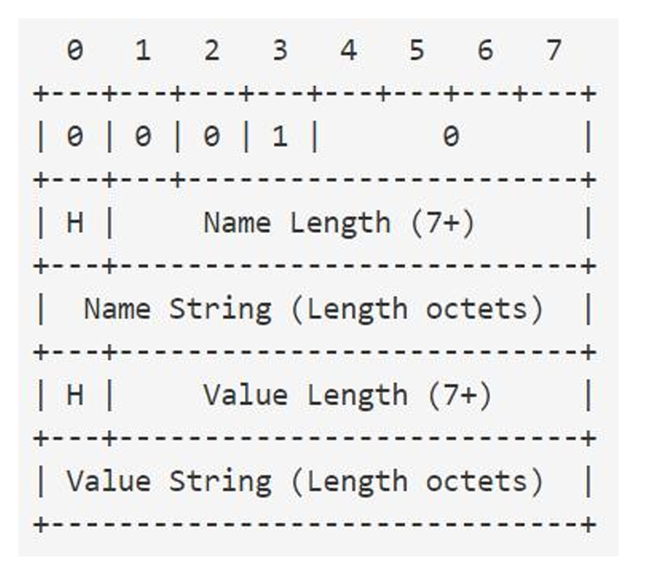

<span style="font-size: 23px;">**动态表大小的两种控制方式**</span>

- **在 HEADER 帧中直接修改**

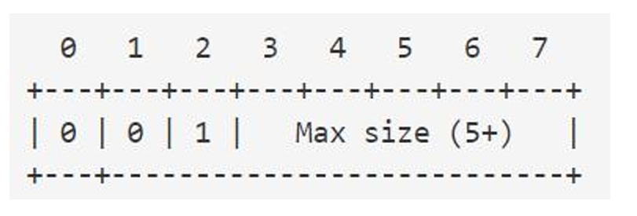

- **在 SETTING 帧中修改**
  - SETTINGS_MAX_HEADER_LIST_SIZE (0x6)

---

## 服务端推送

<span style="font-size: 19px;">**服务器推送的价值**</span>

- **提前将资源推送至浏览器缓存**
- **特性**
  - 推送可以基于已经发送的请求，例如客户端请求 html，主动推送 js 文件
- **实现方式**
  - 推送资源必须对应一个请求
  - **对应的请求**由服务器端PUSH_PROMISE 帧发送
  - 响应在偶数 ID 的 STREAM 中发送

<span style="font-size: 19px;">**当获取 HTML 后，需要 CSS 资源时**</span>

**PUSH_PROMISE 方式**
- 在 Stream1 中通知客户端 CSS 资源即将来临
- 在 Stream2 中发送 CSS 资源(Stream1 和 2 可以并发)

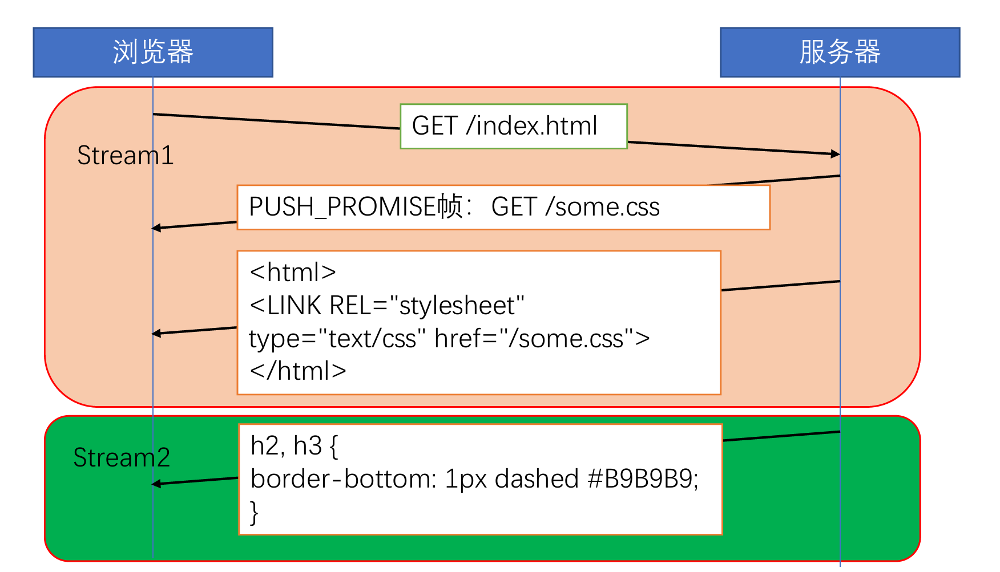

<span style="font-size: 19px;">**服务器推送 PUSH**</span>

**PUSH 帧的格式**
- PUSH_PROMISE 帧，type=0x5，只能由服务器发送


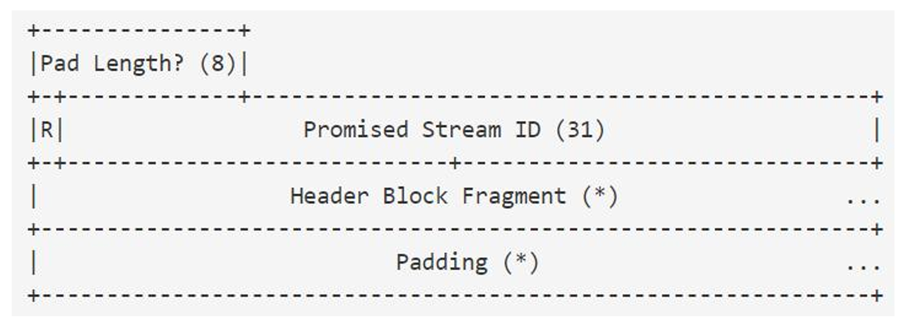

<span style="font-size: 19px;">**PUSH 推送模式的禁用**</span>

- SETTINGS_ENABLE_PUSH（0x2）
  - 1表示启用推送功能
  - 0表示禁用推送功能

## stream的状态变迁

<span style="font-size: 19px;">**Stream 特性**</span>

- 一条 TCP 连接上，可以并发存在多个处于 **OPEN状态**的 Stream 
- 客户端或者服务器都可以创建新的 Stream
- 客户端或者服务器都可以首先关闭 Stream
- 同一条 Stream 内的 Frame 帧是有序的
- 从 Stream ID 的值可以轻易分辨 PUSH 消息
  - 所有为发送 HEADER/DATA 消息而创建的流，从1、3、5 等递增奇数开始
  - 所有为发送 PUSH 消息而创建的流，从 2、4、6 等递增偶数开始

<span style="font-size: 19px;">**Message 特性**</span>

- 一条 HTTP Message 由 1 个 HEADER（可能含有 0 个或者多个持续帧构成）及 0 个或者多个 DATA 帧构成
- HEADER 消息同时包含 HTTP/1.1 中的 start line 与 headers 部分
- 取消 HTTP/1.1 中的不定长 Chunk 消息

<span style="font-size: 23px;">**Stream 流的状态**</span>

- 帧符号
  - H: HEADERS 帧
  - PP: PUSH_PROMISE 帧
  - ES: END_STREAM 标志位 
  - R: RST_STREAM 帧
- 流状态
  - idle：起始状态
  - closed
  - open：可以发送任何帧
  - half closed 单向关闭
    - remote：不再接收数据帧
    - local：不能再发送数据帧
- reserved
  - remote
  - local

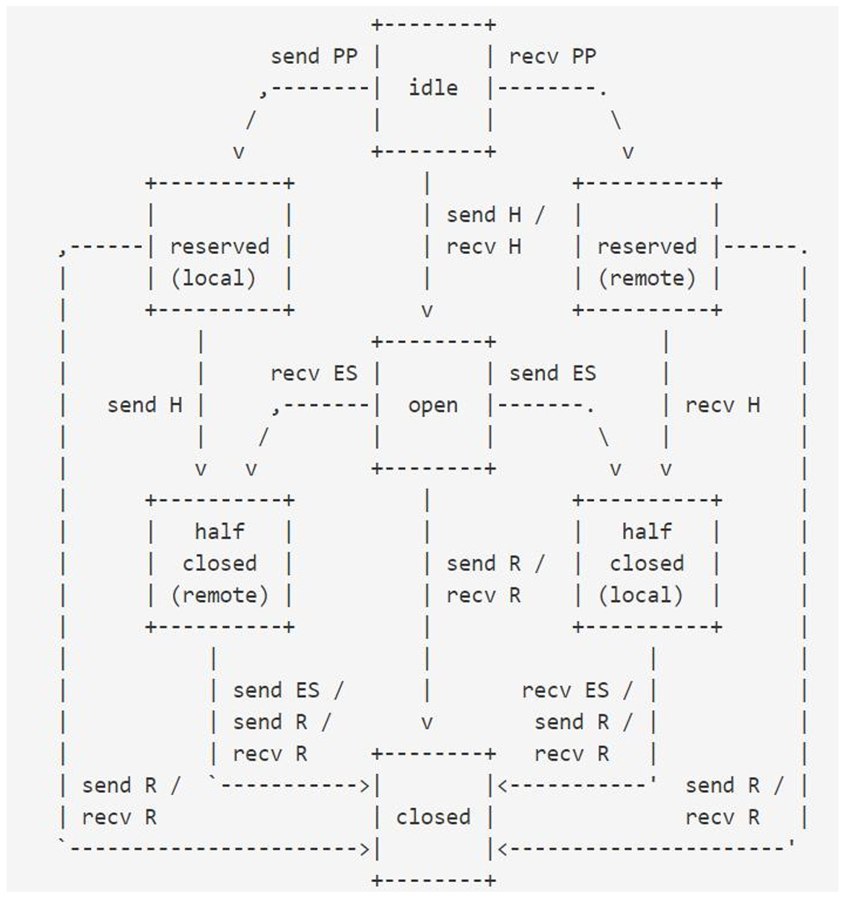

### RST_STREAM帧

<span style="font-size: 19px;">**RST_STREAM 帧(type=0x3)**</span>

- HTTP2 多个流共享同一连接，RST 帧允许立刻终止一个未完成的流
- RST_STRAM 帧不使用任何 flag
- RST_STREAM 帧的格式

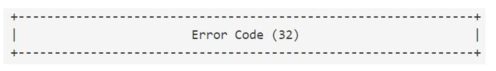

### error_code 

<span style="font-size: 23px;">**常见错误码**</span>

- NO_ERROR (0x0): 没有错误。GOAWAY帧优雅关闭连接时可以使用此错误码 
- PROTOCOL_ERROR (0x1): 检测到不识别的协议字段
- INTERNAL_ERROR (0x2):内部错误 
- FLOW_CONTROL_ERROR (0x3): 检测到对端没有遵守流控策略 
- SETTINGS_TIMEOUT (0x4): 某些设置帧发出后需要接收端应答，在期待时间内没有得到应答则由此错误码表示

- STREAM_CLOSED (0x5): 当Stream已经处于半关闭状态不再接收Frame帧时，又接收到了新的Frame帧 
- FRAME_SIZE_ERROR (0x6): 接收到的Frame Size不合法
- REFUSED_STREAM (0x7): 拒绝先前的Stream流的执行 
- CANCEL (0x8): 表示Stream不再存在
- COMPRESSION_ERROR (0x9): 对HPACK压缩算法执行失败

- CONNECT_ERROR (0xa): 连接失败 
- ENHANCE_YOUR_CALM (0xb): 检测到对端的行为可能导致负载的持续增加，提醒对方“冷静”一点 
- INADEQUATE_SECURITY (0xc): 安全等级不够 
- HTTP_1_1_REQUIRED (0xd): 对端只能接受HTTP/1.1协议

### 请求的优先级

<span style="font-size: 19px;">**Priority 优先级设置帧**</span>

- 帧类型：type=0x2
- 不使用 flag 标志位字段
- Stream Dependency：依赖流
- Weight权重：取值范围为 1 到 256。默认权重16
- 仅针对 Stream 流，若 ID 为 0 试图影响连接，则接收端必须报错
- 在 idle 和 closed 状态下，仍然可以发送 Priority 帧

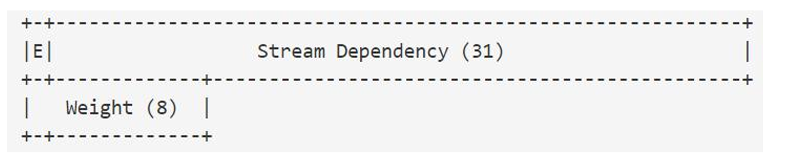

<span style="font-size: 19px;">**数据流优先级**</span>

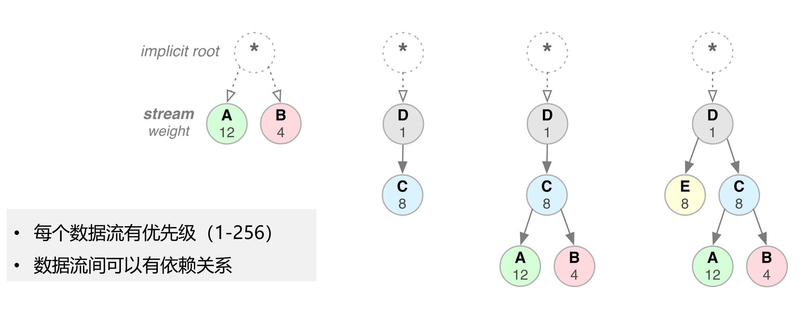

<span style="font-size: 19px;">**exclusive 标志位**</span>

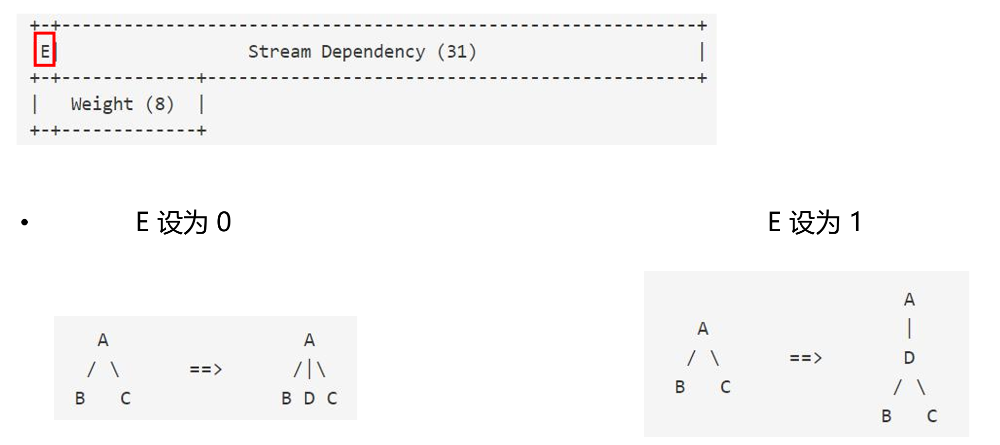

##  应用层流控

<span style="font-size: 19px;">**为什么需要HTTP/2 应用层流控？**</span>

- HTTP/2 中，多路复用意味着多个 Stream 必须共享 TCP 层的流量控制
  - 问题：多 Stream 争夺 TCP 的流控制，互相干扰可能造成 Stream 阻塞
  - 代理服务器内存有限，上下游网速不一致时，通过流控管理内存

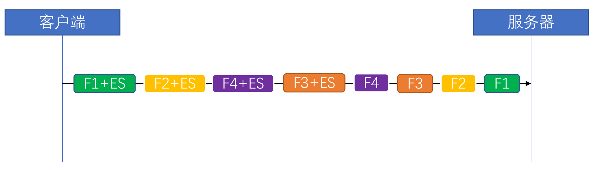

<span style="font-size: 19px;">**由应用层决定发送速度**</span>

**HTTP/2 中的流控制既针对单个 Stream，也针对整个 TCP 连接**
- 客户端与服务器都具备流量控制能力
- 单向流控制：发送和接收独立设定流量控制
- 以信用为基础：接收端设定上限，发送端应当遵循接收端发出的指令
- 流量控制窗口（流或者连接）的初始值是 65535 字节
- 只有 DATA 帧服从流量控制
- 流量控制不能被禁用

<span style="font-size: 19px;">**WINDOW_UPDATE 帧**</span>

- type=0x8，不使用任何 flag
- 窗口范围 1 to 2<sup>31</sup>-1 (2,147,483,647)字节
  - 0 是错误的，接收端应返回 PROTOCOL_ERROR
- 当 Stream ID 为 0 时表示对连接流控，否则为对 Stream 流控
- 流控仅针对直接建立 TCP 连接的两端
  - 代理服务器并不需要透传 WINDOW_UPDATE 帧
    - 接收端的缩小流控窗口会最终传递到源发送端

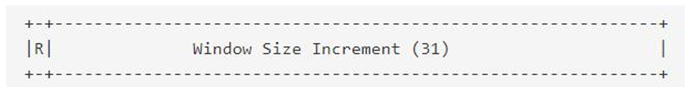

<span style="font-size: 19px;">**流控制窗口**</span>

- 窗口大小由接收端告知
- 窗口随着 DATA 帧的发送而减少

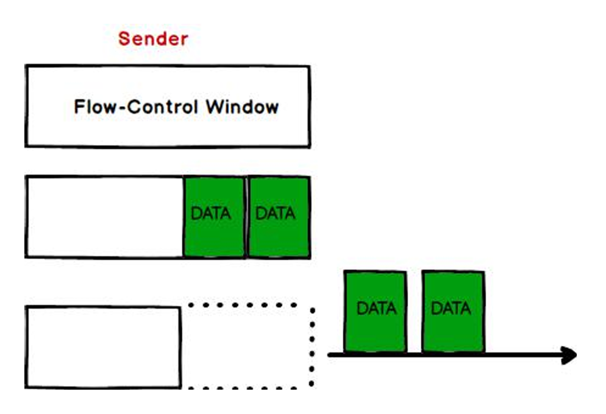

<span style="font-size: 19px;">**SETTINGS_MAX_CONCURRENT_STREAMS 并发流**</span>

- 并发仅统计 open 或者 half-close 状态的流（不包含用于推送的 reserved 状态）
- 超出限制后的错误码
  - PROTOCOL_ERROR
  - REFUSED_STREAM

## gRPC 框架

<span style="font-size: 19px;">**gRPC：支持多语言编程、基于 HTTP/2 通讯的中间件**</span>

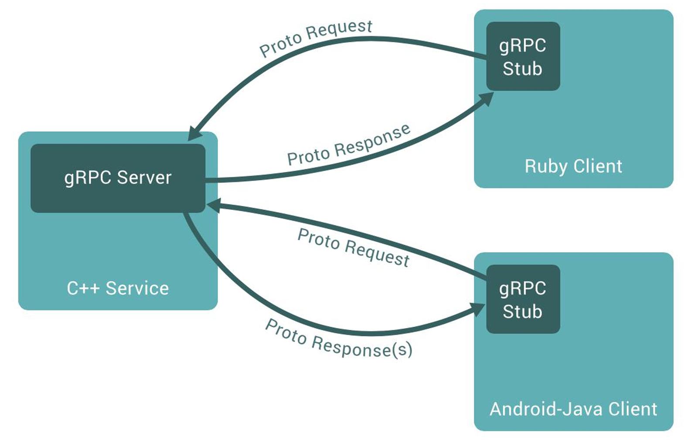

<span style="font-size: 19px;">**gRPC测试**</span>

[gRPC官网](https://grpc.io/)

[基于 Python 快速入门](https://grpc.io/docs/languages/python/quickstart/)

<span style="font-size: 19px;">**Protocol Buffers 编码**</span>

**消息结构**


**数据类型 Wire Type**


**Protocol Buffers 字符串编码举例**


---

