# IP Protocol

## intro

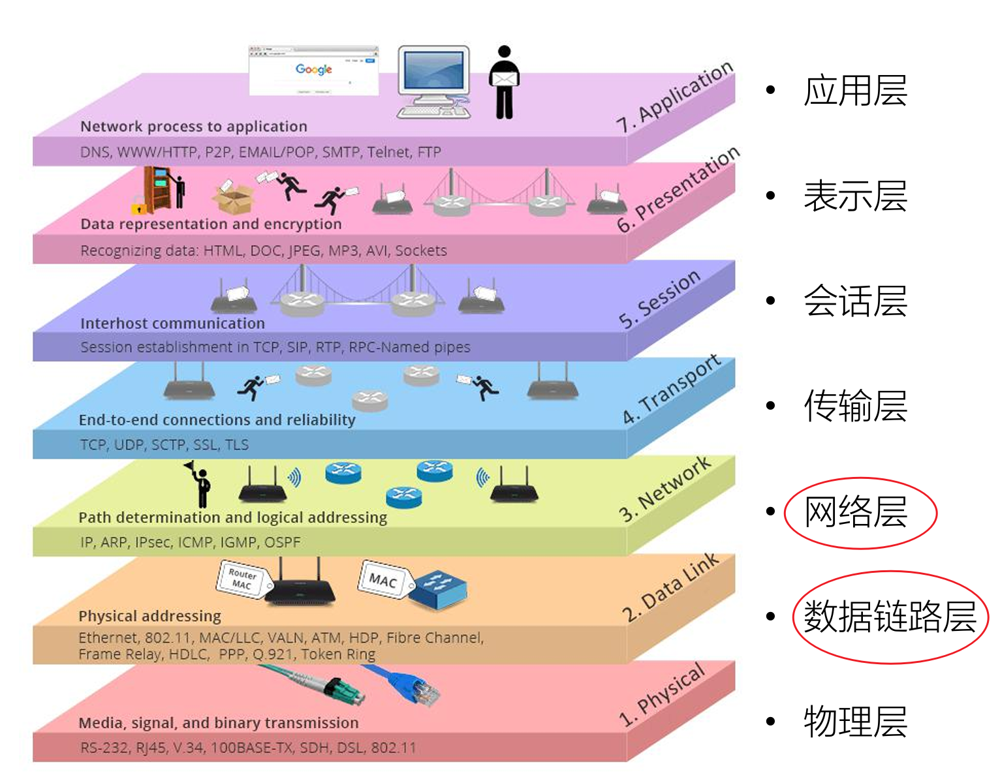

**网络层功能**

- IP 寻址
- 选路
- 封装打包
- 分片

**数据链路层功能**

- 逻辑链路控制
- 媒体访问控制
- 封装链路层帧
- MAC 寻址
- 差错检测与处理
- 定义物理层标准

**细腰结构：IP 网络层的核心地位**

- **性能至上**的 IP 层
  - 无连接
  - 非可靠
  - 无确认

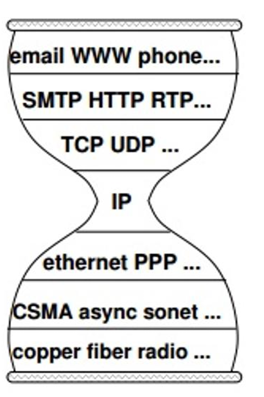

**多播：广播与组播**

- 全球作用域
- 组织内
- 场点内
- 本地链路层
- 本机作用

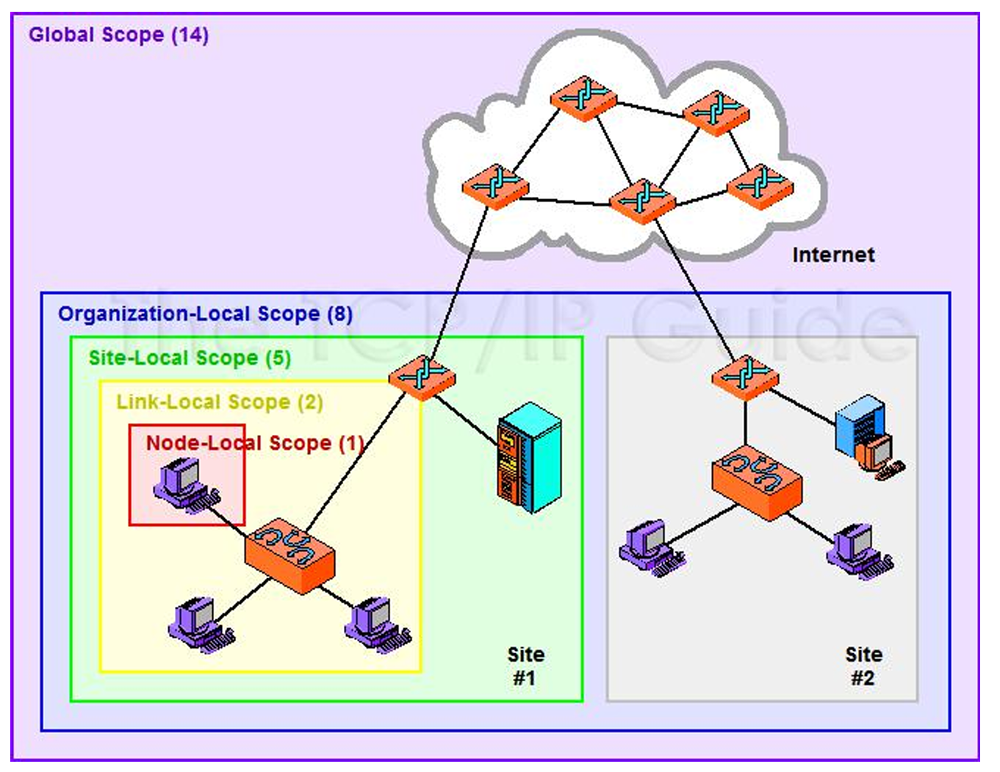

**路由器与交换机**

[Switch and Router](../cyber/network.md#switch-and-router)

- 工作在**网络层**的**路由器**
  - 连接不同网络的设备
- 工作在**数据链路层**的**交换机**
  - 同一个网络下连接不同主机的设备

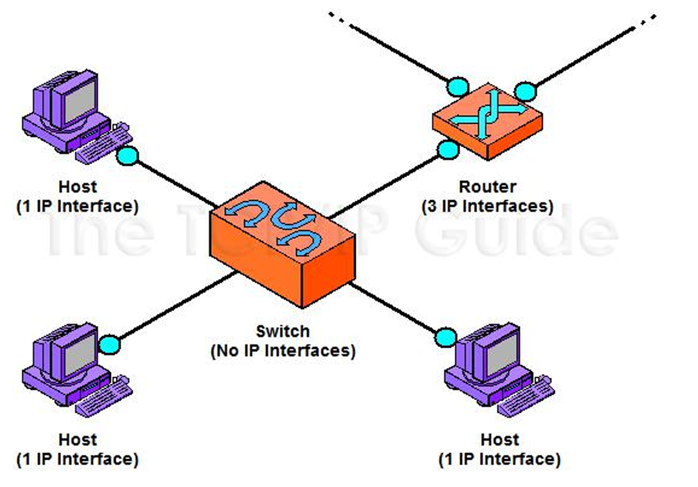

## IPv4 分类地址

**易用性：IPv4 地址的点分十进制表示**

- 32 位二进制数
- IP 地址空间：2^32 个

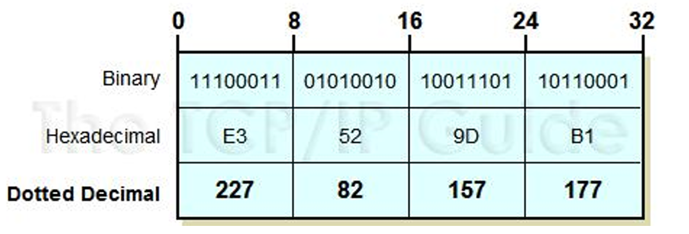

**IP 地址的分配机构**

-  层层分配的 IP 地址

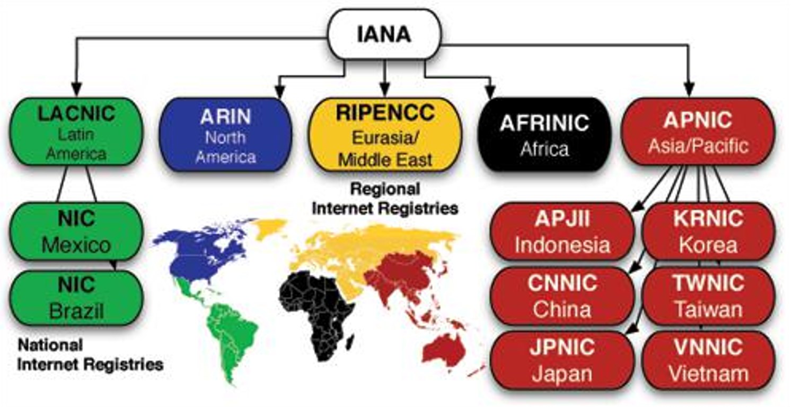

**IPv4地址分类**

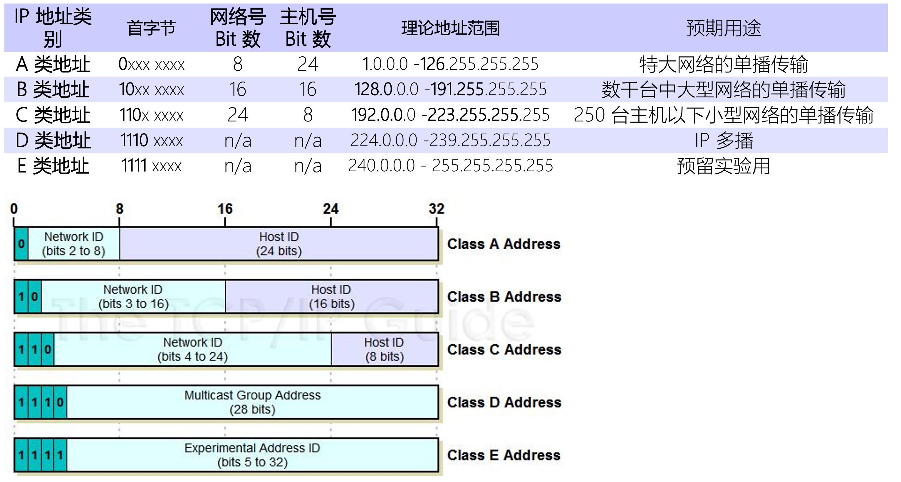

**分类 IP 地址的优点**

- 简单明了
- 具有 3 个级别的灵活性
- 选路(基于网络地址)简单

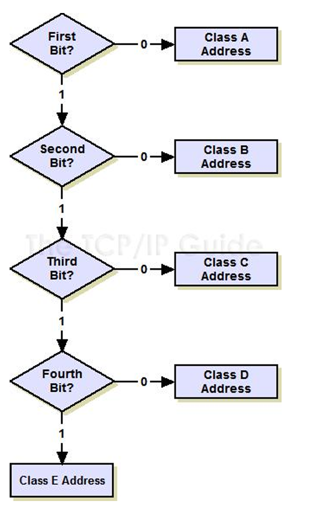

**分类 IP 寻址的问题**

- 缺少私有网络下的地址灵活性：同一个网络下没有地址层次
- 3 类地址块太少，无法与现实网络很好的匹配

## CIDR无分类地址

**CIDR 子网掩码**

- CIDR
  - Classless Inter-Domain Routing
- 表示方法
  - A.B.C.D/N，N 范围[0, 32]

**CIDR 子网划分示例**

- 71.94.0.0/15
  - 多级子网划分

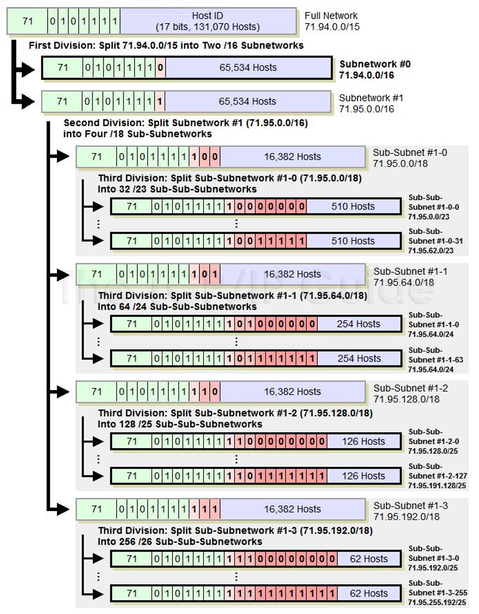

**寻址历程示例**

**208.130.29.33 的寻址历程**

- MCI 分配到了 208.128.0.0/11
- MCI 将 208.130.28.0/22 分配给ARS
- ARS 将 208.130.29.0/22 分配给Public Servers 使用
- www.freesoft.org 使用了208.130.29.33 地址

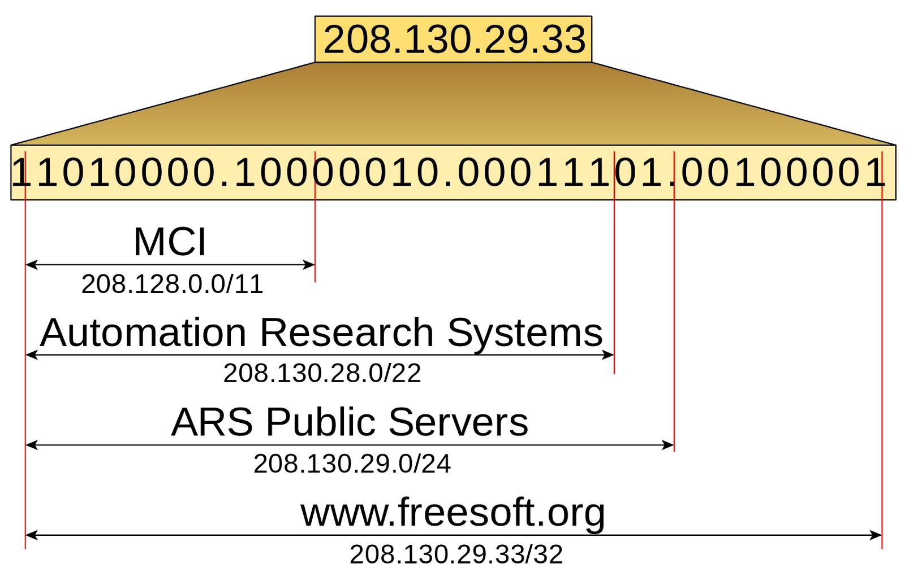

**全 0 或者全 1 的特殊含义**

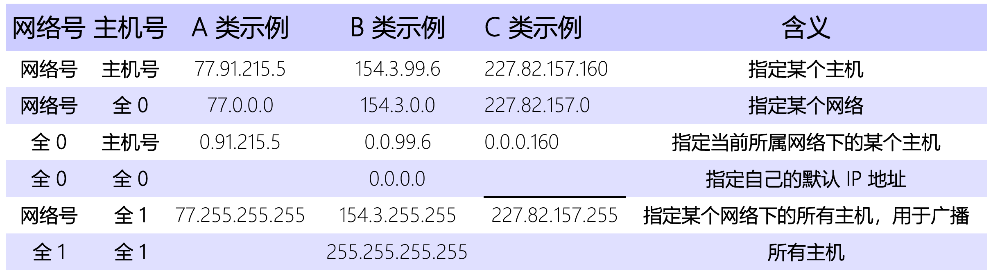

**预留 IP 地址(RFC1918)**

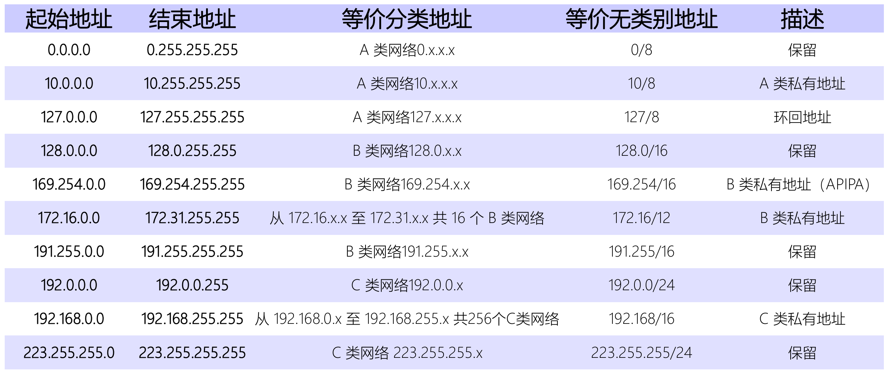

## ARP与RARP

**IP 地址与链路地址的转换：ARP 与 RARP 协议**

**链路层 MAC 地址**

- **链路层地址 MAC(Media Access Control Address)**
  - 实现本地网络设备间的直接传输
- **网络层地址 IP(Internet Protocol address)**
  - 实现大型网络间的传输，
- **查看 MAC 地址**
  - Windows: ipconfig /all
  - Linux：ifconfig

### ARP

**2.5 层协议 ARP：从 IP 地址寻找 MAC 地址**

- **动态地址解析协议 ARP(RFC826)**
  - Address Resolution Protocol
- **动态地址解析：广播**

**ARP的工作流程**

1. **检查本地缓存**
   - Windows: arp –a
   - Linux: arp –nv
   - Mac: arp -nla
2. **广播形式的请求**
3. **单播形式的应答**

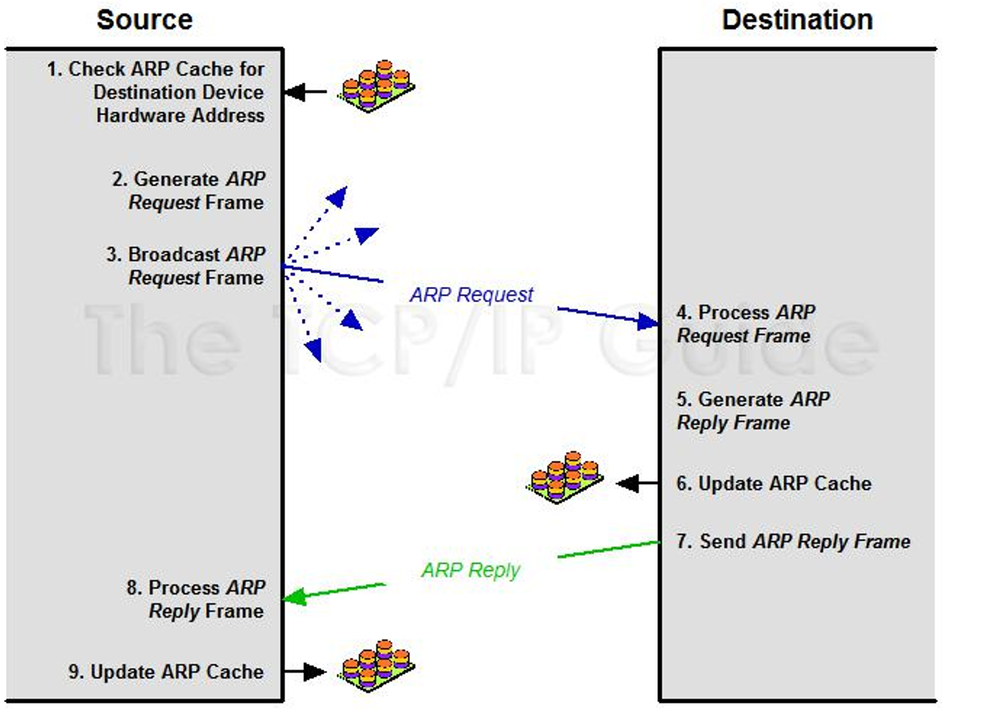

**ARP 报文格式：FrameType=0x0806**

- 硬件类型，如 1 表示以太网
- 协议类型，如 0x0800 表示 IPv4
- 硬件地址长度，如 6
- 协议地址长度，如 4 表示 IPv4
- 操作码，如 1 表示请求，2 表示应答
- 发送方硬件地址
- 发送方协议地址
- 目标硬件地址
- 目标协议地址

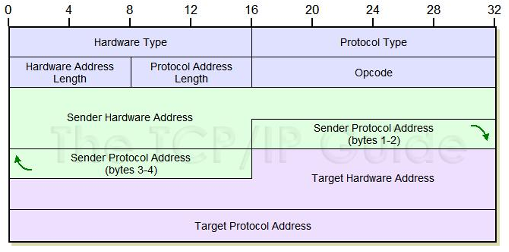

**硬件类型与操作码**

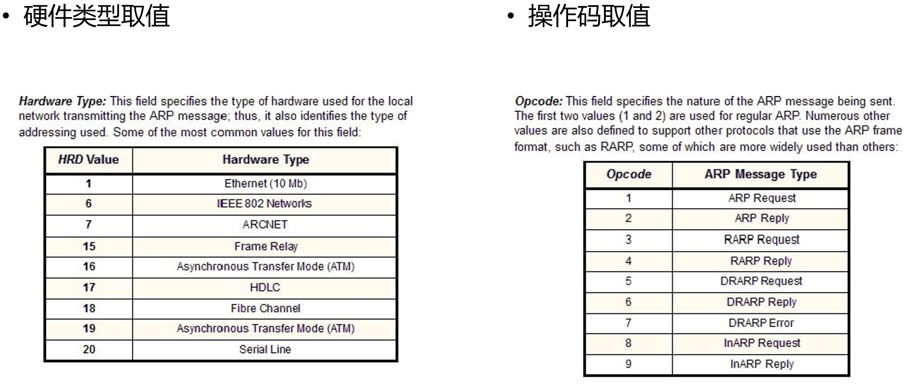

### RARP

**2.5 层协议 RARP：从 MAC 地址中寻找 IP 地址**

- **动态地址解析协议 RARP(RFC903)**
  - Reverse Address Resolution Protocol

**RARP的工作流程**

1. 广播形式的请求
2. 单播形式的应答

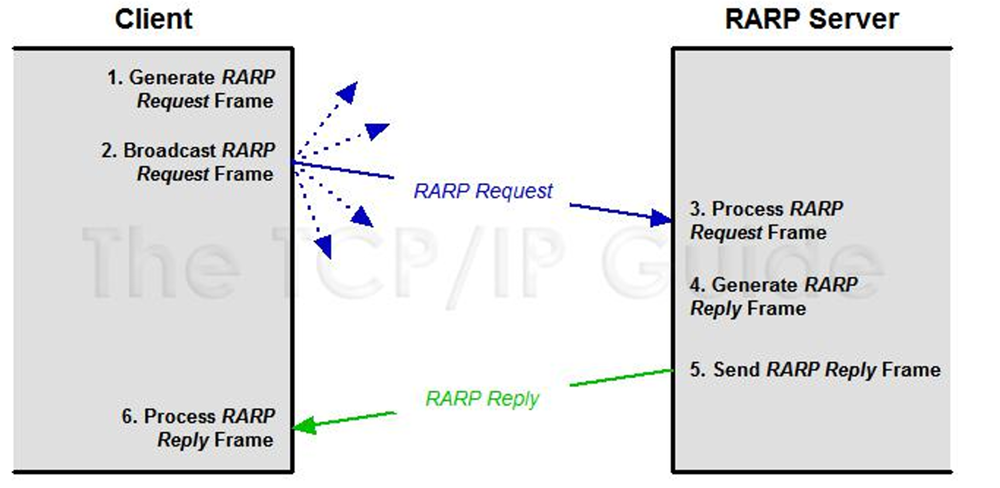

**RARP 报文格式：FrameType=0x8035**

- 硬件类型，如 1 表示以太网
- 协议类型，如 0x0800 表示 IPv4
- 硬件地址长度，如 6
- 协议地址长度，如 4 表示 IPv4
- **操作码，如 3 表示请求，4 表示应答**
- 发送方硬件地址
- 发送方协议地址
- 目标硬件地址
- 目标协议地址

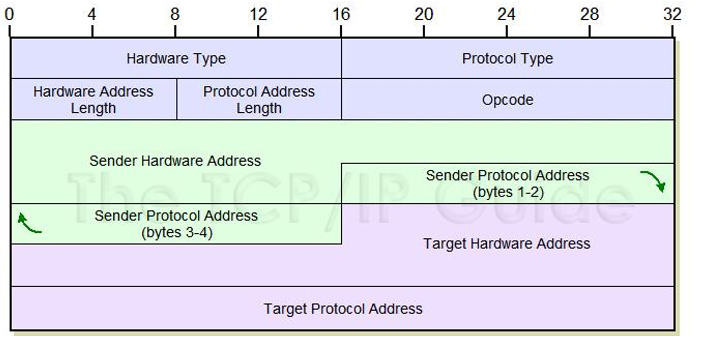

**ARP 欺骗(ARP spoofing/poisoning)**

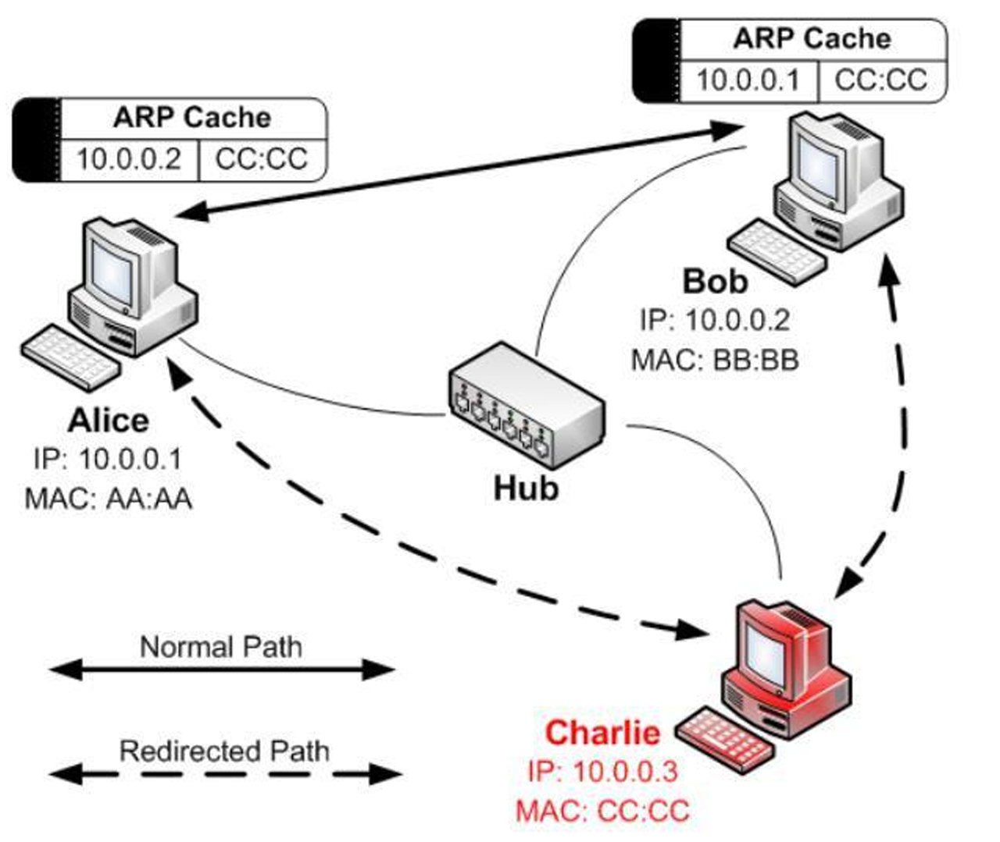

## NAT与LVS

**[Network Address Translation](../cyber/networkpro.md#nat) 应用的前提**

- 内网中主要用于客户端访问互联网
- 同一时间仅少量主机访问互联网
- 内网中存在一个路由器负责访问外网

**单向(向外)转换 NAT：动态映射**

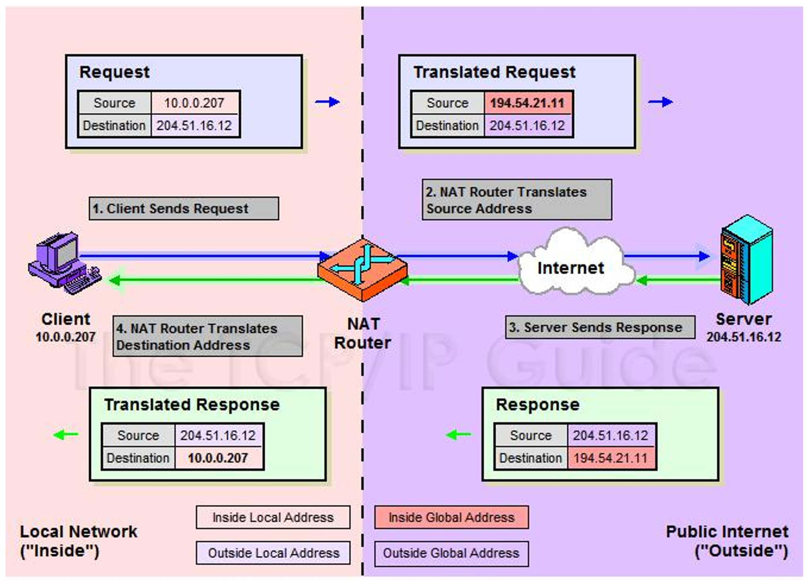

**NAPT 端口映射：Network Address Port Translation**

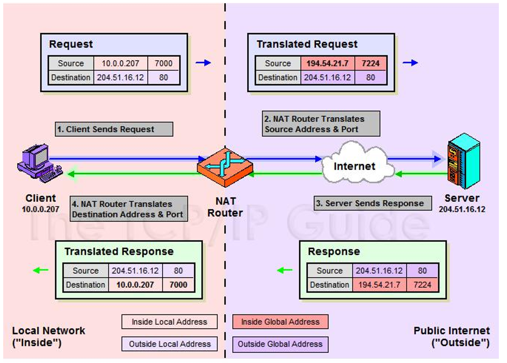

**双向(向内)NAT：IP 地址静态映射**

**LVS(Linux Virtual Server)/NAT 工作模式**

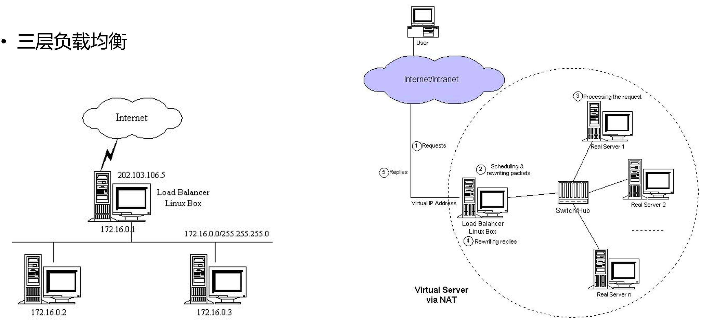

**NAT 优缺点**

**优点**
- 共享公共 IP 地址，节约开支
- 扩展主机时不涉及公共地址
- 更换 ISP 服务商(更换公网 IP 地址)，不对主机地址产生影响
- 更好的安全性，外部服务无法主动访问内网服务
- 更好的隔离性

**缺点**
- 网络管理复杂
- 性能下降
- 重新修改校验和
- 客户端缺乏公网 IP 导致功能缺失
- 某些应用层协议由于传递网络层信息而功能受限

## IP选路协议

**IP报文传输方式**

1. **直接传输**
2. **本地网络间接传输**
   - 内部选路协议
    - RIP
    - OSPF
3. **公网间接传输**
   - 外部选路协议
    - BGP

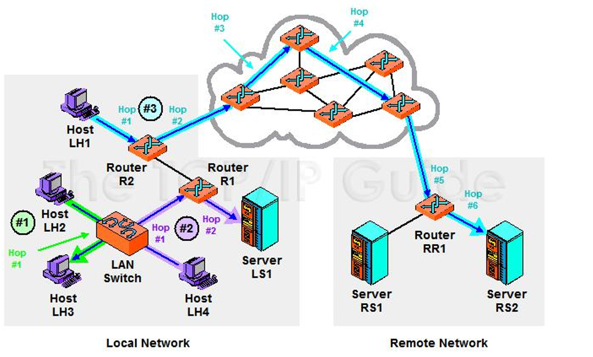

**路由表 routing table**

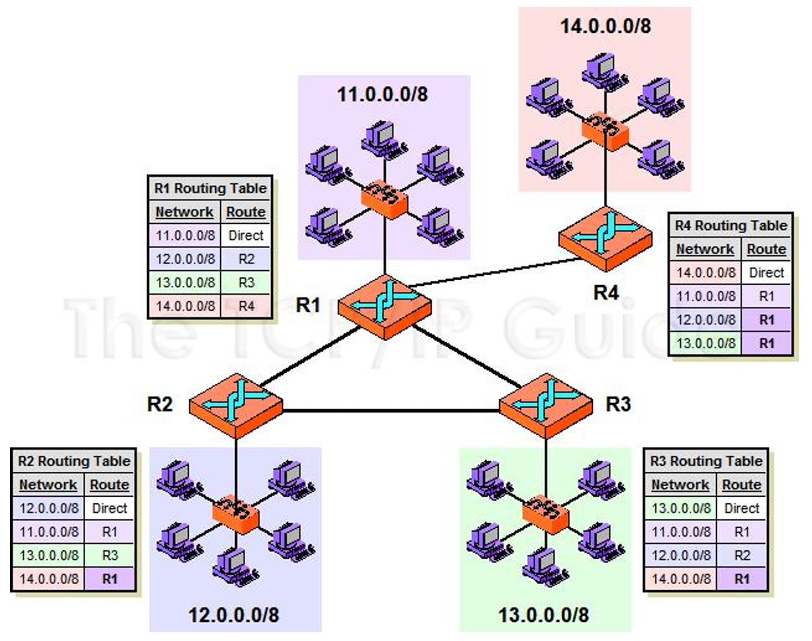

### 内部选路协议

**RIP 内部选路协议**

- **Routing Information Protocol**
- **特点**
  - 基于跳数确定路由
  - UDP 协议向相邻路由器通知路由表
- **问题**
  - 跳数度量
  - 慢收敛
  - 选路环路

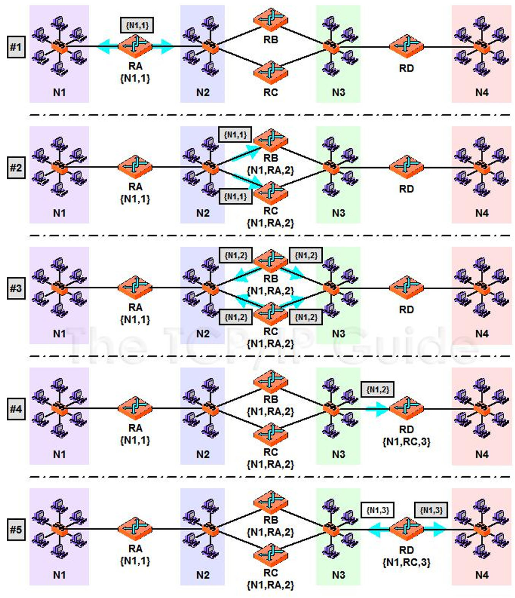

**OSPF 内部选路协议**

- **Open Shortest Path First**
- **多级拓扑结构：同级拓扑中的每台路由器都具有最终相同的数据信息(LSDB)**
  - 直接使用 IP 协议(协议号 0x06 为 TCP，0x11 为 UDP，而 0x59 为 OSPF)传递路由信息

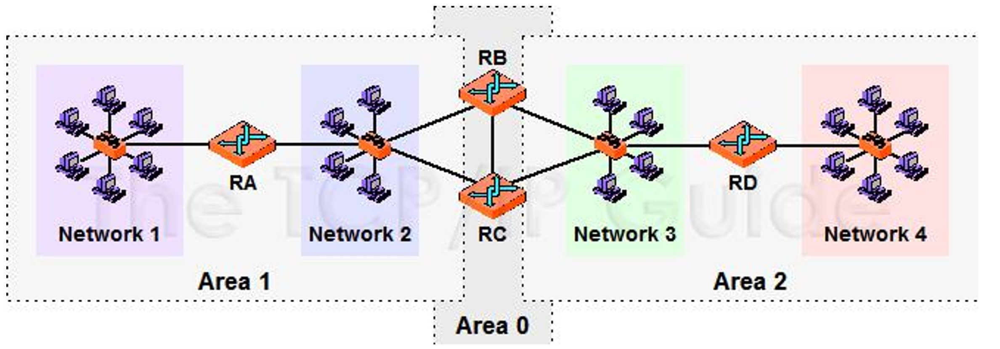

**OSPF 最短路径树**

- **只有路由器到达网络有开销**
  - 网络到达路由器没有开销
- **RC 的最短路径树**

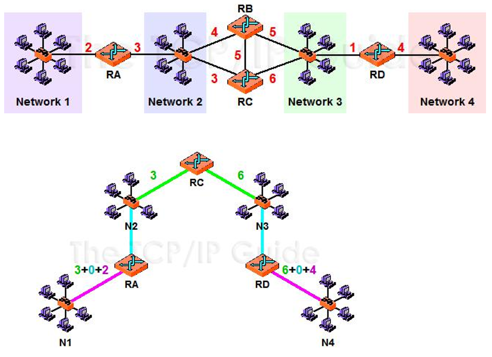

**RC 构造最短路径树**

1. **第一级：RC 直达设备**
   - N2：3
   - N3：6
   - RB：5
2. **第二级：间隔 1 跳设备**
   - 经过 N2 到 RA：3
   - 经过 N3 到 RD：6
3. **第三级：间隔 2 跳设备**
   - 经过 N2、RA 到 N1：5
   - 经过 N3、RD 到 N4：10

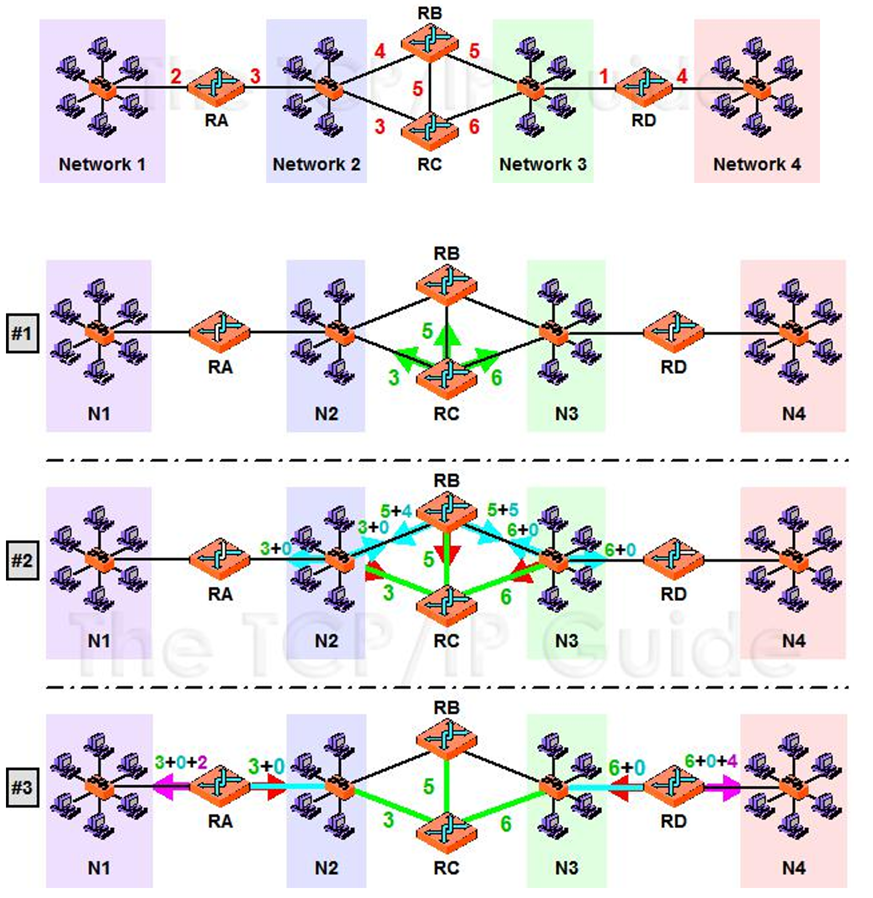

### 外部选路协议

**BGP：Border Gateway Protocol**

- **网络间的选路协议**
- **存放网络间信息 RIB**
  - Routing Information Base
  - **TCP 协议**传输 RIB 信息
- **E(External)BGP**
  - 外部对等方传输使用
- **I(Internal)BGP**
  - 内部对等方传输使用

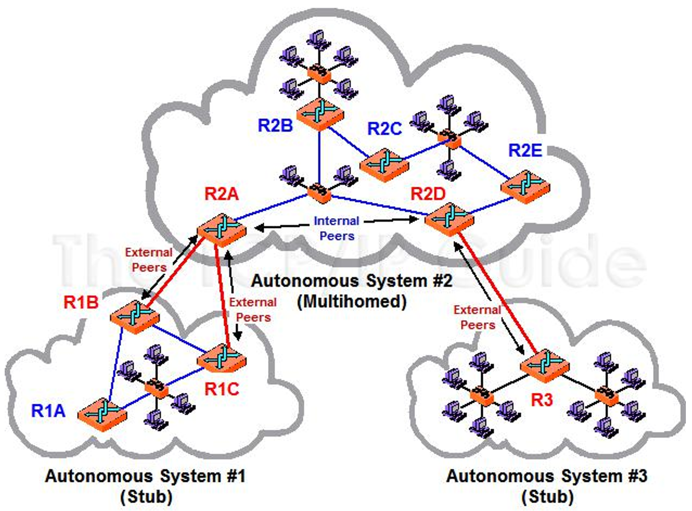

**路由跟踪工具**

- Windows: tracert
- Linux/Mac: traceroute

## MTU与IP报文分片

**IP 报文格式**

- IHL：头部长度，单位字
- TL：总长度，单位字节
- Id：分片标识
- Flags：分片控制
  - DF 为1：不能分片
  - MF 为1：中间分片
- FO：分片内偏移，单位 8 字节
- TTL：路由器跳数生存期
- Protocol：承载协议
- HC：校验和

**MTU(Maximum Transmission Unit)分片**

- **MTU 最大传输单元( RFC791 ：>=576 字节)**
- ping 命令 
  - -f：设置 DF 标志位为 1 
  - -l：指定负载中的数据长度

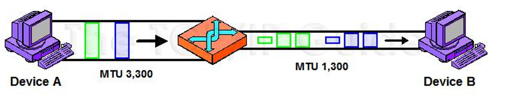

**常见网络 MTU**

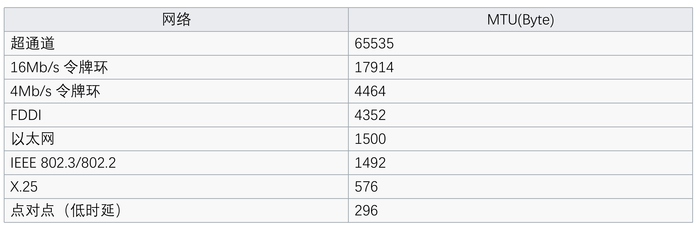

**可能出现多次分片**

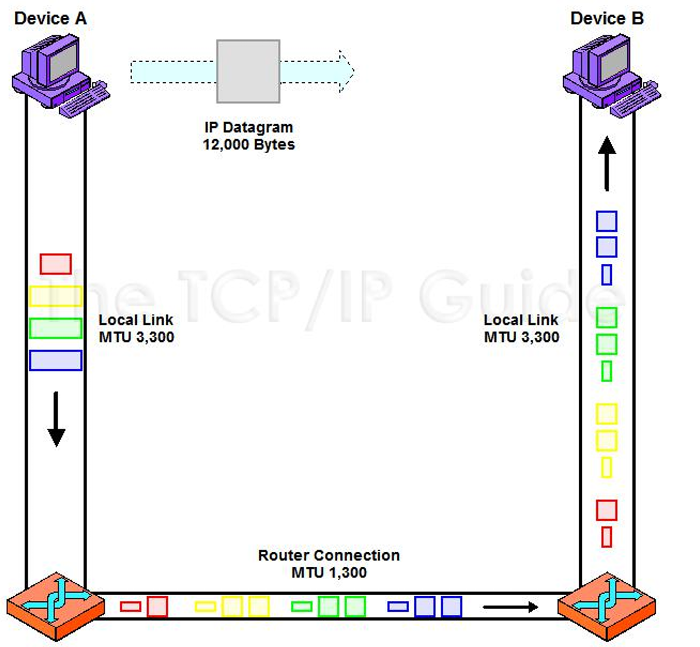

**IP 分片示例**

- **分片主体**
  - 源主机
  - 路由器
- **重组主体**
  - 目的主机

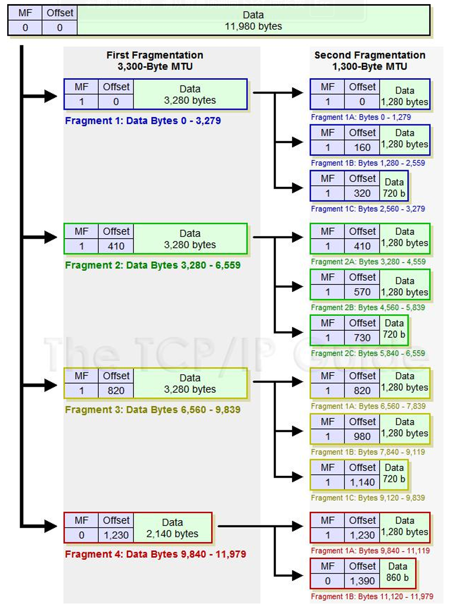

## ICMP协议

[Internet Control Message Protocol](../cyber/network.md#icmp)