# TLS/SSL Protocol

## intro

<span style="font-size: 23px;">**TLS/SSL 发展**</span>


<span style="font-size: 19px;">**TLS 设计目的**</span>

- 身份验证
- 保密性
- 完整性

<span style="font-size: 19px;">**TLS 协议**</span>

- Record 记录协议
  - 对称加密
- Handshake 握手协议
  - 验证通讯双方的身份
  - 交换加解密的安全套件
  - 协商加密参数

<span style="font-size: 19px;">**TLS 安全密码套件解读**</span>


## 对称加密

[Symmetric Encryption](../crypto/cryptography.md#symmetric-encryption)

<span style="font-size: 19px;">**AES 对称加密在网络中的应用**</span>


<span style="font-size: 19px;">**对称加密与 XOR 异或运算**</span>


<span style="font-size: 19px;">**填充 padding**</span>

- Block cipher 分组加密：将明文分成多个等长的 Block 模块，对每个模块分别加解密
- 目的：当最后一个明文 Block 模块长度不足时，需要填充
- 填充方法
  - 位填充：以 bit 位为单位来填充
    - ... | 1011 1001 1101 0100 0010 011`1 0000 0000` |
  - 字节填充：以字节为单位为填充
    - 补零：... | DD DD DD DD DD DD DD DD | DD DD DD DD `00 00 00 00` |
    - ANSI X9.23：... | DD DD DD DD DD DD DD DD | DD DD DD DD `00 00 00 04` |
    - ISO 10126：... | DD DD DD DD DD DD DD DD | DD DD DD DD `81 A6 23 04` |
    - **PKCS7 (RFC5652)**：... | DD DD DD DD DD DD DD DD | DD DD DD DD `04 04 04 04` |

### 分组工作模式

**分组工作模式 block cipher mode of operation**

- 允许使用同一个分组密码密钥对多于一块的数据进行加密，并保证其安全性

<span style="font-size: 19px;">**ECB(Electronic codebook)模式**</span>

- 直接将明文分解为多个块，对每个块独立加密
- 问题：无法隐藏数据特征


<span style="font-size: 19px;">**CBC(Cipher-block chaining)模式**</span>

- 每个明文块先与前一个密文块进行异或后，再进行加密
- 问题：加密过程串行化


<span style="font-size: 19px;">**CTR(Counter)模式**</span>

- 通过递增一个加密计数器以产生连续的密钥流
- 问题：不能提供密文消息完整性校验


<span style="font-size: 19px;">**验证完整性**</span>

**hash 函数**


**MAC (Message Authentication Code)**


<span style="font-size: 19px;">**GCM模式**</span>

**Galois/Counter Mode**
- CTR+GMAC


### AES

<span style="font-size: 19px;">**AES(Advanced Encryption Standard)加密算法**</span>

- 为比利时密码学家 Joan Daemen 和 Vincent Rijmen 所设计，又称 Rijndael 加密算法
- 常用填充算法：PKCS7
- 常用分组工作模式：GCM
- **明文**分组长度只能是128位(16字节)

| AES      | 密钥长度(32位比特字) | 分组长度(32位比特字) | 加密轮数 |
| -------- | ---------------------- | ---------------------- | -------- |
| AES-128  | 4                      | 4                      | 10       |
| AES-192  | 6                      | 4                      | 12       |
| AES-256  | 8                      | 4                      | 14       |

<span style="font-size: 19px;">**AES 的加密步骤**</span>

1. 把明文按照 128bit(16 字节)拆分成若干个明文块，每个明文块是 4*4 矩阵
2. 按照选择的填充方式来填充最后一个明文块
3. **每一个明文块利用 AES 加密器和密钥，加密成密文块**
4. 拼接所有的密文块，成为最终的密文结果

<span style="font-size: 19px;">**AES 加密流程**</span>

**C = E(K,P)，E 为每一轮算法，每轮密钥皆不同**

- 初始轮
  - AddRoundKey 轮密钥加
- 普通轮
  - AddRoundKey 轮密钥加
  - SubBytes 字节替代
  - ShiftRows 行移位
  - MixColumns 列混合
- 最终轮
  - SubBytes 字节替代
  - ShiftRows 行移位
  - AddRoundKey 轮密钥加

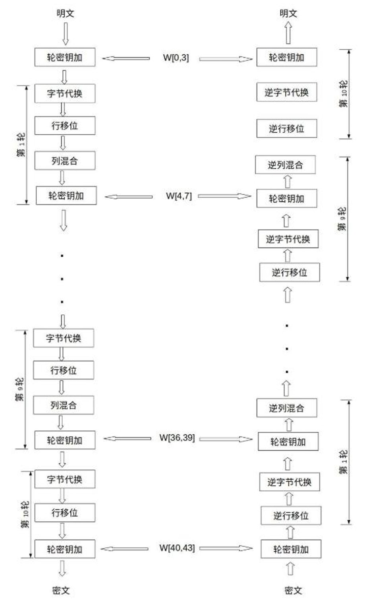

<span style="font-size: 19px;">**(1)AddRoundKey 步骤**</span>

矩阵中的每一个字节都与该次回合密钥(round key)做 XOR 运算；每个子密钥由密钥生成方案产生。 


**密钥扩展**

函数 g 步骤
- a.字循环：左移 1 个字节
- b.使用 S 盒字节代换
- c. 同轮常量 RC[j]进行异或，其中 j 表示轮数

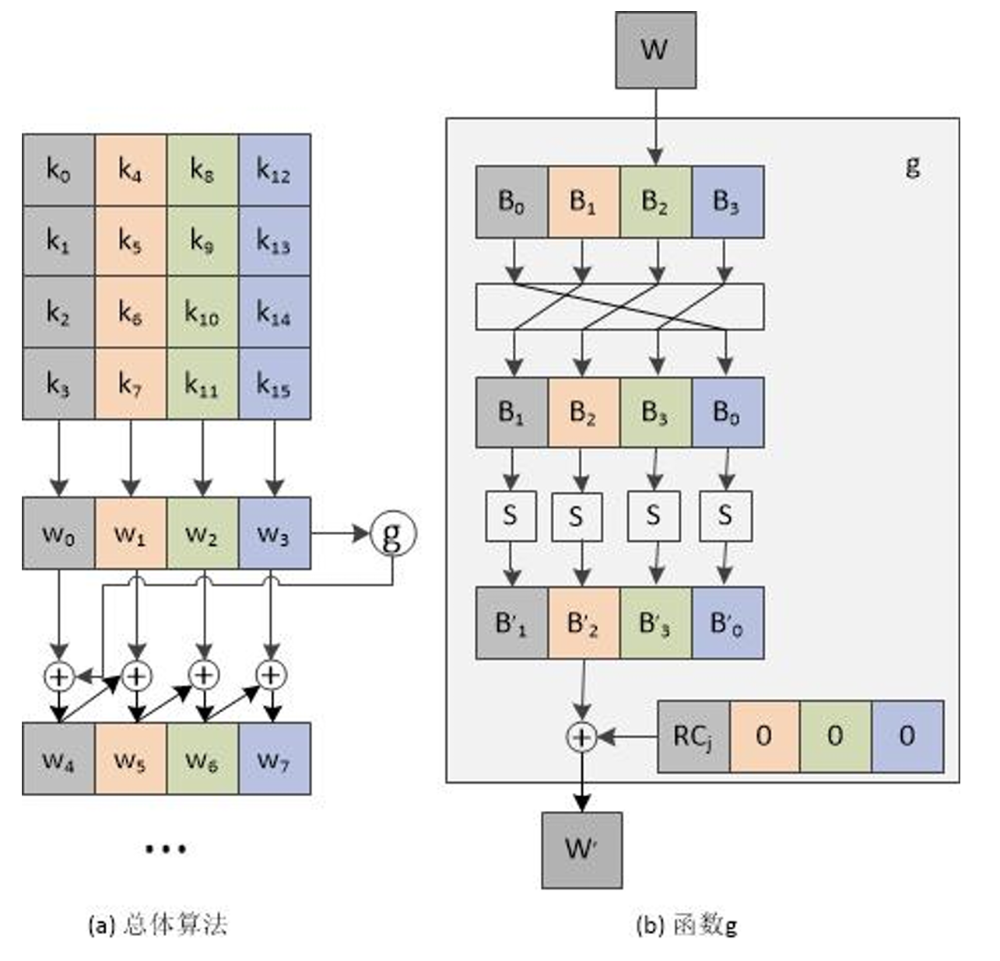

- **RC = {0x01, 0x02, 0x04, 0x08, 0x10, 0x20, 0x40, 0x80, 0x1B, 0x36}**

<span style="font-size: 19px;">**(2)SubBytes 步骤**</span>

**透过一个非线性的替换函数，用查找表的方式把每个字节替换成对应的字节。** 
- 提供非线性变换能力，避免简单代数性质的攻击


**S盒**

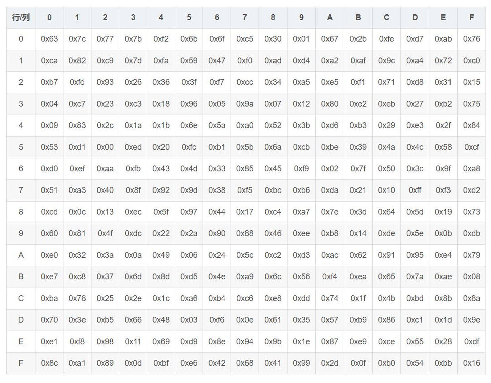

<span style="font-size: 19px;">**(3)ShiftRows 步骤**</span>

**将矩阵中的每个横列进行循环式移位** 
- 第一行不变
- 第二行循环左移 1 个字节
- 第三行循环左移 2 个字节
- 第四行循环左移 3 个字节


<span style="font-size: 19px;">**(4) MixColumns 步骤**</span>


## 非对称加密

[Asymmetric Encryption](../crypto/cryptography.md#asymmetric-encryption)

**每个参与方都有一对密钥**
- 公钥
  - 向对方公开
- 私钥
  - 仅自己使用

### RSA

- 1977 年由罗纳德·李维斯特(Ron Rivest)、阿迪·萨莫尔(Adi Shamir)和伦纳德·阿德曼(Leonard Adleman)一起提出，因此名为 RSA 算法

<span style="font-size: 19px;">**RSA 算法中公私钥的产生**</span>

1. 随机选择两个不相等的质数 p 和 q
2. 计算 p 和 q 的乘积 n（明文小于 n）
3. 计算 n 的欧拉函数 v=φ(n)
4. 随机选择一个整数 k
- 1< k < v，且 k 与 v 互质
5. 计算 k 对于 v 的模反元素 d
6. 公钥：(k,n)
7. 私钥： (d,n)


<span style="font-size: 19px;">**RSA 算法加解密流程**</span>

- 加密：c ≡ m<sup>k</sup> (mod n)
  - m 是明文，c 是密文
- 解密：m ≡ c<sup>d</sup> (mod n)
- 举例：对明文数字 123 加解密
  - 公钥（3,319）加密
    - 123<sup>3</sup> mod 319=140
    - 对140密文用私钥（187,319）解密
      - 140<sup>187</sup> mod 319=123
- 私钥（187,319）加密
  - 123<sup>187</sup> mod 319=161
  - 公钥（3,319）解密
    - 161<sup>3</sup> mod 319=123

### openssl

- **生成私钥（公私钥格式参见 RFC3447）**

```bash
openssl genrsa -out private.pem
```

- **从私钥中提取出公钥**
  
```bash
openssl rsa -in private.pem -pubout -out public.pem
```
- **查看 ASN.1 格式的私钥**

```bash
openssl asn1parse -i -in private.pem
```

- **查看 ASN.1 格式的公钥**

```bash
openssl asn1parse -i -in public.pem
```
*找到BIT STRING 例如19*
```bash
openssl asn1parse -i -in public.pem -strparse 19
```

<span style="font-size: 19px;">**使用 RSA 公私钥加解密**</span>

- 加密文件

```bash
openssl rsautl -encrypt -in hello.txt -inkey public.pem -pubin -out hello.en
```

- 解密文件

```bash
openssl rsautl -decrypt -in hello.en -inkey private.pem -out hello.de
```

### PKI证书体系

<span style="font-size: 19px;">**非对称密码应用：数字签名**</span>

- **基于私钥加密，只能使用公钥解密：起到身份认证的使用**
- **公钥的管理：Public Key Infrastructure（PKI）公钥基础设施**
  - 由 Certificate Authority（CA）数字证书认证机构将用户个人身份与公开密钥关联在一起
  - 公钥数字证书组成
    - CA 信息、公钥用户信息、公钥、权威机构的签字、有效期
  - PKI 用户
    - 向 CA 注册公钥的用户
    - 希望使用已注册公钥的用户

<span style="font-size: 19px;">**签发证书流程**</span>

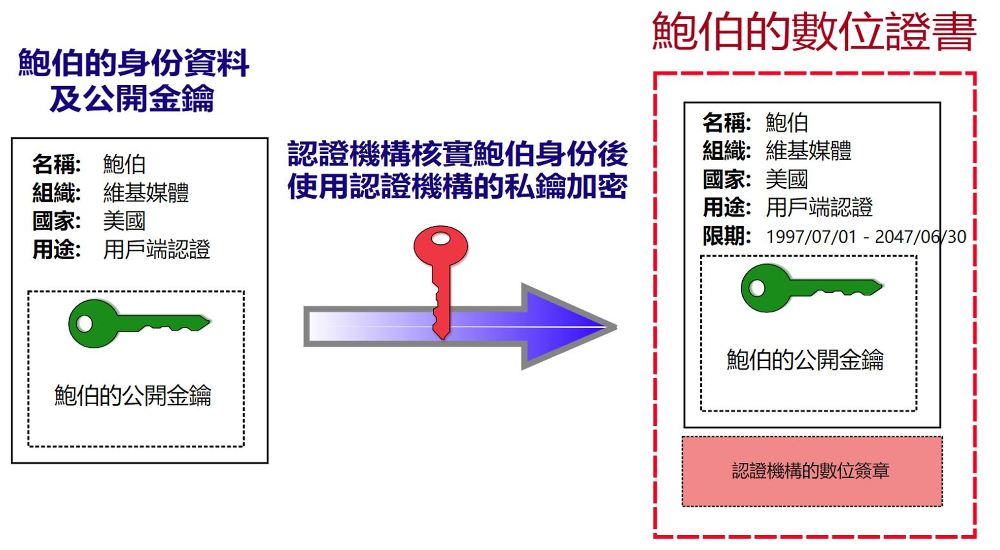

<span style="font-size: 19px;">**签名与验签流程**</span>

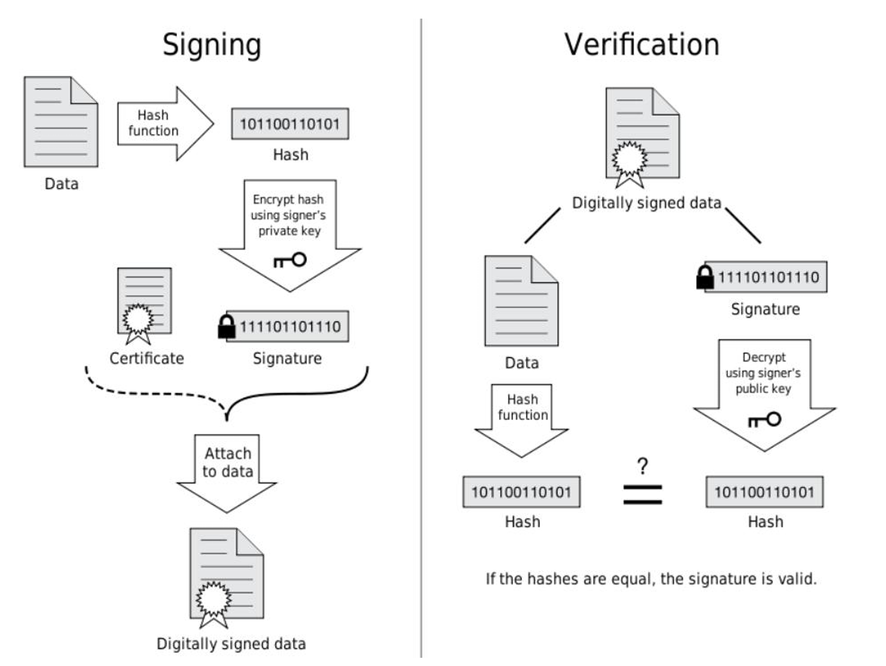

<span style="font-size: 19px;">**证书信任链**</span>

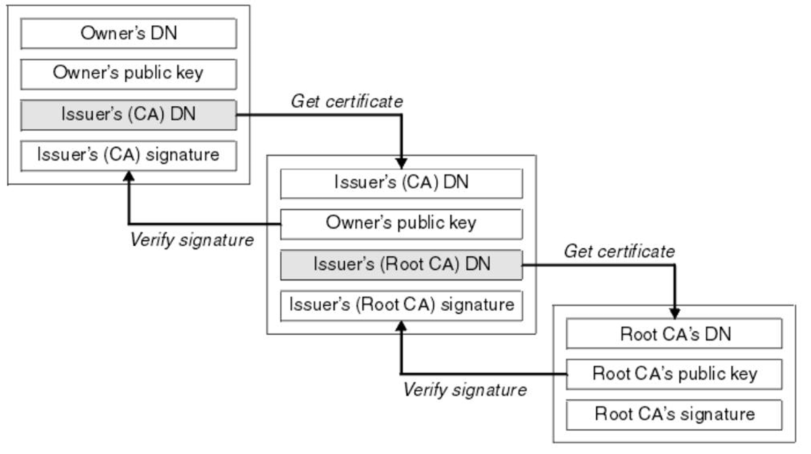

<span style="font-size: 19px;">**PKI 公钥基础设施**</span>


<span style="font-size: 19px;">**证书类型**</span>

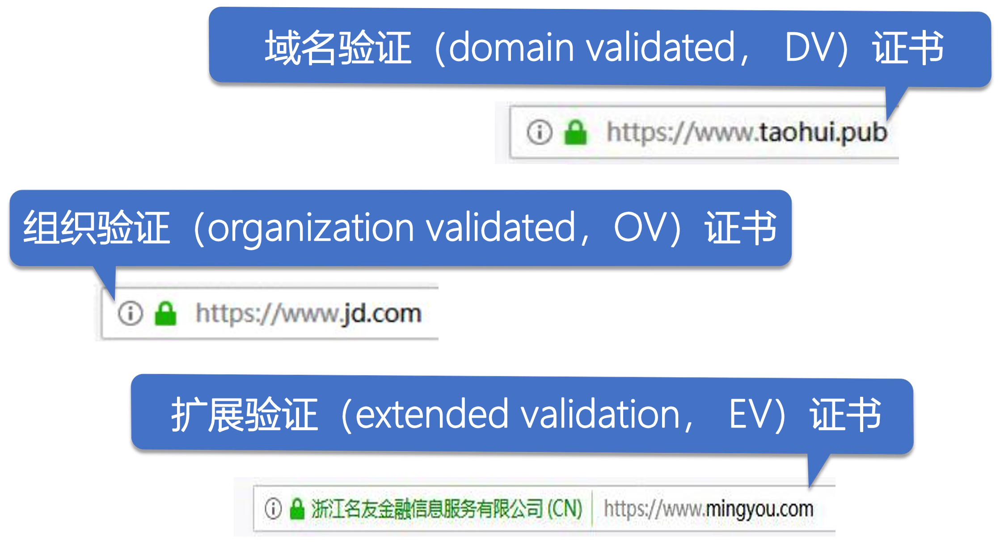

<span style="font-size: 19px;">**验证证书链**</span>

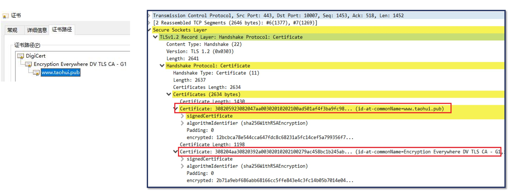

### DH密钥交换协议


<span style="font-size: 19px;">**RSA 密钥交换**</span>

- 由客户端生成对称加密的密钥


- **问题:** 没有前向保密性

<span style="font-size: 19px;">**DH 密钥交换**</span>

- 1976 年由 Bailey Whitfield Diffie 和 Martin Edward Hellman 首次发表，故称为 **Diffie–Hellman key exchange**，简称 **DH**
- 它可以让双方在完全没有对方任何预先信息的条件下通过不安全信道创建起一个密钥


<span style="font-size: 19px;">**DH 密钥交换协议举例**</span>


**问题和解法:**

- **中间人伪造攻击**
  - 向 Alice 假装自己是 Bob，进行一次 DH 密钥交换
  - 向 Bob 假装自己是 Alice，进行一次 DH 密钥交换
- **解决中间人伪造攻击**
  - 身份验证

### ECDH密钥交换协议

<span style="font-size: 23px;">**ECC 椭圆曲线的原理**</span>

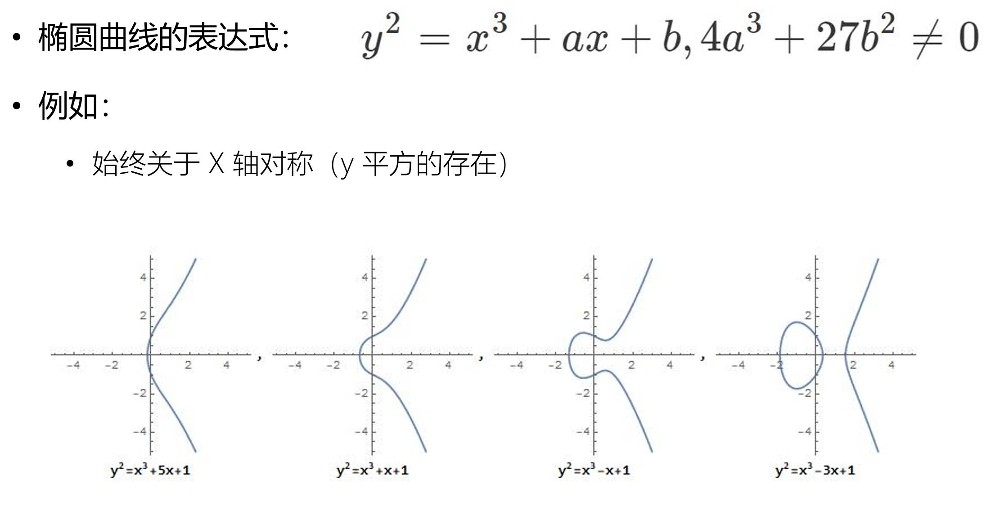

<span style="font-size: 19px;">**ECC 曲线的特性：+运算**</span>


<span style="font-size: 19px;">**+运算的代数计算方法**</span>

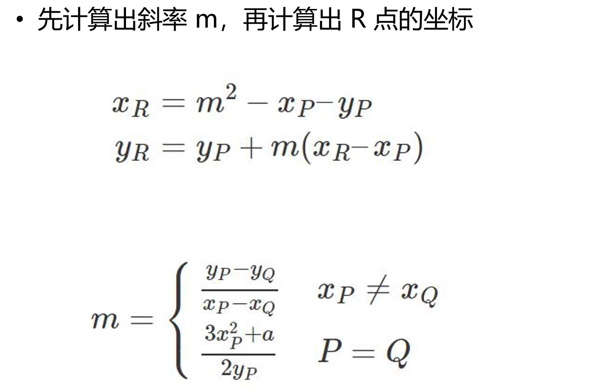

<span style="font-size: 19px;">**ECC+运算举例**</span>

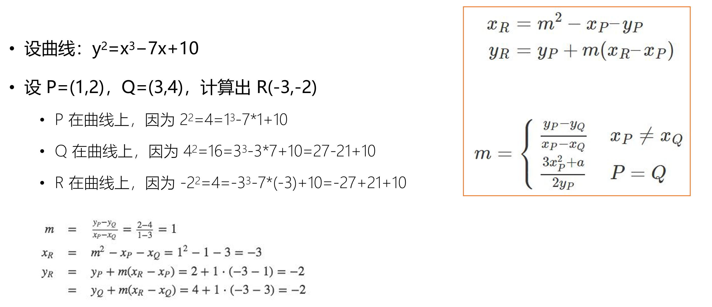

<span style="font-size: 19px;">**ECC 的关键原理**</span>


<span style="font-size: 23px;">**DH 协议升级：基于椭圆曲线的 ECDH 协议**</span>

<span style="font-size: 19px;">**ECDH 密钥交换协议**</span>

- DH 密钥交换协议使用椭圆曲线后的变种，称为 Elliptic Curve Diffie–Hellman key 
Exchange，缩写为 ECDH，优点是比 DH 计算速度快、同等安全条件下密钥更短
- ECC（Elliptic Curve Cryptography）：椭圆曲线密码学
- 魏尔斯特拉斯椭圆函数（Weierstrass‘s elliptic functions）：y^2=x^3+ax+b

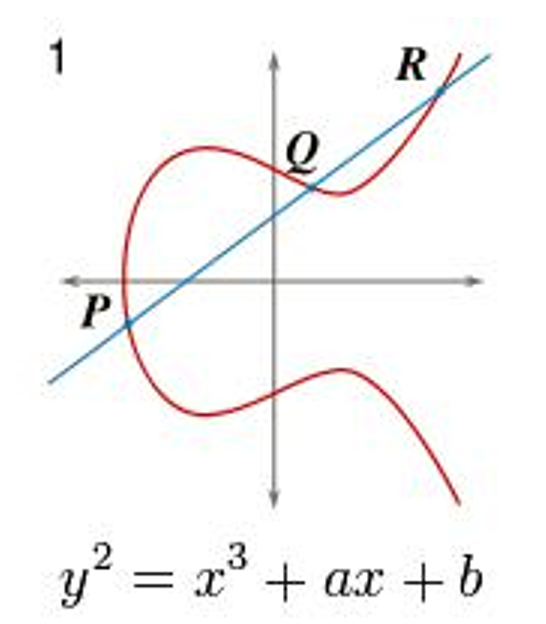

<span style="font-size: 19px;">**ECDH 的步骤**</span>

**步骤**
1. Alice 选定大整数 Ka 作为私钥
2. 基于选定曲线及曲线上的共享 P 点，Alice 计算出 Qa=Ka.P
3. Alice 将 Qa、选定曲线、共享 P 点传递点 Bob
4. Bob 选定大整数 Kb 作为私钥，将计算了 Qb=Kb.P，并将 Qb 传递给 Alice
5. Alice 生成密钥 Qb.Ka = (X, Y)，其中 X 为对称加密的密钥
6. Bob 生成密钥 Qa.Kb = (X, Y)，其中 X 为对称加密的密钥

- **Qb.Ka = Ka.(Kb.P) = Ka.Kb.P = Kb.(Ka.P) = Qa.Kb**

<span style="font-size: 19px;">**X25519 曲线**</span>


## TLS

### TLS1.2与1.3中的ECDH协议


[测试 TLS 站点支持情况](https://www.ssllabs.com/ssltest/index.html)

<span style="font-size: 19px;">**FREAK 攻击**</span>

- 2015 年发现漏洞
- 90 年代引入
  - 512 位以下 RSA 密钥可轻易破解


<span style="font-size: 19px;">**TLS1.3 中的密钥交换**</span>


### 握手的优化

<span style="font-size: 19px;">**session 缓存：以服务器生成的 session ID 为依据**</span>


<span style="font-size: 19px;">**session ticket**</span>


<span style="font-size: 19px;">**TLS1.3 的 0RTT 握手**</span>

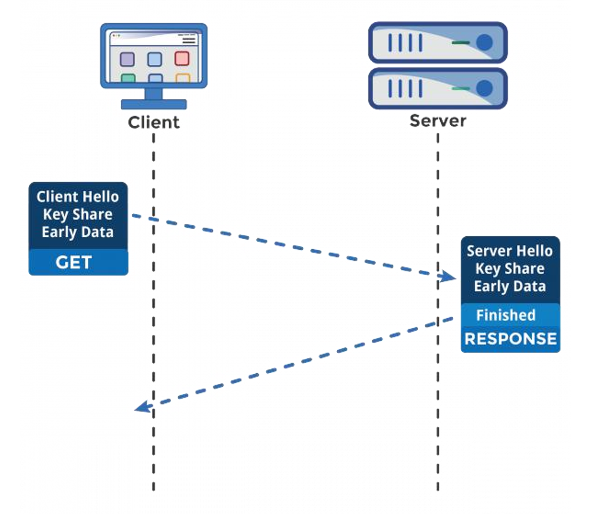

<span style="font-size: 19px;">**0-RTT 面临的重放攻击**</span>

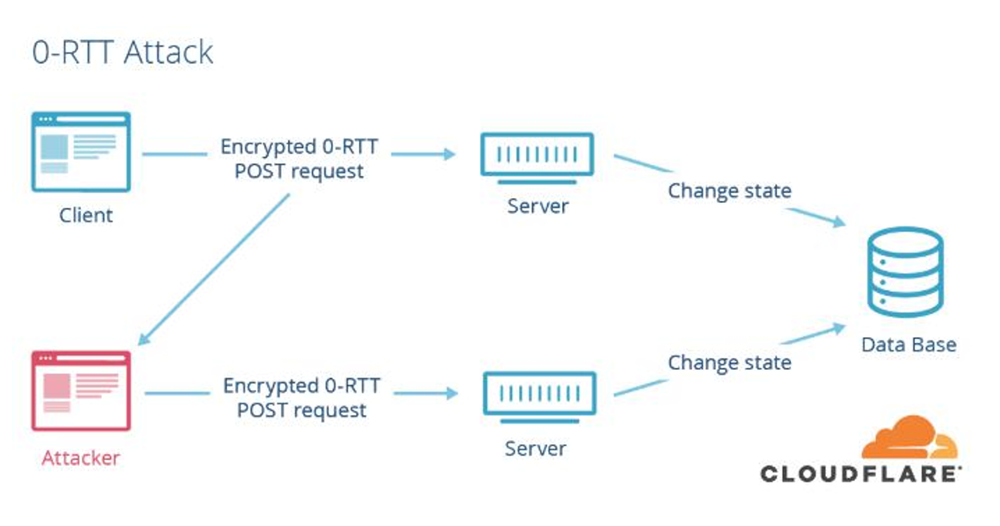

### TLS 与量子通讯的原理

<span style="font-size: 19px;">**TLS 密码学回顾**</span>

- 通讯双方在**身份验证**的基础上，**协商**出**一次性**的、**随机**的密钥
  - PKI 公钥基础设施
  - TLS 中间件生成一次性的、随机的密钥参数
  - DH 系列协议基于非对称加密技术协商出密钥
- 使用**分组**对称加密算法，基于有限长度的密钥将任意长度的明文加密传输
  - 密钥位数
  - 分组工作模式

<span style="font-size: 19px;">**克劳德·艾尔伍德·香农：信息论**</span>

- 证明 one-time-pad（OTP）的绝对安全性
  - 密钥是**随机**生成的
  - 密钥的长度**大于等于**明文长度
  - 相同的密钥只能使用一次

<span style="font-size: 19px;">**QKD 与光偏振原理**</span>

量子密钥分发 quantum key distribution，简称 QKD
- 量子力学：任何对量子系统的测量都会对系统产生干扰
- QKD：如果有第三方试图窃听密码，则通信的双方便会察觉

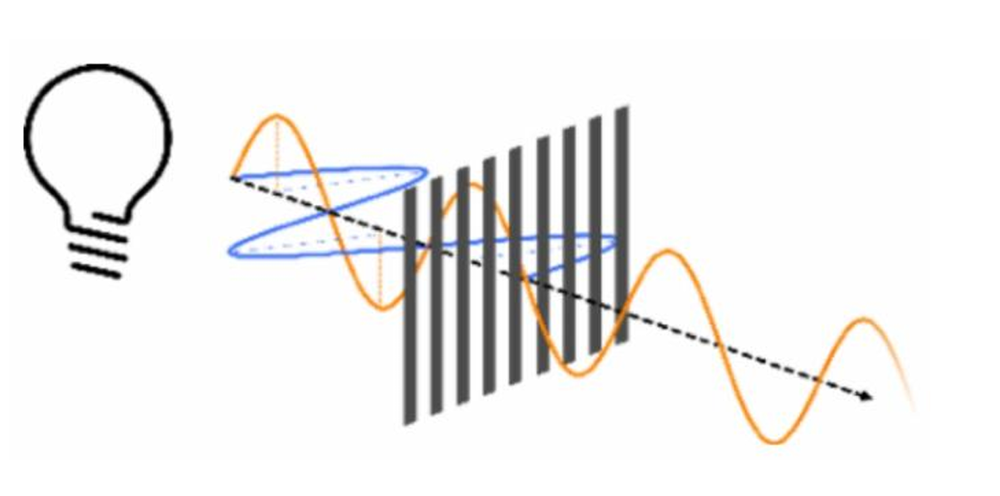

<span style="font-size: 19px;">**量子通讯BB84协议的执行流程**</span>

**BB84 协议**

- 由 Charles Bennett 与 Gilles Brassard 在 1984 年发表


**BB84 协议示意图**


<span style="font-size: 19px;">**QKD 密钥纠错与隐私增强**</span>


