# WebSocket Protocol

<span style="font-size: 19px;">**如何及时获得更新？从轮询到通知**</span>

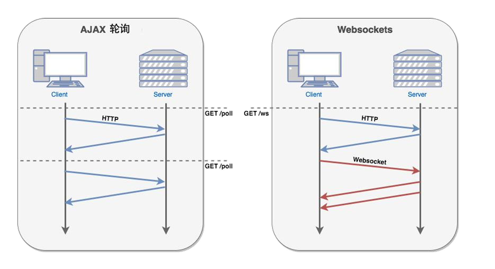

<span style="font-size: 19px;">**Chrome 请求列表：分析 WebSocket**</span>

- 过滤器
  - 按类型：WS
  - 属性过滤：is: running
- 表格列
  - Data： 消息负载。 如果消息为纯文本，则在此处显示。 对于二进制操作码，此列将显示操作码的名称和代码。 支持以下操作码：Continuation Frame、Binary Frame、Connection Close Frame、Ping Frame 和 Pong Frame。
  - Length： 消息负载的长度（以字节为单位）。
  - Time： 收到或发送消息的时间。
- 消息颜色
  - 发送至服务器的文本消息为浅绿色。
  - 接收到的文本消息为白色。
  - WebSocket 操作码为浅黄色。
  - 错误为浅红色。

## 约束

<span style="font-size: 19px;">**WebSocket 的成本**</span>

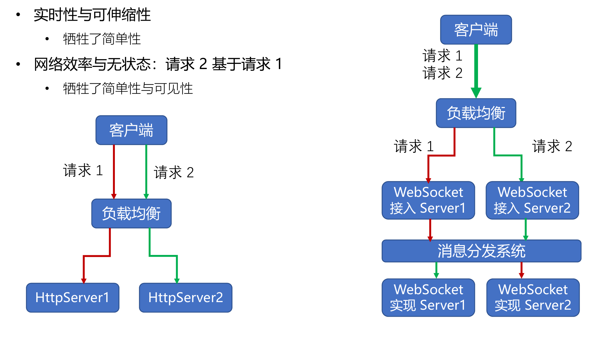

<span style="font-size: 19px;">**长连接的心跳保持**</span>

- HTTP 长连接只能基于简单的超时（常见为 65 秒）
- WebSocket 连接基于 ping/pong 心跳机制维持

<span style="font-size: 19px;">**兼容 HTTP 协议**</span>

- 默认使用 80 或者 443 端口
- 协议升级
- 代理服务器可以简单支持

<span style="font-size: 23px;">**设计哲学：在 Web 约束下暴露 TCP 给上层**</span>

- **元数据去哪了？**
  - 对比：HTTP 协议头部会存放元数据
  - 由 WebSocket 上传输的应用层存放元数据
- **基于帧：不是基于流(HTTP、TCP)**
  - 每一帧要么承载字符数据，要么承载二进制数据
- **基于浏览器的同源策略模型(非浏览器无效)**
  - 可以使用 Access-Control-Allow-Origin 等头部
- **基于 URI、子协议支持同主机同端口上的多个服务**

## 帧格式

<span style="font-size: 19px;">**帧格式示意图**</span>

**红色是 2 字节必然存在的帧首部**

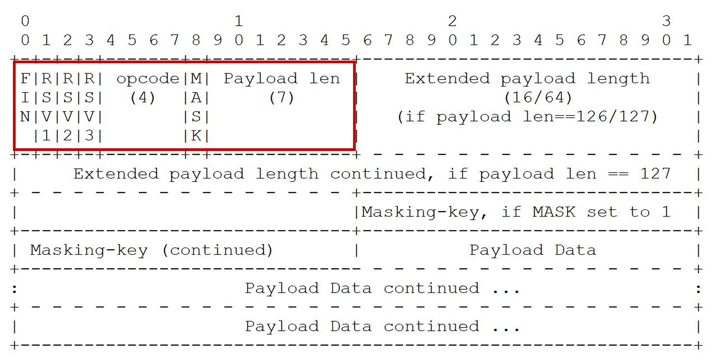

<span style="font-size: 19px;">**数据帧格式：RSV 保留值**</span>

**RSV1/RSV2/RSV3：默认为 0，仅当使用 extension 扩展时，由扩展决定其值**

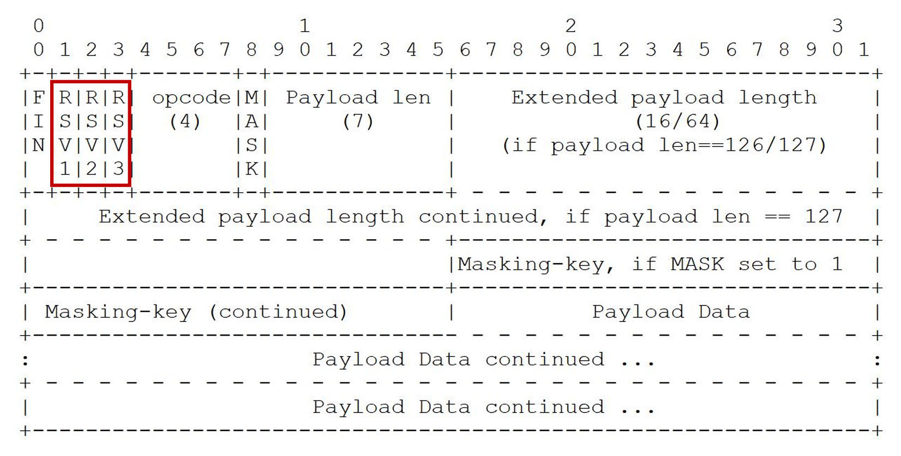

<span style="font-size: 19px;">**数据帧格式：帧类型**</span>

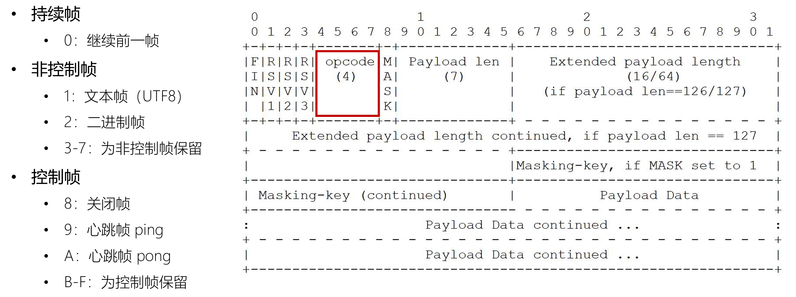

<span style="font-size: 19px;">**ABNF 描述的帧格式**</span>

```txt
ws-frame = frame-fin ; 1 bit in length 
           frame-rsv1 ; 1 bit in length 
           frame-rsv2 ; 1 bit in length 
           frame-rsv3 ; 1 bit in length 
           frame-opcode ; 4 bits in length 
           frame-masked ; 1 bit in length 
           frame-payload-length ; 3 种长度
           [ frame-masking-key ] ; 32 bits in length 
           frame-payload-data ; n*8 bits in ; length, where ; n >= 0

```

## 建立会话

<span style="font-size: 23px;">**如何从HTTP升级到WebSocket**</span>

<span style="font-size: 19px;">**URI 格式**</span>

- **ws-URI = "ws:" "//" host [ ":" port ] path [ "?" query ]** 
  - 默认 port 端口 80
- **wss-URI = "wss:" "//" host [ ":" port ] path [ "?" query ]**
  - 默认 port 端口 443

**客户端提供信息**

- host 与 port：主机名与端口
- shema：是否基于 SSL
- 访问资源：URI
- 握手随机数：Sec-WebSocket-Key
- 选择子协议： Sec-WebSocket-Protocol
- 扩展协议： Sec-WebSocket-Extensions
- CORS 跨域：Origin

<span style="font-size: 19px;">**建立握手**</span>

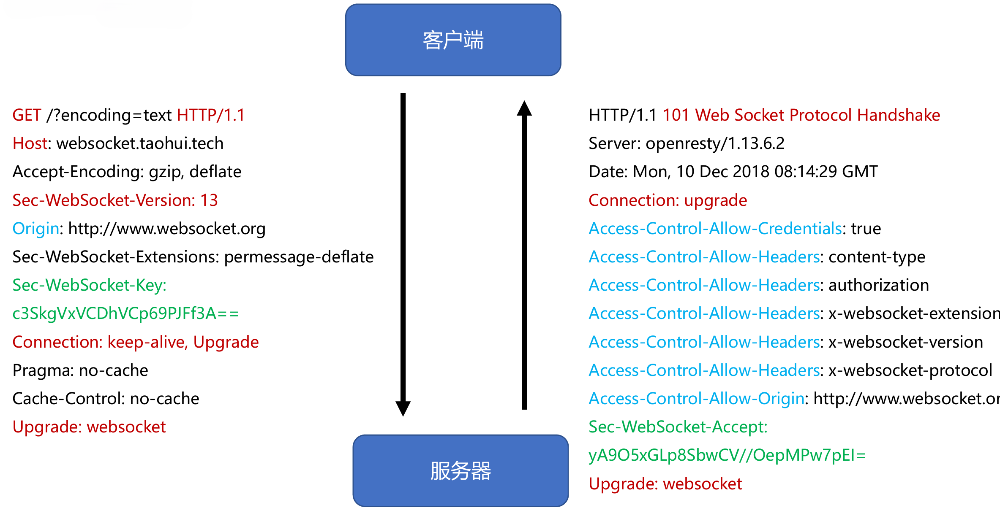

<span style="font-size: 19px;">**如何证明握手被服务器接受？预防意外**</span>

- 请求中的 Sec-WebSocket-Key 随机数
  - 例如 Sec-WebSocket-Key: A1EEou7Nnq6+BBZoAZqWlg==
- 响应中的 Sec-WebSocket-Accept 证明值
  - GUID（RFC4122）：`258EAFA5-E914-47DA-95CA-C5AB0DC85B11`
  - 值构造规则：BASE64(SHA1(Sec-WebSocket-KeyGUID))
    - 拼接值：A1EEou7Nnq6+BBZoAZqWlg==`258EAFA5-E914-47DA-95CA-C5AB0DC85B11`
    - SHA1 值：713f15ece2218612fcadb1598281a35380d1790f
    - BASE 64 值：cT8V7OIhhhL8rbFZgoGjU4DReQ8=
    - 最终头部：Sec-WebSocket-Accept: cT8V7OIhhhL8rbFZgoGjU4DReQ8=

## 传递消息

<span style="font-size: 19px;">**消息与数据帧**</span>

- **Message 消息**
  - 1 条消息由 1 个或者多个帧组成，这些数据帧属于同一类型
  - 代理服务器可能合并、拆分消息的数据帧
- **Frame 数据帧**
  - 持续帧
  - 文本帧、二进制帧

<span style="font-size: 19px;">**非控制帧的消息分片：有序**</span>

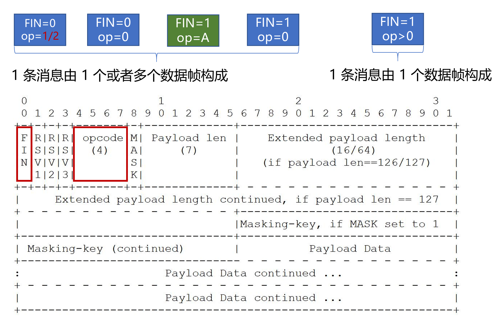

<span style="font-size: 19px;">**数据帧格式：消息内容的长度**</span>

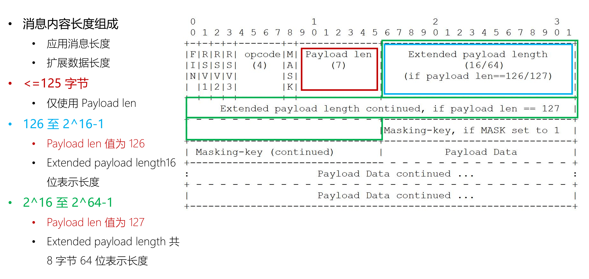

<span style="font-size: 19px;">**发送消息**</span>

- 确保 WebSocket 会话处于 OPEN 状态
- 以帧来承载消息，一条消息可以拆分多个数据帧
- 客户端发送的帧必须基于**掩码**编码
- 一旦发送或者接收到关闭帧，连接处于 CLOSING 状态
- 一旦发送了关闭帧，且接收到关闭帧，连接处于 CLOSED 状态
- TCP 连接关闭后，WebSocket 连接才完全被关闭

### 掩码

<span style="font-size: 19px;">**针对代理服务器的缓存污染攻击**</span>

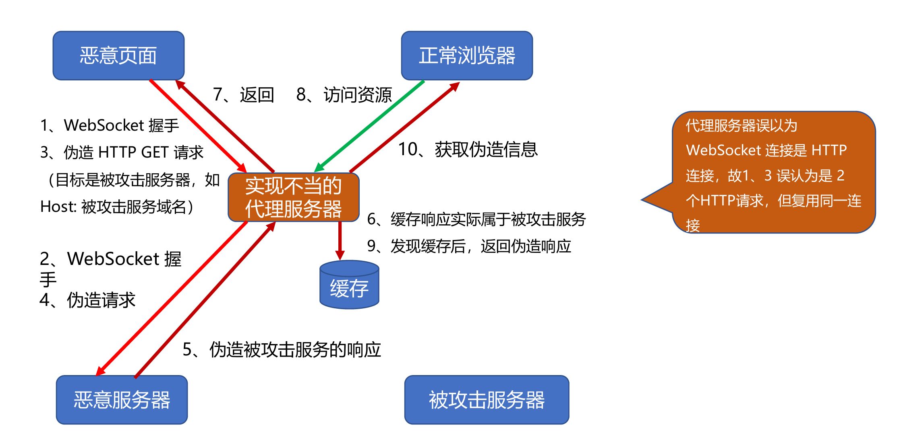

<span style="font-size: 19px;">**frame-masking-key 掩码**</span>

- 客户端消息：MASK 为 1（包括控制帧），传递 32 位无法预测的、随机的 Masking-key
- 服务器端消息：MASK 为 0

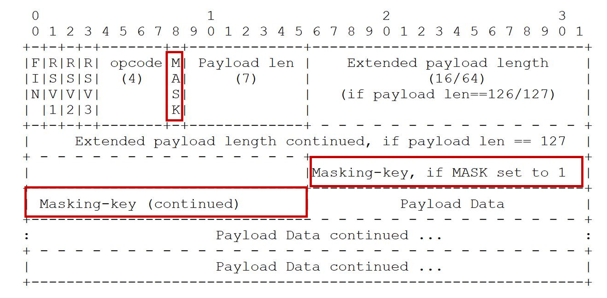

<span style="font-size: 19px;">**掩码如何防止缓存污染攻击？**</span>

- 目的：防止恶意页面上的代码，可以经由**浏览器**构造出合法的 GET 请求，使得代理服务器可以识别出请求并缓存响应
- 强制浏览器执行以下方法：
  - 生成随机的 32 位 frame-masking-key，不能让 JS 代码猜出（否则可以反向构造）
  - 对传输的包体按照 frame-masking-key 执行可对称解密的 XOR 异或操作，使代理服务器不识别
  - 消息编码算法：
    - j = i MOD 4 
    - transformed-octet-i = original-octet-i XOR masking-key-octet-j

### 心跳帧

**心跳帧可以插在数据帧中传输**
- **ping 帧**
  - opcode=9
  - 可以含有数据
- **pong 帧**
  - opcode=A
  - 必须与 ping 帧数据相同

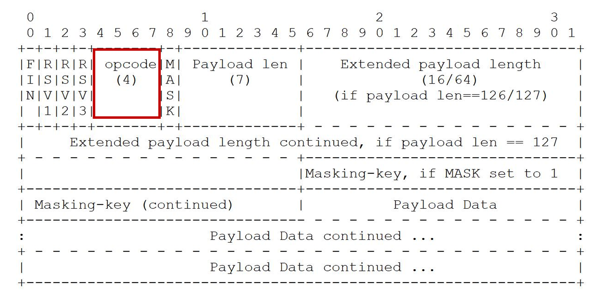

### 关闭帧

<span style="font-size: 19px;">**关闭会话的方式**</span>

**控制帧中的关闭帧：在 TCP 连接之上的双向关闭**
  - 发送关闭帧后，不能再发送任何数据
  - 接收到关闭帧后，不再接收任何到达的数据

**TCP 连接意外中断**

<span style="font-size: 19px;">**关闭帧格式**</span>

- opcode=8
- 可以含有数据，但仅用于解释关闭会话的原因
  - 前 2 字节为无符号整型
  - 遵循 mask 掩码规则

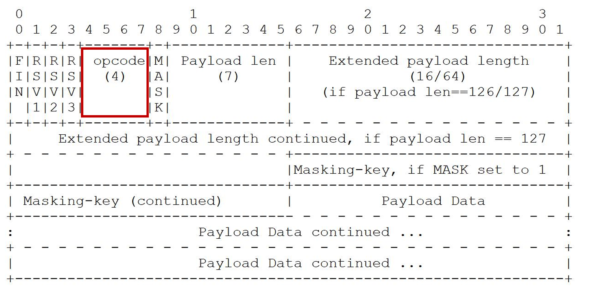

<span style="font-size: 19px;">**关闭帧的错误码**</span>

| 错误码 | 含义                                                         |
| ------ | ------------------------------------------------------------ |
| 1000   | 正常关闭                                                     |
| 1001   | 表示浏览器页面跳转或者服务器将要关机                         |
| 1002   | 发现协议错误                                                 |
| 1003   | 接收到不能处理的数据帧（例如某端不能处理二进制消息）         |
| 1004   | 预留                                                         |
| 1005   | 预留（不能用在关闭帧里），期望但没有接收到错误码             |
| 1006   | 预留（不能用在关闭帧里），期望给出非正常关闭的错误码         |
| 1007   | 消息格式不符合 opcode（例如文本帧里消息没有用 UTF8 编码）     |
| 1008   | 接收到的消息不遵守某些策略（比 1003、1009 更一般的错误）      |
| 1009   | 消息超出能处理的最大长度                                     |
| 1010   | 客户端明确需要使用扩展，但服务器没有给出扩展的协商信息       |
| 1011   | 服务器遇到未知条件不能完成请求                               |
| 1015   | 预留（不能用在关闭帧里），表示 TLS 握手失败                  |